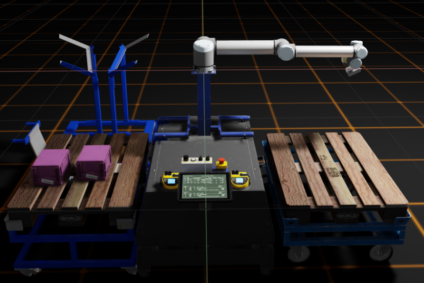
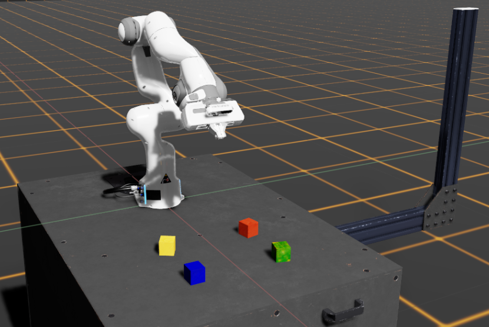
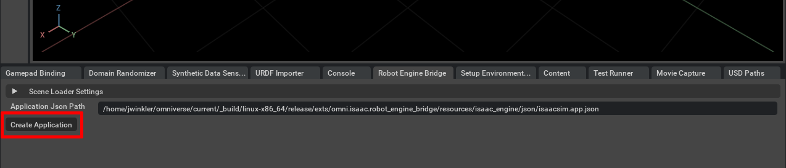
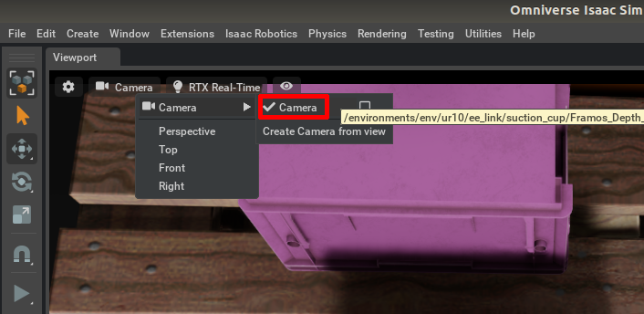
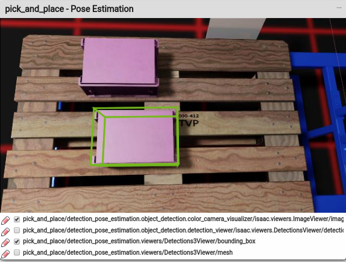
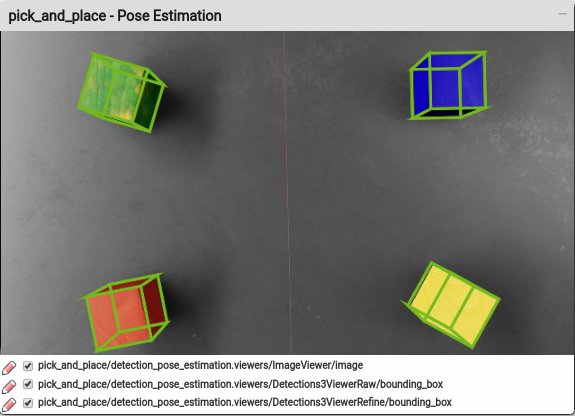

..
   Copyright (c) 2020, NVIDIA CORPORATION. All rights reserved.
   NVIDIA CORPORATION and its licensors retain all intellectual property
   and proprietary rights in and to this software, related documentation
   and any modifications thereto. Any use, reproduction, disclosure or
   distribution of this software and related documentation without an express
   license agreement from NVIDIA CORPORATION is strictly prohibited.

Pick and Place Example Application
==================================

This package provides an application scaffold for pick-and-place scenarios. It features the
high-level steps required for performing pick-and-place tasks and interfaces with two types of
robotic manipulator: the UR10 arm and the Franka Emika arm. Features used in this example
application include actuator control, object detection, and grasping.

Two different scenarios are included in this example application:

* A UR10 arm picking and placing boxes from one pallet to another, using a suction cup grasping
  mechanism.

* A Franka Emika arm picking up colored cubes and placing them on a stack, then unstacking them
  again, using a two finger gripper.

To control both tasks, a central Isaac SDK app driven by a behavior tree is used. The behavior tree
defines two tasks that work in tandem: a *pick* task to detect and grasp objects, and a
*place* task to position them at their destination poses.

The high level steps performed in the *pick* part of the tasks are as follows:

1. Go to a pose from which objects can be seen.

2. Detect objects in the field of view.

3. Go to a pre-grasp pose to grasp an object (e.g., slightly above it).

4. Open the arm's gripper.

5. Close in on the object to grasp it.

6. Close the arm's gripper.

7. Lift the object from the surface.

After performing these steps, the object should be in the robot arm's grasping mechanism, ready for
a subsequent placing task.

For the *place* part, the required steps are as follows:

1. Go to a pre-drop-off pose (e.g., slightly above the drop-off point).

2. Go to the drop-off pose to place the grasped object.

3. Open the arm's gripper.

4. Lift the arm away from the object.

Independent from the robotic manipulator used (and apart from the actual controller modules loaded),
the scaffolding of the application stays the same and serves the purpose of showing how to build
such an application using the Isaac SDK.

Using Omniverse Kit for Simulating the Actuated Robot Arm
*********************************************************

The pick-and-place example uses NVIDIA Omniverse Kit™, which simulates the UR10 and Franka
Emika arm. To set up and start Omniverse,  refer to the respective documentation:

* https://docs.omniverse.nvidia.com/robotics/text/Robotics_QuickStart.html

* https://docs.omniverse.nvidia.com/robotics/text/Robotics_Robot_Engine_Bridge.html

Once Omniverse is running, from the **Content** panel on the lower part of the Omniverse Kit window,
select the address field and enter this URL to load the UR10 robot assets from the Omniverse server:

.. code-block:: bash

   omni:/Isaac/Samples/Isaac_SDK/Scenario/sortbot_sim.usd

To load the assets for the Franka Emika arm, use this URL:

.. code-block:: bash

   omni:/Isaac/Samples/Isaac_SDK/Scenario/franka_table.usd

Confirm with **Return**. Afterwards, on the **Robot Engine Bridge** panel, click **Create
Application**. This starts the Isaac SDK backend.

Once the backend is running, start the simulation by clicking the **Play** button in the Omniverse
window.

Viewport Camera for Object Detection
~~~~~~~~~~~~~~~~~~~~~~~~~~~~~~~~~~~~

Both the Franka and UR10 scenario use camera frames to enable model-based object pose estimation
by default. After the arms move to their first waypoint, they stop and try to perceive the
target objects.

Omniverse allows you to use different scene cameras as the source of the viewport image. In the
Camera menu on top of the viewport, ensure that the first-person camera of the arm is selected.
Use the Viewport **Camera** Settings and select the **Camera** entry in the **Camera** (for UR10) or
**realsense_camera** (for Franka) submenu, as shown below:

The viewport now shows the synthetic image from the camera at the arm end effector, which is
used by the pose estimation codelet. Once the arm properly detects the target object and is
closing in to grasp them, you can switch the camera back to **Perspective**.

Starting the Pick and Place Example Application
***********************************************

To run the application with a connection to Omniverse, execute one of the following commands:

* UR10 box pick-and-place scenario, using Pose CNN with RGB image for object pose estimation:

  .. code-block:: bash

     bazel run //apps/samples/pick_and_place -- --arm ur10

* Franka cube stacking/unstacking scenario, using superpixel-based block pose estimation with RGB-D
  image:

  .. code-block:: bash

     bazel run //apps/samples/pick_and_place -- --arm franka

This starts the respective example application and moves the simulated robot arm in Omniverse
according to the selected scenario.

You may launch both scenarios with additional command line argument :code:`--groundtruth` to use
groundtruth 3d poses from simulation instead of camera-based pose estimation for detecting and
picking target objects. In this case, you can switch the Omniverse viewport to **Perspective** to
view the whole process from third-person view.

For a full list of command line options, run:

.. code-block:: bash

   bazel run //apps/samples/pick_and_place -- --help

