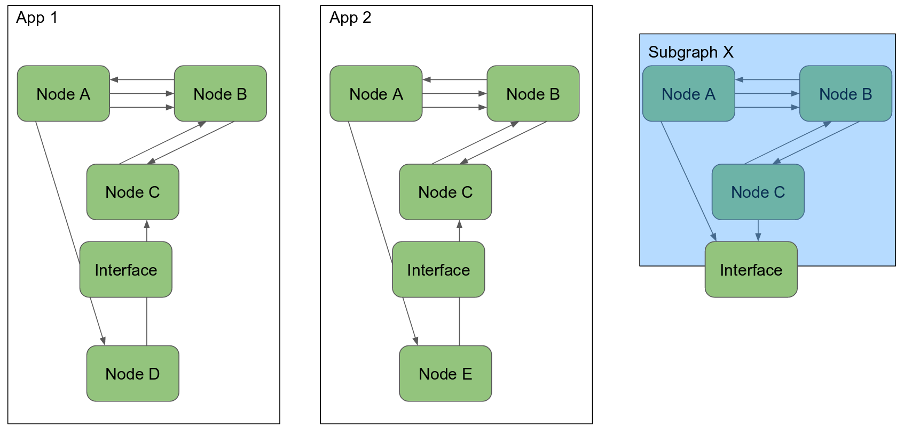
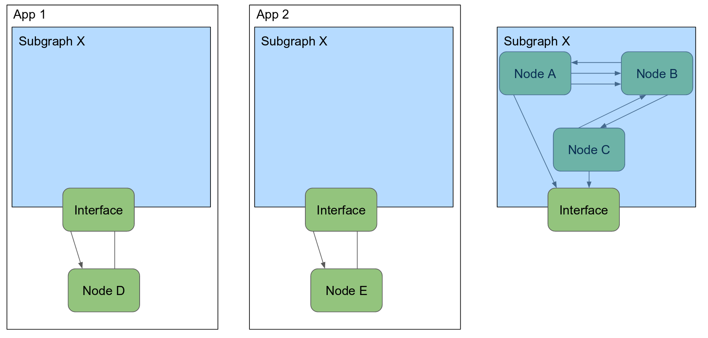

..
   Copyright (c) 2020, NVIDIA CORPORATION. All rights reserved.
   NVIDIA CORPORATION and its licensors retain all intellectual property
   and proprietary rights in and to this software, related documentation
   and any modifications thereto. Any use, reproduction, disclosure or
   distribution of this software and related documentation without an express
   license agreement from NVIDIA CORPORATION is strictly prohibited.

.. _understanding_codelets:

Understanding Codelets
==================================

Components are the basic building blocks of a robotics application. Isaac SDK includes various
components which can use in your application. This tutorial uses an existing component to explain
the various important concepts around components.

The public interface of the component :code:`DifferentialBaseOdometry`, contained in the
:code:`//packages/navigation`, directory, is shown below. This component listens to the wheel
odometry from a differential base and tries to estimate the pose of the robot.

.. code-block:: cpp

    namespace isaac {
    namespace navigation {

    // Integrates (2D) odometry for a differential base to estimate it's
    // ego motion.
    class DifferentialBaseOdometry : public alice::Codelet {
     public:
      void start() override;
      void tick() override;

      // Incoming current dynamic state of the differential base which is used to estimate its
      // ego motion in an odometry frame (type: DifferentialBaseDynamics)
      ISAAC_PROTO_RX(StateProto, state);
      // Outgoing ego motion estimate for the differential base.
      ISAAC_PROTO_TX(Odometry2Proto, odometry);

      // Maximum acceleration to use (helps with noisy data or wrong data
      // from simulation)
      ISAAC_PARAM(double, max_acceleration, 5.0);
      // The name of the source coordinate frame under which to publish
      // the pose estimate.
      ISAAC_PARAM(std::string, odometry_frame, "odom");
      // The name of the target coordinate frame under which to publish
      // the pose estimate.
      ISAAC_PARAM(std::string, robot_frame, "robot");
      // 1 sigma of noise used for prediction model in the following order:
      //   pos_x, pos_y, heading, speed, angular_speed, acceleration
      ISAAC_PARAM(Vector6d, prediction_noise_stddev, \
          (MakeVector<double, 6>({0.05, 0.05, 0.35, 0.05, 1.00, 3.00})));
      // 1 sigma of noise used for observation model in the following order:
      //   speed, angular_speed, acceleration
      ISAAC_PARAM(Vector3d, observation_noise_stddev, \
          (Vector3d{0.25, 0.45, 2.0}));

      // This is the pose under which the ego motion estimation will be
      // written to the pose tree.
      ISAAC_POSE2(odom, robot);

     private:
      ...
    };

    }  // namespace navigation
    }  // namespace isaac

    ISAAC_ALICE_REGISTER_CODELET(isaac::navigation::DifferentialBaseOdometry);

The following sections step through :code:`DifferentialBaseOdometry`, explaining each section.

Codelets and `tick`
--------------------

.. code-block:: cpp

    class DifferentialBaseOdometry : public alice::Codelet {

Codelets are very common components which enable you to write code which is executed repeatedly.
:code:`DifferentialBaseOdometry` is derived from the :code:`alice::Codelet`.

Codelets run in one of the three following ways:

- Tick periodically: The tick function is executed regularly after a fixed time period. A typical
  example is a controller which ticks 100 times a second to send control commands to hardware.

- Tick on message: The tick function is executed whenever a new message is received. A typical
  example is an image processing algorithm which computes certain information on every new camera
  image which is captured.

- Tick blocking: The tick function is executed immediately again after it has finished. A typical
  example is a hardware driver which reads on a socket in blocking mode.

.. Note:: Always use blocking communication with hardware instead of threads, if possible. Isaac SDK
          automatically creates and manages the necessary threads.

When a codelet ticks, it prevents other codelets in the same node from ticking at the same time. To
run codelets in parallel, place them in separate nodes.

:code:`DifferentialBaseOdometry` uses a periodic tick. This is realized in the start function as
shown below:

.. code-block:: cpp

    void DifferentialBaseOdometry::start() {
      ...
      tickPeriodically();
      ...
    }

The tick period itself is set in the configuration as explained later.

Receiving Messages
----------------------------------

Many components receive or transmit messages to other components. Message passing is a powerful way
to encapsulate components and ensuring modularity of the codebase.

.. code-block:: cpp

    // Incoming current dynamic state of the differential base which is used to estimate its
    // ego motion in an odometry frame (type: DifferentialBaseDynamics)
    ISAAC_PROTO_RX(StateProto, state);

The `ISAAC_PROTO_RX` macro is used to define a receiving (RX) channel. The macros take two
arguments: the type of the message and the name of the channel. Isaac SDK is not particularly
tied to a specific message format, but currently cap'n'proto is in widespread use. For more
information see `the cap'n'proto website <https://capnproto.org/index.html>`_.

A message can be read on an receiving channel for example, as follows:

.. code-block:: cpp

    const auto& rmp_reader = rx_state().getProto();
    ...
    state_.speed() = rmp_reader.getLinearSpeed();

The function :code:`rx_state` is automatically generated by the :code:`ISAAC_PROTO_RX` macro, and a
:code:`StateProto` message containing a DifferentialBaseDynamics is expected. All message schemas of
the Isaac SDK can be found in the :code:`//message` folder or in the corresponding section in this
document.

Transmitting Messages
----------------------------------

At the end of the tick, after all computations are done, a component often wants to send out a new
message to whomever is listening.

.. code-block:: cpp

    // Outgoing ego motion estimate for the differential base.
    ISAAC_PROTO_TX(Odometry2Proto, odometry)

The :code:`ISAAC_PROTO_TX` macro is used to define a transmitting (TX) channel. This is very similar to
the way in which :code:`ISAAC_PROTO_RX` macro works.

A message can be created and sent as shown below:

.. code-block:: cpp

    auto odom_builder = tx_odometry().initProto();
    ToProto(odom_T_robot, odom_builder.initOdomTRobot());
    odom_builder.setSpeed(state_.speed());
    ...
    tx_odometry().publish();

Again the :code:`tx_odometry` function is automatically created by the :code:`ISAAC_PROTO_TX` macro.
Use :code:`initProto` to start a new message on this channel. Functions automatically generated by
the cap'n'proto schema like :code:`initOdomTRobot` and :code:`setSpeed` can be used to write data to
the message proto. When the message is complete it can be send via the :code:`publish()` function.
Only one message can be generated at a time.

Convenient ToProto/FromProto Functions
--------------------------------------

Primary data types such as integers are supported directly by cap'n'proto, but it can be more
difficult to process complicated data types. To handle such cases, Isaac SDK provides convenient
:code:`ToProto`/:code:`FromProto` functions, which have common patterns like following:

.. code-block:: cpp

    // Writes a UUID to a proto
    void ToProto(const Uuid& uuid, ::UuidProto::Builder builder)
    // Reads a UUID from a proto
    Uuid FromProto(::UuidProto::Reader reader)

or

.. code-block:: cpp

    // Parses a tensor from a message. This version parses tensors of any element type and rank.
    bool FromProto(::TensorProto::Reader reader, const std::vector<isaac::SharedBuffer>& buffers,
                   isaac::UniversalTensorConstView<Storage>& universal_view);
    // Creates a tensor from a proto. Will print errors and return false if the tensor type is not
    // compatible with the proto.
    bool FromProto(::TensorProto::Reader reader, const std::vector<isaac::SharedBuffer>& buffers,
                   isaac::TensorBase<K, Dimensions, BufferType>& tensor_view)

See the :code:`messages/` folder for header files containing :code:`ToProto`/:code:`FromProto`
functions.

Configuration Parameters
------------------------

Complicated algorithms can often be parameterized in various different ways. :code:`ISAAC_PARAM`
allows you to define a configuration parameter which can be set via configuration, read in the code,
and changed in the frontend.

.. code-block:: cpp

    // Maximum acceleration to use (helps with noisy data or wrong data
    // from simulation)
    ISAAC_PARAM(double, max_acceleration, 5.0)

There are three parameters to :code:`ISAAC_PARAM`:

- type: This is the type of configuration parameter. The basic types are :code:`int`, :code:`double`, :code:`bool`
  and :code:`std::string`. Isaac SDK also provides support for various math types like Pose2/3, SO2/3, and
  Eigen vectors and matrices. An STD vector of any of those types is also supported.

- name: The name defines the key under which the parameter is stored in the configuration file and
  the function name under which it can be accessed in code.

- default value: In case no value is specified in the configuration file this value is used instead.
  The default can also be omitted which forces the user to specify a value in the configuration
  file.

In the example of :code:`DifferentialBaseOdometry` the :code:`tick` function starts with retrieving the desired
prediction noise used in the Kalman filter:

.. code-block:: cpp

    void DifferentialBaseOdometry::tick() {
      navigation::DifferentialBaseState prediction_noise_stddev;
      prediction_noise_stddev.elements = get_prediction_noise_stddev();

Configuration can be changed in multiple ways:

- The default configuration parameter can be changed. This should be used with caution, because it'
  changes the value for all applications which have not overwritten the value in a configuration
  file.

- The value can be set in a JSON configuration file. Most sample applications include a JSON file
  where various parameters are set. For example in `//app/samples/simple_robot`, a configuration
  parameter can be changed by adding the following JSON to the config section:

   .. code-block:: javascript

       {
         "config": {
           ...
           "segway_odometry": {
             "isaac.navigation.DifferentialBaseOdometry": {
               "max_acceleration": 2.0
             }
           }
           ...
         }
       }

In this example :code:`segway_odometry` is the name of the node which contains a component of our
type with name :code:`isaac.navigation.DifferentialBaseOdometry`.

.. _app_graphs:

Application JSONs
------------------

Every Isaac application is based on a JSON file. The JSON file describes the dependencies of the
application, the node graph and the message flow, and contains custom configuration. The
basic structure of a JSON application file:

  .. code-block:: javascript

    {
      "name": "my_application",
      "modules": [
        ...
      ],
      "graph": {
        "nodes": [
          ...
        ],
        "edges": [
          ...
        ]
      },
      "config": {
        ...
      }
    }

The "name" given of the application must match the name given to the isaac_app in the appropriate
BUILD file, and must also match the filename of the JSON file
(in this case, "my_application.app.json").

The "modules" list enumerates all the packages that contain components used in this application. The
"modules" list specified for the isaac_app in the BUILD file must contain the list in the JSON.

An application "graph" defines "nodes" that correspond to the components in use, with "edges"
connecting the nodes. The edges determine the message passing sequence between different nodes.
An example of the "nodes" section of the app graph:

  .. code-block:: javascript

      "nodes": [
        {
          "name": "node_1",
          "components": [
            {
              "name": "message_ledger",
              "type": "isaac::alice::MessageLedger"
            },
            {
              "name": "component_a",
              "type": "isaac::alice::ComponentX"
            }
          ]
        },
        {
          "name": "node_2",
          "components": [
            {
              "name": "message_ledger",
              "type": "isaac::alice::MessageLedger"
            },
            {
              "name": "component_b",
              "type": "isaac::alice:CodeletY"
            }
          ]
        }
      ]

Note that the "type" parameter must match the name given to the component by the macro
ISAAC_REGISTER_COMPONENT or ISAAC_REGISTER_CODELET. In addition, each node must contain a
message_ledger component in order to handle the message passing to/from the node.

The edges determine the message passing sequence between different components. Each edge requires a
source and a target. Using the example above, an edge between the "output" message of node_1's
component_a and the "input" message of node_2's component_b looks like this:

  .. code-block:: javascript

      "edges": [
        {
          "source": "node_1/component_a/output",
          "target": "node_2/component_b/input"
        },
      ]

This example assumes component_a has an ISAAC_PROTO_TX message defined with the name "output"
and component_b has an ISAAC_PROTO_RX message defined with the name "input" of the same type.

The application JSON file also contains configuration data, or "config", for various parameters to
customize behavior. Every configuration parameter is referenced by three elements: node name,
component name, and parameter name.

Configuration of a floating point value parameter named "param" of node_1's component_a looks
like this:

  .. code-block:: javascript

    "config": {
      "node_1": {
        "component_a": {
          "param": 0.1
         }
       }
     }

This assumes that component_a has defined an ISAAC_PARAM by the name of "param" and set it to 0.1.

See :ref:`cplusplus_ping` for a tutorial that includes building an application graph using the
concepts introduced above.

Subgraphs
-----------------------

As more components are added to applications, application graphs can get lengthy and repetitive.
Subgraphs can prove useful in simplifying application graphs. When using and re-using nodes with
multiple components connected together, a JSON subgraph can include required components, edges, and
configurations, so that you can add a relatively high-level group without concern for the
lower-level details.

In the following diagram, nodes A, B, and C in App 1 and App 2 are identical. Instead of duplicating
them in the JSON for each application, a subgraph X can be created.

In this way, the graphs for App 1 and App 2 are greatly simplified, as shown below. This abstraction
simplifies the apps, lowers the maintenance, hides the expertise, and provides a better user
experience.

An example of a subgraph is apps/carter/carter_hardware.subgraph.json, which contains edges and
components needed for almost any application pertaining to Carter hardware. Rather than
repeating that information in the JSON file for every application, the subgraph can be included
in the larger JSON configuration for the entire application. Below is an example of the
:code:`carter_hardware` subgraph, which has nodes for Segway base, Velodyne lidar, and BMI160
inertial measurement unit (IMU). The component type `isaac::alice::Subgraph` makes input/output
with subgraphs cleaner; an example is provided later in this section. In addition to a "graph"
section, a subgraph also includes "modules", "edges", and "config" as illustrated below.

.. code-block:: javascript

  {
    "modules": [
      "imu",
      "segway",
      "velodyne_lidar"
    ],
    "graph": {
      "nodes": [
        {
          "name": "subgraph",
          "components": [
            {
              "name": "message_ledger",
              "type": "isaac::alice::MessageLedger"
            },
            {
              "name": "interface",
              "type": "isaac::alice::Subgraph"
            }
          ]
        },
        {
          "name": "segway_rmp",
          "components": [
            {
              "name": "message_ledger",
              "type": "isaac::alice::MessageLedger"
            },
            {
              "name": "isaac.SegwayRmpDriver",
              "type": "isaac::SegwayRmpDriver"
            },
            {
              "name": "isaac.alice.Failsafe",
              "type": "isaac::alice::Failsafe"
            }
          ]
        },
        {
          "name": "vlp16_initializer",
          "components": [
            {
              "name": "lidar_initializer",
              "type": "isaac::alice::PoseInitializer"
            }
          ]
        },
          "name": "vlp16",
          "components": [
            {
              "name": "message_ledger",
              "type": "isaac::alice::MessageLedger"
            },
            {
              "name": "VelodyneLidar",
              "type": "isaac::velodyne_lidar::VelodyneLidar"
            }
          ]
        },
        {
          "name": "imu",
          "components": [
            {
              "name": "message_ledger",
              "type": "isaac::alice::MessageLedger"
            },
            {
              "name": "IioBmi160",
              "type": "isaac::imu::IioBmi160"
            }
          ]
        }
      ],
      "edges": [
        {
          "source": "subgraph/interface/diff_base_command",
          "target": "segway_rmp/isaac.SegwayRmpDriver/segway_cmd"
        },
        {
          "source": "segway_rmp/isaac.SegwayRmpDriver/segway_state",
          "target": "subgraph/interface/diff_base_state"
        },
        {
          "source": "vlp16/VelodyneLidar/scan",
          "target": "subgraph/interface/scan"
        },
        {
          "source": "imu/IioBmi160/imu_raw",
          "target": "subgraph/interface/imu_raw"
        }
      ]
    },
    "config": {
      "segway_rmp": {
        "isaac.SegwayRmpDriver": {
          "ip": "192.168.0.40",
          "tick_period": "20ms"
        },
        "isaac.alice.Failsafe": {
          "name": "robot_failsafe"
        }
      },
      "vlp16": {
        "VelodyneLidar": {
          "ip": "192.168.0.5"
        }
      },
      "imu": {
        "IioBmi160": {
          "i2c_device_id": 1,
          "tick_period": "100Hz"
        }
      }
    }
  }

Employ subgraphs using the syntax shown below. It's important to note that
each node in a subgraph is prefixed with the subgraph name, e.g., `carter1.segway_rmp`.
This allows configuring or creating edges with a specific instance of a subgraph.

.. code-block:: javascript

    {
      ....
      "graph": {
        "nodes": [
          {
            "name": "carter1",
            "subgraph": "apps/carter/carter_hardware.subgraph.json"
          },
          {
            "name": "carter2",
            "subgraph": "apps/carter/carter_hardware.subgraph.json"
          },
          {
            "name": "imu_corrector",
            "components": [
              {
                "name": "message_ledger",
                "type": "isaac::alice::MessageLedger"
              },
              {
                "name": "ImuCorrector",
                "type": "isaac::imu::ImuCorrector"
              }
            ]
          },
          ...
        ],
        "edges": [
          {
            "source": "carter1.subgraph/interface/imu_raw",
            "target": "imu_corrector/ImuCorrector/raw"
          },
          ...
        ]
      },
      "config": {
        "imu_corrector": {
          "ImuCorrector": {
            "calibration_variance_stationary": 0.1,
          }
        },
        "carter1.vlp16_initializer": {
          "lidar_initializer": {
            "pose": [1.0, 0.0, 0.0, 0.0, -0.04, 0.0, 0.59]
          }
        },
        "carter2.vlp16_initializer": {
          "lidar_initializer": {
            "pose": [1.0, 0.0, 0.0, 0.0, -0.04, 0.0, 0.77]
          }
        },
        ...
      }
    }

Note that when referring to the nodes in the :code:`carter_hardware` subgraph, the name of the
subgraph is used as prefix, e.g., `carter1.subgraph`, `carter1.vlp16`,  or `carter2.vlp16`.
Otherwise, the format is as explained in :ref:`app_graphs`.

Subgraphs can be nested. For example, :code:`carter_hardware` and :code:`scan_flattener` subgraphs
are used in :code:`2d_carter.subgraph.json` as shown below:

.. code-block:: javascript

    {
      "graph": {
        "nodes": [
          {
            "name": "subgraph",
            "components": [
              {
                "name": "message_ledger",
                "type": "isaac::alice::MessageLedger"
              },
              {
                "name": "interface",
                "type": "isaac::alice::Subgraph"
              }
            ]
          },
          {
            "name": "carter_hardware",
            "subgraph": "apps/carter/carter_hardware.subgraph.json"
          },
          {
            "name": "scan_flattener",
            "subgraph": "packages/navigation/apps/scan_flattener.subgraph.json"
          }
        ],
        "edges": [
          {
            "source": "carter_hardware.subgraph/interface/imu_raw",
            "target": "subgraph/interface/imu_raw"
          },
          ...
        ]
      },
      "config": {
          "carter_hardware.vlp16_initializer": {
           "lidar_initializer": {
             "pose": [1.0, 0.0, 0.0, 0.0, -0.04, 0.0, 0.59]
            }
          },
          "scan_flattener.range_scan_flattening": {
           "isaac.perception.RangeScanFlattening": {
             "param": $(fullname carter_hardware.vlp16/lidar_initializer)
            }
          },
          ....
      }
    }

:code:`2d_carter` is itself a subgraph, contained in gmapping.app.json and various other
sample applications included in the Isaac SDK.

Note that when creating an edge for IMU and when setting `pose` parameter for lidar,
all the prefixes are added until the node definition is reached (only `carter_hardware` in this
case). The complete node name in the application also depends on the name used when employing the
:code:`2d_carter` subgraph, which is not known by this subgraph itself. To refer to the
full name, the `$(fullname <>)` syntax can be used as illustrated above.

To prevent a node name being prefixed in the "edges" section, add a '/' character to the
edge name. In the example below, if the prefix due to the subgraph name is :code:`commander`, the
target is expanded to :code:`commander.virtual_gamepad_bridge/VirtualGamepadBridge/request`,
while the source reads :code:`websight/WebsightServer/virtual_gamepad` thanks to the '/' special
character.

.. code-block:: javascript

    "edges": [
      {
        "source": "/websight/WebsightServer/virtual_gamepad",
        "target": "virtual_gamepad_bridge/VirtualGamepadBridge/request"
      },
      ....

To make use of a subgraph in an application, it must be listed under the "data" parameter of the
isaac_app Bazel function in the BUILD file. Declare the subgraph in the BUILD file
by using the isaac_subgraph function.

Declare the subgraph with the isaac_subgraph function as shown below:

.. code-block:: javascript

   load("//engine/build:isaac.bzl", "isaac_subgraph")

   isaac_subgraph(
       name = "carter_hardware_subgraph",
       subgraph = "carter_hardware.subgraph.json",
       modules = [
           "imu",
           "segway",
           "velodyne_lidar"
       ],
       visibility = ["//visibility:public"],
   )

When using isaac_subgraph, the list of packages used by the subgraph can be enumerated and do not
have to be repeated in the module list of an isaac_app that uses the subgraph.

To use the subgraph in an application, list it as a data parameter of an isaac_app as shown below:

.. code-block:: javascript

   isaac_app(
       name = "carter",
       data = [
           ...
           "//apps/carter:carter_hardware_subgraph",
       ],
       modules = [
           ...
       ]
   )

To specify a prefix when loading a configuration file through the command line, use the following
syntax:

  .. code-block:: bash

     bob@desktop:~/isaac/sdk$ bazel run packages/freespace_dnn/apps:freespace_dnn_inference_image -- --config inference:packages/freespace_dnn/apps/freespace_dnn_inference_sidewalk_tensorrt.config.json

The :code:`inference:` specification before the file name will result in the "inference" prefix
being applied to all the nodes when loading
*packages/freespace_dnn/apps/freespace_dnn_inference_sidewalk_tensorrt.config.json*.

.. _pose_tree:

Poses
-----

Isaac SDK automatically has a global pose tree which can be used to compute the relative poses of 3D
or 2D coordinate frames. The Isaac SDK pose tree also caches time histories of poses to allow
queries relative to different time points.

If a component needs to read a pose it should use the :code:`ISAAC_POSE2` macro:

.. code-block:: cpp

    // This is the pose under which the ego motion estimation will be written to the pose tree.
    ISAAC_POSE2(odom, robot)

 or :code:`ISAAC_POSE3` macro:

.. code-block:: cpp

    // This provides access to the very same pose as above, in Pose3 format instead of Pose2.
    ISAAC_POSE3(odom, robot);

The :code:`ISAAC_POSE2` or :code:`ISAAC_POSE3` macro has two arguments which indicate the two coordinate frames in
question. :code:`ISAAC_POSE2(lhs, rhs)` will give the transformation :code:`lhs_T_rhs`. This
transformation can be used to transform a point in the :code:`rhs` frame into a point in the
:code:`lhs` frame: :code:`p_lhs = lhs_T_rhs * p_rhs;`.

In the case of :code:`DifferentialBaseOdometry` the estimated pose of the robot relative to where it
started is computed and written to the pose tree.

.. code-block:: cpp

    const Pose2d odom_T_robot{SO2d::FromAngle(state_.heading()),
                              Vector2d{state_.pos_x(), state_.pos_y()}};
    set_odom_T_robot(odom_T_robot, getTickTime());

.. code-block:: cpp

    // In case of using Pose3d, use the following line instead
    const Pose3d odom_T_robot{SO3d::FromAxisAngle(Vector3{0.0, 0.0, 1.0}, state_.heading()),
                              Vector3d{state_.pos_x(), state_.pos_y(), state_.pos_z()}};
    set_odom_T_robot(odom_T_robot, getTickTime());

Note that the function :code:`set_odom_T_robot` (and similarly :code:`get_odom_T_robot`) is generated
automatically when the macro is used.

The pose is read with respect to a particular point in time. In this example :code:`getTickTime` is
used. Querying poses at various timepoints is crucial for time synchronization of data channels to
avoid lag and data mismatch.

If you want to read a pose from the pose tree a similar mechanism could be used:

.. code-block:: cpp

    const Pose2d foo_T_bar = get_foo_T_bar(getTickTime());

.. code-block:: cpp

    // This is for Pose3d case
    const Pose3d foo_T_bar = get_foo_T_bar(getTickTime());

:code:`Pose3d` provides 6-DOF information consisting 3-DOF orientation and 3-DOF translation thus works
in general cases.
:code:`Pose2d` provides 1-DOF orientation and 2-DOF translation with assumption that the movement is
constrained in X-Y plane with trivial pitch and roll, as most wheeled robots do.
It is easier to work with and more efficient in such cases.
Please choose one of them depending on the assumption for movement.
