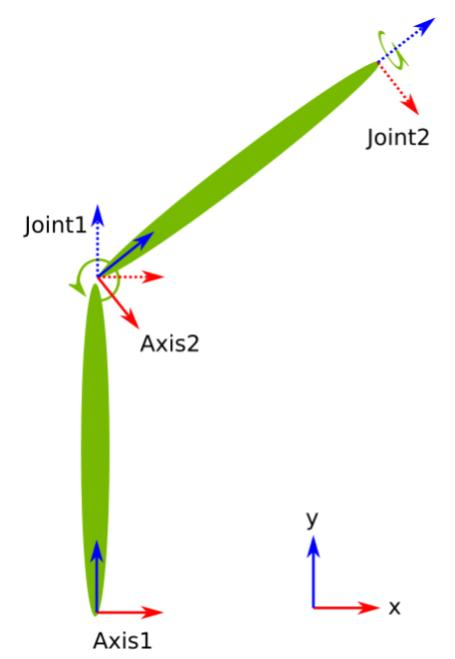

..
   Copyright (c) 2020, NVIDIA CORPORATION. All rights reserved.
   NVIDIA CORPORATION and its licensors retain all intellectual property
   and proprietary rights in and to this software, related documentation
   and any modifications thereto. Any use, reproduction, disclosure or
   distribution of this software and related documentation without an express
   license agreement from NVIDIA CORPORATION is strictly prohibited.

Manipulation Kinematics
=======================

To control the movement of a robot arm, a mathematical representation is required to
compute actuator inputs and to represent obstacles for a trajectory planner. To accomplish this,
the Manipulation Kinematics GEM represents an articulated robotic system as linked
rigidbodies and converts robot states between configuration space and cartesian space.

Application Architecture
------------------------

The robot arm is modeled as a tree of links, each identified by a string name. Each link can have a
“motor” describing the transform between its frame and its child frame. This transform can be
constant (for non-joint links and fixed joints) or parameterized for movable joints like revolute
joints.

.. Note:: Links currently do not have associated geometry (mesh) for collision modeling.

The degrees of freedom of the kinematic tree is the sum of degrees of freedom of all the motors in
a kinematic chain.
An example below shows a kinematic chain with four links. The links “Axis1” and “Axis2” (frame shown
as solid lines) have a constant motor, and the links “Joint1” and “Joint2” (frame shown as dashed
lines) have parameterized motors, with the rotation axis along (001) and (010)
(in their own frames) respectively.

Implementation Details
----------------------

The Manipulation Kinematics GEM is located at :code:`//engine/gems/kinematic_tree:
kinematic_tree`. All calculations are performed as `dual quaternions`_ to represent displacement
in a 3D space: See the :code:`//engine/core/math/dual_quaternion.hpp` component for more details.
The validation of kinematic states only accounts for joint limits at the moment; there are currently
no other checks for self-collision.

.. _dual quaternions: https://en.wikipedia.org/wiki/Dual_quaternion#Dual_quaternions_and_spatial_displacements

Forward Kinematic
^^^^^^^^^^^^^^^^^

To find the position of the end effector from the position of each joint, the application extracts
the chain of links from the root to the end effector, multiplying the dual quaternion of each link
along the way. The final dual quaternion will represent the current 3D displacement and can be
converted into a Pose3d.

Inverse Kinematic
^^^^^^^^^^^^^^^^^^

To find a joint configuration that will bring the end effector to a given target, the application
implements a gradient-descent method using Jacobian transposition. For an over-specified
system--that is, one with more than six joints--this solution provides the closest configuration
to the initial state provided to the solver. This s effective when the target state and current
state is connected and close in the configuration pace, and when the current state is provided
to the solver as an initial guess.

Codelets
--------

.. _kinematic_tree:

The Manipulation Kinematics GEM uses the :ref:`KinematicTree <isaac.map.KinematicTree>` codelet to
load a kinematic-tree file, which has a naming structure of "<name>.kinematic.json".
The following is an example of the file format:

.. code::

   {
     "links": [
       {
         "name": "base",
         "motor": {
           "type": "constant",
           "properties": {
             "pose": {
               "translation": [0.0, 0.0, 0.0],
               "rotation": {
                 "axis": [0.0, 0.0, 1.0],
                 "angle_radians": 0.0
               }
             }
           }
         }
       },
       {
         "name" : "axis1",
         "parent": "base",
         "motor": {
           "type": "constant",
           "properties": {
             "pose": {
               "translation": [0.0, 0.0, 0.1373],
               "rotation": {
                 "axis": [0.7071, 0.7071, 0.0],
                 "angle_degrees": 180.0
               }
             }
           }
         }
       },
       {
         "name" : "joint1",
         "parent": "axis1",
         "motor": {
           "type": "revolute",
           "properties": {
             "axis": [0, 0, 1]
           }
         }
       }
     ]
   }

