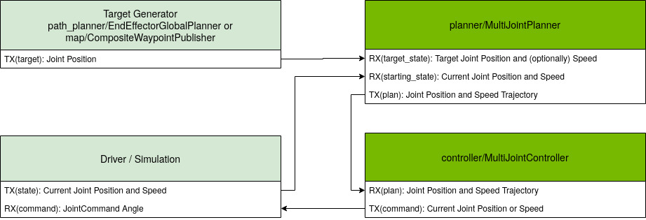

..
   Copyright (c) 2020, NVIDIA CORPORATION. All rights reserved.
   NVIDIA CORPORATION and its licensors retain all intellectual property
   and proprietary rights in and to this software, related documentation
   and any modifications thereto. Any use, reproduction, disclosure or
   distribution of this software and related documentation without an express
   license agreement from NVIDIA CORPORATION is strictly prohibited.

Manipulation Motion Planning
============================

Isaac SDK provides the following components for motion planning of robotics arms:

* **EndEffectorGlobalPlanner**: Converts cartesian target for the end effector to joint angles
  target using inverse kinematics. This codelet can either receive the cartesian target (3d pose)
  as composite message, or read from the pose tree.

* **MultiJointPlanner**: Produces a trajectory to move a list of joints from a starting state to
  a target state. This component contains generic parsing code for the messages, and requires an
  additional component that implements the **MultiJointPlannerInterface**.

* **MultiJointLqrPlanner**: Implements **MultiJointPlannerInterface** using LQR. The LQR solver
  treats each joint is treated independently, and automatically adjusts the time to find a valid
  trajectory that does not exceed the minimum and maximum speed and acceleration constraints. It
  also ensures that the last state in the trajectory is the received target.

  This component only outputs a new plan when the target has changed. Use the :code:`speed_max`,
  :code:`speed_min`, :code:`acceleration_max`, and :code:`acceleration_min` config parameters to
  ensure the plan is feasible for the robot.

* **MultiJointRmpPlanner**: Implements **MultiJointPlannerInterface** using RMPFlow_. It outputs
  short trajectory by integrating the output of the RMPFlow policy over a number of timesteps.
  Because RMPFlow acts as a local reactive controller, it expects the target state to not be too far
  away from the starting position. See the paper below for more information on how RMPFlow works.

.. _RMPFlow: https://arxiv.org/pdf/1801.02854.pdf

* **MultiJointController**: Interpolates a trajectory received from the planner to determine the
  current command to send. This codelet can output either a joint position or speed command based on
  the :code:`control_mode`  config. The interpolation is based on the timestamps in the trajectory
  and the current tick time--with a small look-ahead, which can be configured with the
  :code:`command_delay` config parameter, to account for latency in the control loop.

These codelets require a :code:`kinematic_tree` config parameter, which must refer to a
kinematic-tree file. The codelets use the kinematic-tree configuration to retrieve the number of
joints and their names for parsing and serializing CompositeProto messages. See the
:ref:`Manipulation Kinematics <kinematic_tree>` documentation for more information on creating a
kinematic-tree file.

Manipulation Subgraph
---------------------

Isaac SDK provides a subgraph that integrates the MultiJointPlanner, MultiJointController and
KinematicTree components. You can find this subgraph at
:code:`packages/planner/apps/multi_joint_lqr_control.subgraph.json` (using MultiJointLqrPlanner)
or :code:`packages/planner/apps/multi_joint_rmp_control.subgraph.json` (using MultiJointRmpPlanner).
The subgraphs provide the following interface edges:

* state (input): "subgraph/interface/joint_state"
* target (input): "subgraph/interface/joint_target"
* command (output): "subgraph/interface/joint_command"

Messages
---------------------------------

Manipulation-related components use :ref:`CompositeProto <composite_message>` messages to
communicate. A CompositeProto with rank-1 tensor is used for a single state or command. The
following example shows a state for two joints:

.. code-block:: python

  CompositeProto: {
    "schema": [
      {"entity": "shoulder", "element_type": Float64, "measure": Position},
      {"entity": "shoulder", "element_type": Float64, "measure": Speed},
      {"entity": "elbow", "element_type": Float64, "measure": Position},
      {"entity": "elbow", "element_type": Float64, "measure": Speed}
    ],
    "schema_hash": "...",
    "values": {
      "element_type": Float64,
      "sizes": [19],
      "dataBufferIndex": 0
    }
  }
  buffers: [[0.7, 0.3, -0.4, 0.1]]

A CompositeProto with rank-2 tensor represents a trajectory. The first dimension of the tensor is
the number of timesteps. The timestamp for each timestep is part of the schema. The following
example shows a trajectory for two joints with two timesteps at t=0 and t=0.1:

.. code-block:: python

  CompositeProto: {
    "schema": [
      {"entity": "timestamp", "element_type": Float64, "measure": Time},
      {"entity": "joint1", "element_type": Float64, "measure": Position},
      {"entity": "joint2", "element_type": Float64, "measure": Position},
      {"entity": "joint1", "element_type": Float64, "measure": Speed},
      {"entity": "joint2", "element_type": Float64, "measure": Speed}
    ],
    "schema_hash": "...",
    "values": {
      "element_type": Float64,
      "sizes": [10 , 4],
      "dataBufferIndex": 0
    }
  }
  buffers: [[[0, 0.3, 0.7, -0.4, 0.1], [0.1, 0.32, 0.72, -0.3, 0.15]]]
