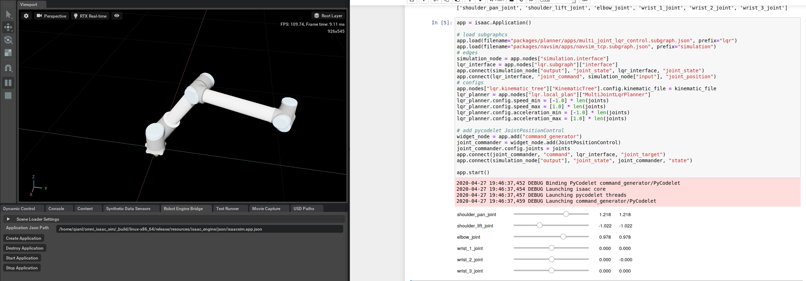
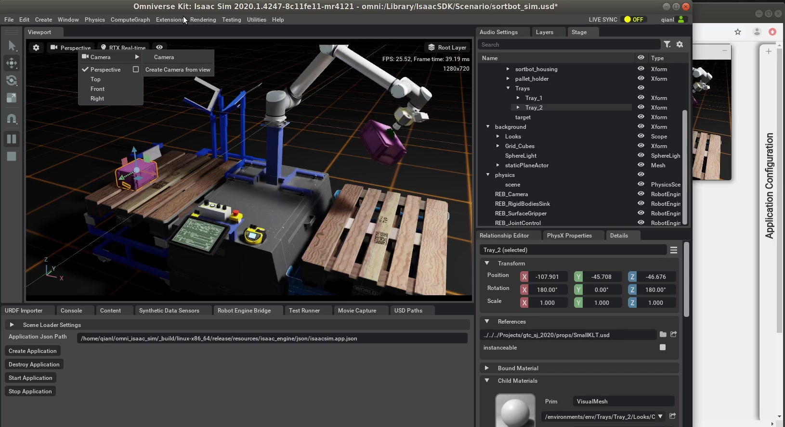
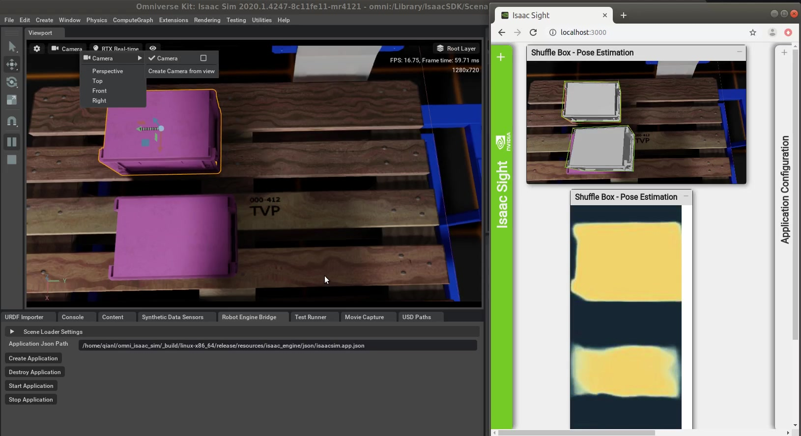

..
   Copyright (c) 2020, NVIDIA CORPORATION. All rights reserved.
   NVIDIA CORPORATION and its licensors retain all intellectual property
   and proprietary rights in and to this software, related documentation
   and any modifications thereto. Any use, reproduction, disclosure or
   distribution of this software and related documentation without an express
   license agreement from NVIDIA CORPORATION is strictly prohibited.

.. _Manipulation Sample Applications:

Manipulation Sample Applications
=================================

Simple Joint Control with Jupyter Notebook
------------------------------------------

This sample provides interactive joint control using Jupyter Notebook. It's a great starting
point for working with the CompositeProto message used for manipulation components, including the
LQR planner.

In the Isaac SDK repository, run the :code:`simple_joint_control` Jupyter notebook app:

   .. code-block:: bash

      bob@desktop:~/isaac/sdk$ bazel run apps/samples/manipulation:simple_joint_control

Your web browser should open the Jupyter notebook document. If it does not, search for a link on the
console: It will look like :code:`http://localhost:8888/notebooks/simple_joint_control.ipynb`.
Open that link in your browser.

This sample has two parts. The first part, `UR10 in Omniverse`, controls a simulated
UR10 arm in Isaac Sim in NVIDIA Omniverse™. The second part, `Kinova Jaco Hardware`, controls the
Kinova generation 2 robotic arm hardware.

* **UR10 in Omniverse**: Follow the documentation Isaac Sim built on NVIDIA Omniverse™ to start the
  simulator and open the stage at :code:`omni:/Isaac/Samples/Isaac_SDK/Scenario/ur10_basic.usd`.
  Start the simulation and Robot Engine Bridge.

  In the Jupyter notebook, follow the cells to start the SDK application using either LQR planner
  or RMP planner. Once it is connected to the simulator, you can use the sliders to move
  individual joints of the UR10 arm in simulation. The joint commands to reach the target joint
  angles are computed by the :code:`multi_joint_lqr_control` or :code:`multi_joint_rmp_control`
  subgraph, respectively.

.. Note:: The ur10 model in simulation by default has self collision disabled. To enable this,
          select `ur10` in Stage, in the `PhysX Properties` window, check `enableSelfCollisions`.
          Note the LQR planner **do not** avoid self collision.

* **Kinova Jaco Hardware**: Follow the instructions in the notebook to install the Kinova API and
  connect the arm to the workstation. Follow the cells to start the SDK application, and use the
  sliders to move individual joints on the Kinova arm.

Shuffle Box with Simulator
------------------------------------------

This sample shows how to make the robotic arm move through a set of predefined waypoints in joint
angles and control the end effector (in this case, a gripper). The :ref:`CompositeMetric and
CompositeAtlas <CompositeMetric and CompositeAtlas>` documentation explains in detail how to make
the arm follow a predefined path.

Follow the documentation for Isaac Sim built on Omniverse to start the simulator and open the stage
at `omni:/Isaac/Samples/Isaac_SDK/Scenario/sortbot_sim.usd`. Start the simulation and Robot Engine
Bridge.

In the Isaac SDK repository, run the following:

   .. code-block:: bash

      bob@desktop:~/isaac/sdk$ bazel run apps/samples/manipulation:shuffle_box

The UR10 arm should repetitively pick up a pink box on one dolly and drop it off on the other side.
Since the pick-up and drop-off waypoints are hard-coded joint angles, while the box position will
shift slightly over time, after a number of iterations the arm will not be able to pick up the box
due to misalignment.

The sample app also includes a pre-trained 3d pose estimation model for the pink box. The
perception output can be visualized in Sight:

1. Change the simulation camera resolution: click the **Settings** icon on the top left of the view
   port and change the 'Render Resolution' from 'Viewport' to '1280x720'.

2. Switch the camera in simulation next to the **Settings** icon from **Perspective** to
   **Camera / Camera** . Open Sight at http://localhost:3000. You should see the CAD model of the
   box with the detected 3D pose overlayed on the RGB camera image.

