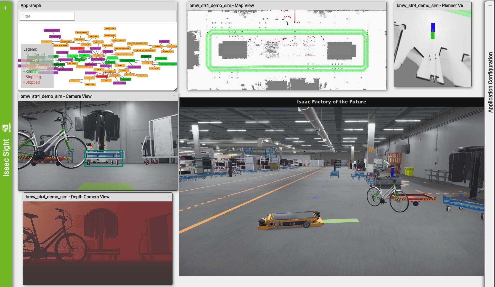
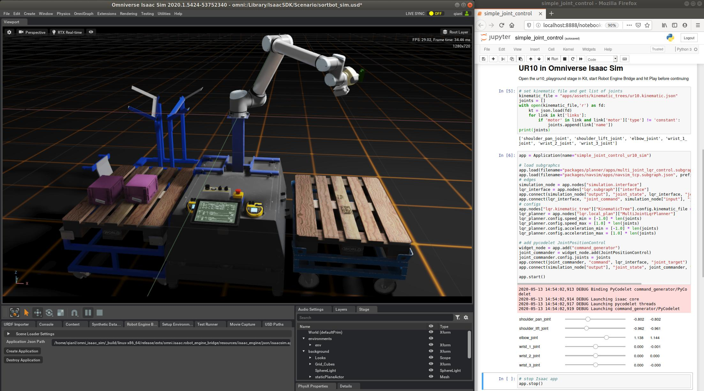
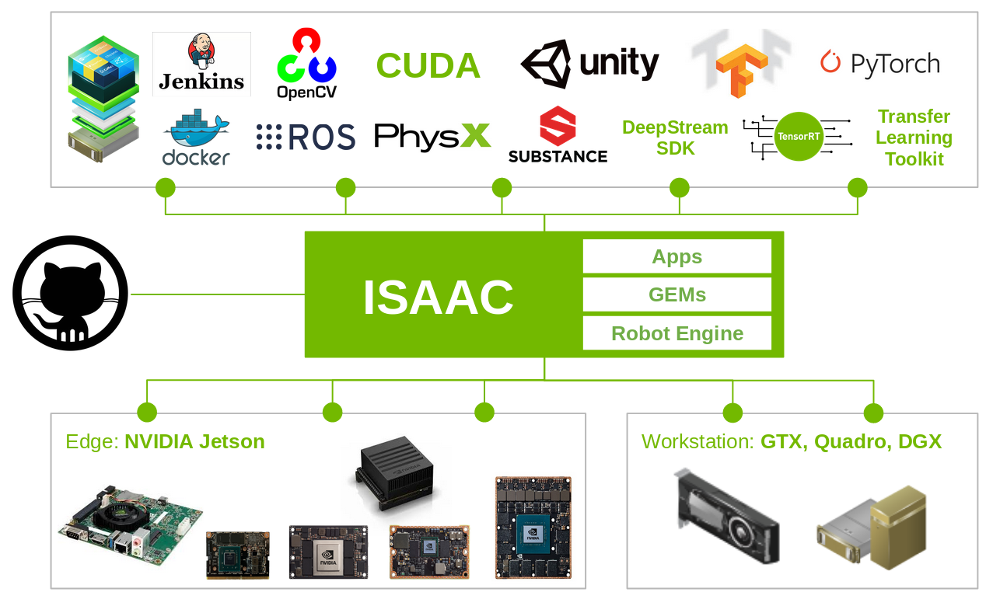
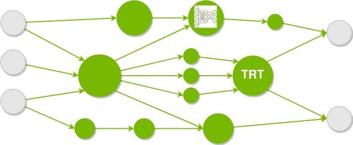
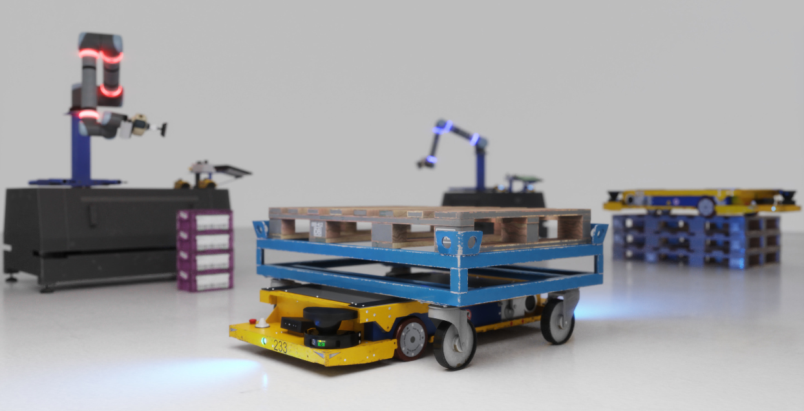

..
   Copyright (c) 2020, NVIDIA CORPORATION. All rights reserved.
   NVIDIA CORPORATION and its licensors retain all intellectual property
   and proprietary rights in and to this software, related documentation
   and any modifications thereto. Any use, reproduction, disclosure or
   distribution of this software and related documentation without an express
   license agreement from NVIDIA CORPORATION is strictly prohibited.

Overview
========

Isaac is NVIDIA's open platform for intelligent robots. The Isaac SDK provides a large collection
of powerful GPU-accelerated algorithm GEMs for navigation and manipulation. Isaac SDK Engine is a
framework to easily write modular applications and deploy them on a real robot. Isaac SDK comes
with various example applications from basic samples that show specific features to applications
that facilitate complicated robotics use cases. Isaac SDK also works hand-in-hand with Isaac SIM,
which allows for development, testing, and training of robots in a virtual environment.

Isaac GEMs
--------------

Robotics combines many different disciplines, including low-level hardware drivers, safe
planning algorithms, fast and accurate computer vision, deep neural networks, and high-level
artificial intelligence. Suceeding in these disciplines often requires years of expertise.

Isaac SDK comes with a collection of high-performance algorithms, also called GEMs, to accelerate
the development of challenging robotics applications. For example, Isaac provides planning and
perception GEMs for navigation and manipulation use cases. GEMs also provide support for key
hardware components and robotic peripherals.

Isaac Applications
----------------------

Isaac SDK provides various sample applications, which highlight features of Isaac SDK Engine or
focus on the functionality of a particular Isaac SDK GEM. These sample applications are good
starting points for learning Isaac.

The Isaac SDK is meant for development of applications for complicated use cases like a delivery
robot. The Carter application gives you a starting point for building your own delivery robot.
Carter can drive to a goal location, patrol a building, or bring you popcorn. The Carter navigation
stack is based on a Lidar.

To start on a smaller scale, see the Kaya application. Isaac includes instructions on how to build
your own robot and bring it to life with artificial intelligence.

Isaac SDK is also supported by a rich ecosystem, and Isaac SDK Engine connects Isaac GEMs to existing
packages like OpenCV, ROS, PCL, and others.

Isaac Engine
----------------

Isaac SDK includes the Isaac SDK Engine, a feature-rich framework for building modular robotics
applications. With Isaac, you can build an application out of small components, which pass messages
between each other and can be configured to your custom use case.

Isaac SDK comes with toolchains based on the Bazel build system for building and deploying
applications. You can build and run applications with a command as simple as
:code:`bazel run //apps/samples/realsense_camera`. All external dependencies are pulled
automatically to your system without any additional setup. The :ref:`setup-isaac` section of this
document explains the few steps necessary for getting started.

Isaac SDK Engine fully supports NVIDIA GPUs and CUDA, TensorRT, NPP and other
frameworks that allow you to build the fastest robotics application. It is optimized for NVIDIA
hardware like Jetson Xavier, Jetson TX/2, Jetson Nano, and workstation GPUs. You can deploy a
cross-compiled application optimized for your platform with a single, short command line script.

Isaac Sim
---------

Isaac Sim applies the NVIDIA Omniverse™ platform to robotics with state-of-the-art RTX
graphics and GPU-accelerated PhysX simulation. You can use Omniverse Connect to export engineering
models from popular tools into the Omniverse Nucleus server, and build your simulation experiments
using the Isaac Sim editor. You can learn more about Isaac Sim on the
`Omniverse documentation page <https://docs.omniverse.nvidia.com/app_isaacsim/app_isaacsim/overview.html>`_.

Isaac SDK also provides support for Unity3D as a simulation backend for navigation and
perception training, with support for the Unity3D high-definition render pipeline
(HDRP).
