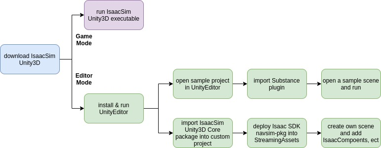

..
   Copyright (c) 2020, NVIDIA CORPORATION. All rights reserved.
   NVIDIA CORPORATION and its licensors retain all intellectual property
   and proprietary rights in and to this software, related documentation
   and any modifications thereto. Any use, reproduction, disclosure or
   distribution of this software and related documentation without an express
   license agreement from NVIDIA CORPORATION is strictly prohibited.

.. _setup-isaac:

Setup
=================================

This document explains how to start developing with Isaac SDK and Isaac Sim. After following
the steps in this document you should be ready to start developing robotics applications with
Isaac SDK.

Prerequisites
---------------------------------

Isaac currently only supports `Ubuntu 18.04 LTS`_ for development and simulation from your
workstation. Please make sure to install recent NVIDIA graphics card drivers on your workstation;
we recommend using version 440.

The compute capability of a GPU is represented by a version number. This version number identifies
the features supported by the GPU hardware and is used by applications at runtime to determine which
hardware features and/or instructions are available on the present GPU. The compute capability
version of a particular GPU should not be confused with the CUDA version (e.g., CUDA 7.5, CUDA 8,
CUDA 9), which is the version of the CUDA software platform.

Isaac SDK requires that your desktop system include a GPU with a compute capability of 6.1 or
higher.

To determine the compute capability of your GPU, find your GPU on the `CUDA GPUs
<https://developer.nvidia.com/cuda-gpus>`_ website.

For deployment of your robotics applications, Isaac works best with a `Jetson Nano`_, `Jetson Nano
2GB`_, `Jetson Xavier`_, `Jetson Xavier NX`_, or `Jetson TX2`_ developer kit. Please make sure to
install `Jetpack 4.4.1`_ on your embedded devices. Isaac currently only supports this Jetpack
version.

.. _Ubuntu 18.04 LTS: http://releases.ubuntu.com/18.04/
.. _Jetson TX2: https://developer.nvidia.com/embedded/buy/jetson-tx2-devkit
.. _Jetson Xavier: https://developer.nvidia.com/embedded/buy/jetson-xavier-devkit
.. _Jetson Xavier NX: https://www.nvidia.com/en-us/autonomous-machines/embedded-systems/jetson-xavier-nx/
.. _Jetson Nano: http://www.nvidia.com/JetsonNano-Start
.. _Jetson Nano 2GB: https://www.nvidia.com/en-us/autonomous-machines/embedded-systems/jetson-nano/education-projects/
.. _Jetpack 4.4.1: https://developer.nvidia.com/embedded/jetpack

.. Note:: Ubuntu 18.04 LTS may come installed with a higher Linux kernel version
          than L4T on your Jetson device, which can cause unpredictable errors when you run Isaac
          applications. Ensure that your workstation is using a Linux kernel version that is less
          than or equal to that of your Jetson device.

Installing Dependencies on the Desktop
--------------------------------------

While most of the Isaac SDK build is hermetic, some system dependencies are required. A script that
installs required dependencies is included.

.. note:: Avoid installing CUDA manually unless you plan on running a module that uses CUDA, such as
          TensorFlow. If you know you need CUDA, in addition to running the script below, make sure
          to also install CUDA 10.2--see the `CUDA Requirements for Machine Learning`_ section
          below for more details.

To install dependencies, at the root folder of the Isaac SDK repository run the following command:

.. code-block:: bash

   bob@desktop:~/isaac/engine/$ ./engine/build/scripts/install_dependencies.sh

The script requests your administrator password at points to install certain dependencies. It
installs three kinds of dependencies:

* Ubuntu packages from the official Ubuntu repositories via aptitude

* Python packages via pip, for example, TensorFlow and keras

* the build system Bazel, used by Isaac SDK.

.. _install_dependencies_jetson:

Installing Dependencies on Robots
---------------------------------

To install required dependencies on Jetson devices in robots, such as Jetson Nano, Jetson Xavier,
and Jetson TX2, run the following command:

.. code-block:: bash

   bob@desktop:~/isaac/engine/$ ./engine/build/scripts/install_dependencies_jetson.sh -u <jetson_username> -h <jetson_ip>

Where <jetson_username> is your username **on the Jetson**, and <jetson_ip> is the IP address of the
Jetson device.

The script installs Ubuntu packages from the official Ubuntu repositories via aptitude.

Bazel
---------------------------------

Large software projects need a reliable and efficient build system and Isaac SDK uses `Bazel`_.
Bazel enables clean module dependencies, hermetic builds, and cross-compilation for various hardware
platforms like the Jetson TX2 or Jetson Xavier developer kits. Bazel is installed by the dependency
script. If additional resources are needed see `Installation instructions`_ on the Bazel homepage.

Please make sure you have the correct version of bazel, currently 3.1.0. Isaac SDK might not work
with an older or newer version of bazel.

.. _bazel: https://docs.bazel.build
.. _Installation instructions: https://docs.bazel.build/versions/master/install-ubuntu.html

.. note:: Bazel requires the file .bazelrc, located in the Isaac SDK package. The Archive
          Manager application in Ubuntu Linux may fail to extract the hidden file, leading to
          building errors. If you see errors when building, confirm that .bazelrc is present in the
          extracted sources.

NVIDIA GPU Driver
---------------------------------

An NVIDIA GPU and corresponding driver software is required to run CUDA-enabled code on a PC. It is
also required by machine learning software. We recommend using NVIDIA GPU Driver version 440.

Use the following procedure to install the driver:

  .. code-block:: bash

    bob@desktop:~/isaac/sdk$ sudo add-apt-repository ppa:graphics-drivers/ppa
    bob@desktop:~/isaac/sdk$ sudo apt-get update
    bob@desktop:~/isaac/sdk$ sudo apt-get install nvidia-driver-440

Replace version 440 with a later version if needed.

Isaac Sim Unity3D Setup
-----------------------

.. _setup-isaac-unity3d:

:ref:`Isaac Sim Unity3D <isaac_sim_unity3d>` allows you to use Unity3D as the simulation environment for
Isaac robotics. Follow the steps below to set up Isaac Sim Unity3D.

Prerequisites
^^^^^^^^^^^^^

Perform all the Isaac SDK setup steps outlined above before installing Unity3D. In addition,
Isaac Sim Unity3D requires the Vulkan graphics API, which comes installed with the NVIDIA graphics
driver. We recommend using an NVIDIA GTX 1080 or higher GPU with NVIDIA driver version 440 or
above.

.. _vulkan_setting:

.. Tip:: On some machines, Vulkan may be using another graphics card instead of the NVIDIA card
         by default. This results in the Unity Editor window being completely black or the binaries
         exiting immediately. To fix this, add the line
         :code:`export VK_ICD_FILENAMES=/usr/share/vulkan/icd.d/nvidia_icd.json`
         to end of the :code:`$HOME/.bashrc` file and save the change. This will apply to any newly
         opened terminal.

Download Isaac Sim Unity3D
^^^^^^^^^^^^^^^^^^^^^^^^^

Download Isaac Sim Unity3D from the `Isaac Developer Downloads`_ website and unzip it to *$HOME/isaac_sim_unity3d*.
This package contains both a "play mode" build and "editor mode" projects and packages. You can use
the "play mode" build without installing Unity Editor, so it's a good way to start exploring
Isaac SDK and Isaac Sim Unity3D. On the other hand, the "editor mode" projects and packages, which
require the Unity Editor, allow you to create your own simulation environment for Isaac SDK.

.. _Isaac Developer Downloads: https://developer.nvidia.com/isaac/downloads

.. _unity_editor_mode_install:

Install Unity Editor for Editor Mode
^^^^^^^^^^^^^^^^^^^^^^^^^^^^^^^^^^^^

If you do not have a Unity ID, `create a Unity account`_ first.

Download Unity Hub for Linux from the `Unity forum`_, then run the following commands:

.. code-block:: bash

   bob@desktop:~$: chmod +x UnityHub.AppImage
   bob@desktop:~$: ./UnityHub.AppImage

.. _create a Unity account: https://id.unity.com/account/new
.. _Unity forum: https://forum.unity.com/threads/unity-hub-v-1-3-2-is-now-available.594139/

When the Unity Hub application opens, follow these steps to install the Unity Editor:

1. Click the person icon in the upper right and select **Sign in**. Sign in with your Unity ID.
2. Select **Installs** on the left, then select **Add**.
3. In the **Add Unity Version** popup window, install 2019.3.x (no modules are required). The
   sample project for Isaac Sim Unity3D is created with 2019.3.0f6, so any newer 2019.3 version can
   be used.

CUDA Requirements for Machine Learning
--------------------------------------

Isaac SDK supports TensorFlow version 1.15.0, which is installed by the
:code:`install_dependencies.sh` script.

To avoid potential issues caused by mismatching library versions, we recommend using
CUDA 10.2, cuDNN 8.0.3, and TensorRT 7.1.3, which are the versions available in Jetpack.

To install CUDA 10.2 directly, follow the `instructions`_ on the NVIDIA Developer website.

.. _instructions: https://developer.nvidia.com/cuda-10.2-download-archive?target_os=Linux&target_arch=x86_64&target_distro=Ubuntu&target_version=1804&target_type=debnetwork
