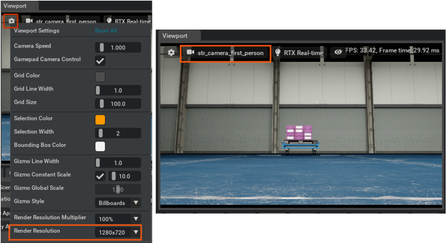

.. _isaac_sim_omniversekit:

Isaac Sim Built on Omniverse
============================

Isaac Sim built on NVIDIA Omniverse™ leverages the NVIDIA Omniverse Kit and has been enhanced with
robotics-specific extensions. It provides access to NVIDIA PhysX and RTX ray-tracing technologies
for high performance, photo-realistic robotic simulations.

Isaac SDK integrates with Isaac Sim built on Omniverse through the Robot Engine Extension. Sensor
data and drive commands are exchanged though TCP. Isaac SDK provides navigation and manipulation
sample applications that work with Omniverse.

Getting Started
------------------------------

Download Isaac Sim built on Omniverse from `Isaac Sim Downloads`_ and follow instructions there
to set up the simulator.

.. _Isaac Sim Downloads: https://developer.nvidia.com/isaac-sim/download

.. Note:: The Isaac SDK 2020.2 release requires the Isaac Sim 2020.2.2 release for simulation. Isaac
          Sim 2020.2.2 will be available a few weeks after the Isaac SDK 2020.2 release.

Simulator Settings
------------------

The physics simulation setting can be access in **Physics > Settings**. The default physics
settings of 60 timesteps per second and maximum 2 steps per frame provide sufficient accuracy for
differential base simulation when the simulation framerate is higher than 30Hz. If the framerate
drops below 30Hz, increase the `max num steps` to 3. This setting will persist after restarting
Omniverse Kit.

.. Note:: Increasing the maximum number of physics steps per frame will further decrease the
          framerate.

Camera simulation in Isaac Sim currently only publishes the viewport camera. To
provide valid first-person robot camera simulation data to Isaac SDK, switch the viewport camera
to the robot camera and change the viewport resolution to 1280x720 to match the expected camera
resolution for most Isaac SDK perception modules. This setting will not persist after restarting
kit.

Navigation Samples
------------------------------

Warehouse Navigation with Carter
^^^^^^^^^^^^^^^^^^^^^^^^^^^^^^^^

Launch Omniverse Kit and open the
:code:`omni:/Isaac/Samples/Isaac_SDK/Scenario/carter_warehouse_with_forklift.usd` stage. Start the
Robot Engine Bridge and press **Play**.

Run the Isaac SDK application with the Carter navigation stack:

.. code-block:: bash

  bob@desktop:~/isaac/sdk$ bazel run apps/navsim/navsim_navigate -- --map_json apps/assets/maps/virtual_test_warehouse_1.json

Once connection is established between Isaac SDK and Omniverse Kit, open Isaac Sight at
:code:`http://localhost:3000`. In the **Application Configuration** panel on the right, search for
"goal_behavior" and change the "desired_behavior" in "SelectorBehavior" from :code:`pose` to
:code:`random`. Carter will start navigating to randomly generated goal positions.

Cart Delivery
^^^^^^^^^^^^^^^^^^^^

Launch Omniverse Kit and open the :code:`omni:/Isaac/Samples/Isaac_SDK/Scenario/str_dolly_warehouse_with_forklifts.usd`
stage. Start the Robot Engine Bridge.

.. Note:: Before you continue, follow the steps in `Simulator Settings`_ to complete these setting
   changes:

   **1. Increase "Max num steps" for physics to 3**: Once the perception model in the cart_delivery
   application is running, GPU usage will increase and the Kit framerate will drop. Increasing the
   "Max num steps" for physics is necessary to keep the differential base simulation accurate.

   **2. Change the viewport camera to first person and "Render Resolution" to 1280x720**: The
   sample application needs to detect the dolly pose from the robot camera before driving
   underneath, so Kit needs to publish images from the first-person camera at the expected
   resolution for the perception models.

Press **Play** in Omniverse kit. Run the Isaac SDK application with the cart-delivery stack:

.. code-block:: bash

  bob@desktop:~/isaac/sdk$ bazel run packages/cart_delivery/apps:cart_delivery -- --map_json apps/assets/maps/virtual_test_warehouse_1.json --pose2_planner ""

Once connection is established between Isaac SDK and Omniverse Kit, open Isaac Sight at
:code:`http://localhost:3000`. The robot should detect the dolly and move it to a predefined
drop-off waypoint.

Manipulation Samples
------------------------------

See :ref:`Manipulation Sample Applications <Manipulation Sample Applications>` to learn how to use
Isaac SDK manipulation sample applications with Omniverse Isaac Sim.

Jetbot Samples
------------------------------

See :ref:`jetbot_sample_applications` to learn how to use
Isaac SDK Jetbot sample applications with Omniverse Isaac Sim.
