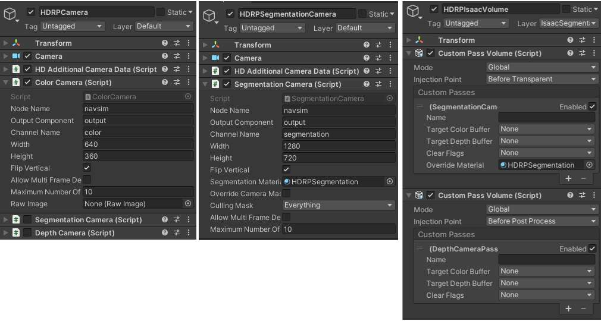
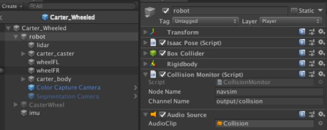

..
   Copyright (c) 2020, NVIDIA CORPORATION. All rights reserved.
   NVIDIA CORPORATION and its licensors retain all intellectual property
   and proprietary rights in and to this software, related documentation
   and any modifications thereto. Any use, reproduction, disclosure or
   distribution of this software and related documentation without an express
   license agreement from NVIDIA CORPORATION is strictly prohibited.

.. _isaac_sim_unity3d:

Isaac Sim Unity3D
=================

Isaac Sim allows you to use Unity3D as the simulation environment for Isaac robotics. Isaac Sim
Unity3D provides an expandable test environment to evaluate the performance of the Isaac navigation
stack. It also provides an infinite stream of procedurally generated, fully annotated training
data for machine learning. Features include emulation of sensor hardware and robot base models,
scene randomization, and scenario management.

See the Isaac SDK :ref:`Setup <setup-isaac>` page for details on installing Isaac Sim Unity3D.

Getting Started with Play Mode
------------------------------

This section explains how to use the "play mode" build of Isaac Sim Unity3D with Isaac SDK.

Warehouse Navigation
^^^^^^^^^^^^^^^^^^^^

The "play mode" build contains two scenes: "small_warehouse" and "medium_warehouse". To select a
scene to run, use the :code:`--scene` command-line option followed by the name of the scene.

First, start the simulator with the "small_warehouse" scene:

.. code-block:: bash

  bob@desktop:~/isaac_sim_unity3d$ cd builds
  bob@desktop:~/isaac_sim_unity3d/builds$ ./sample.x86_64 --scene small_warehouse -logFile -

The :code:`-logFile -` argument tells Unity to print the log to the console. Without this argument,
Unity writes the log to :code:`~/.config/unity3d/NVIDIA/<Project Name>/Player.log`.

Next, run the Isaac SDK application with the Carter navigation stack:

.. code-block:: bash

  bob@desktop:~/isaac/sdk$ bazel run //apps/navsim:navsim_navigate

The "navsim_navigate" application is similar to the Carter application for a real-world robot.
Instead of the hardware subgraph, which launches hardware drivers, the "navsim_navigate" application
uses the navsim subgraph, which communicates with the simulator via TCP sockets. The additional
parameters above specify configuration files for the simulated warehouse map and robot used in the
simulation.

Below is a top-down Unity camera view in :ref:`Isaac Sight <sight-overview>` when the
"small_warehouse" simulation is running: The goal pose is shown as a semi-transparent green Carter,
and the global and local plans are displayed as red and blue lines, respectively.

Sight also displays the following windows:

* **Map View**: Displays Carter localization using flatscan LIDAR.
* **Speed Profile**: Displays commanded and observed speeds for the differential base.
* **Color Camera**: Outputs a forward-facing, first-person view from Carter.

.. Tip:: On some machines, Vulkan may be using another graphics card instead of the NVIDIA card
         by default. In this case, the binary may exit immediately. See :ref:`the Setup page <vulkan_setting>`
         for a fix.

Visualizing Data
^^^^^^^^^^^^^^^^

Once an Isaac Sim Unity3D scene is running, you can use the Isaac SDK "navsim_viewer_tcp" app to
visualize via Websight camera data published by NavSim. To start the NavSim viewer, run the
following command:

.. code-block:: bash

   bob@desktop:~/isaac/sdk$ bazel run packages/navsim/apps:navsim_viewer_tcp

Note that the number and type of cameras differ by scene: For example, the "small_warehouse" and
"medium_warehouse" scenes only have one color camera and one depth camera, while the "rng_warehouse"
has instance and label cameras as well. Only enabled channels can be viewed in Websight.

Command Line Arguments
^^^^^^^^^^^^^^^^^^^^^^^^^^^^^

The following command line arguments are used in Isaac Sim Unity3D scripts when running a build.

+----------------------------------+----------------------+--------------------------------------------+
| Option                           | Script               | Description                                |
+==================================+======================+============================================+
| :code:`--scene *name*`           | SceneLoader          | Name of the scene to load (e.g.            |
|                                  |                      | "small_warehouse")                         |
+----------------------------------+----------------------+--------------------------------------------+
| :code:`--scenarioFile *path*`    | ScenarioFromFile     | Path to the scenario JSON file. See the    |
|                                  |                      | example in                                 |
|                                  |                      | :code:`isaac/sdk/packages/navsim/scenarios`|
+----------------------------------+----------------------+--------------------------------------------+
| :code:`--scenario *index*`       | ScenarioManager      | Index of the scenario to set to active.    |
|                                  |                      | Starts with 0.                             |
+----------------------------------+----------------------+--------------------------------------------+
| :code:`--timeScale *number*`     | TimeScaler           | Timescale for Unity (only works for >=1)   |
+----------------------------------+----------------------+--------------------------------------------+
| :code:`--root *path*`            | IsaacNative          | Path to the Isaac application root folder  |
|                                  |                      | (navsim-pkg)                               |
+----------------------------------+----------------------+--------------------------------------------+
| :code:`--app *path*`             | IsaacApplication     | Path to the Isaac application JSON file    |
|                                  |                      | relative to root                           |
+----------------------------------+----------------------+--------------------------------------------+
| :code:`--more *files*`           | IsaacApplication     | A comma-separated list of additional JSON  |
|                                  |                      | files relative to root for the Isaac       |
|                                  |                      | application to load                        |
+----------------------------------+----------------------+--------------------------------------------+
| :code:`--buildTarget *path*`     | BuildHelper          | Output filename of the build               |
+----------------------------------+----------------------+--------------------------------------------+
| :code:`--sceneFile *path*`       | BuildHelper.BuildFrom| Path to the Isaac application root folder  |
|                                  | File                 | (navsim-pkg)                               |
+----------------------------------+----------------------+--------------------------------------------+
| :code:`--mode *[client/server/`  | ScenarioFromFile     | Which mode to run from the simulator       |
| :code:`standalone]*`             |                      |                                            |
+----------------------------------+----------------------+--------------------------------------------+
| :code:`--showScenes`             | SceneLoader          | Prints the list of scenes in the binary.   |
|                                  |                      | Use with :code:`-logFile -` to print       |
|                                  |                      | the list to the console log. The binary    |
|                                  |                      | will exit after printing.                  |
+----------------------------------+----------------------+--------------------------------------------+
| :code:`--showScenarios`          | ScenarioManager      | Prints the list of scenarios in a scene.   |
|                                  |                      | Use `--scenes *name*` to specify a         |
|                                  |                      | scene and :code:`-logFile -` to print the  |
|                                  |                      | list to the console log. The binary will   |
|                                  |                      | exit after printing.                       |
+----------------------------------+----------------------+--------------------------------------------+

Unity also supports a set of `command line arguments`_. Useful arguments include the following:

* :code:`-logFile -`: Dumps Unity logs to the console.
* :code:`-screen-fullscreen 0[1]`: Disables/enables fullscreen.

.. _command line arguments: https://docs.unity3d.com/2019.3/Documentation/Manual/CommandLineArguments.html

Scenes in the Play Mode Build
^^^^^^^^^^^^^^^^^^^^^^^^^^^^^

For binaries in :code:`isaac_sim_unity3d/builds`, use :code:`--showScenes` to list scenes included
in the binary:

.. code-block:: bash

   bob@desktop:~/isaac_sim_unity3d/builds$ ./sample.x86_64 --showScenes -logFile -

The binary will exit after logging the scene list to console. If you scroll up in the console log,
you will see a block with the following:

.. code-block:: bash

    ====== Scene List ======
    9 scenes in build

    Scene 0 manager_scene: Packages/com.nvidia.isaac_sim_core/Scenes/manager_scene.unity

    Scene 1 tutorial: Assets/tutorial.unity
    ...
    ====== Scene List ======

Use :code:`--showScenarios` to list the scenarios included in a particular scene:

.. code-block:: bash

   bob@desktop:~/isaac_sim_unity3d/builds$ ./sample.x86_64 --scene small_warehouse --showScenarios -logFile -

The binary will exit after loading the scene, which could take a few seconds, and logging the
scenario list to console. If you scroll up in the console log, you will see a block with the
following:

.. code-block:: bash

    ====== Scenario List ======
    3 scenarios. Default Robot: Carter_Wheeled

    (0) ScenarioFromFile: sets up scenario from a json file. UseDefaultRobot: False
    >> ScenarioFromFile robots (Robots): Carter, Carter_Wheeled, Carter_Stereo, Carter_Base,
     Carter_Dummy, Carter_Sensor, CDS Camera Rig, Stereo Camera Rig, Turtlebot3WafflePi,
     CircleRobot, RectangleRobot, TriangleRobot
    >> ScenarioFromFile obstacles (Obstacles): Cube, Cylinder, Box01, BucketPlastic_A, Pushcart,
     TrashCan02

    [(1)] Interactive: You can use the goal marker to command the robot.. UseDefaultRobot: True
    ...
    ====== Scenario List ======

The default active scenario index is shown in square bracket, in this case scenario 1. For
scenarios that allow customizing of robots and obstacles through the JSON file or Isaac messages,
the name of available robot and obstacle prefabs are also listed.

The sample scenes contained in :code:`builds/sample.x86_64` are detailed below:

+--------------------------+--------------------------------------------+----------------------+
| Scene                    | Description                                | Isaac app            |
+==========================+============================================+======================+
| small_warehouse          | A small warehouse environment to test and  | apps/navsim          |
|                          | demonstrate the Isaac navigation stack.    | /navsim_navigate     |
|                          | By default, this scene uses Carter, but    |                      |
|                          | you can use other robots and scenarios     |                      |
|                          | as well.                                   |                      |
+--------------------------+--------------------------------------------+----------------------+
| medium_warehouse         | A medium-sized warehouse environment to    | apps/navsim          |
|                          | test and demonstrate the Isaac navigation  | /navsim_navigate     |
|                          | stack. By default, this scene uses         |                      |
|                          | Carter, but you can use other robots and   |                      |
|                          | scenarios as well.                         |                      |
+--------------------------+--------------------------------------------+----------------------+
| pose_estimation_cnn_     | A sample scene to generate training        | packages/object      |
| training                 | samples for a pose-estimation model for    | _pose_estimation/    |
|                          | the pose cnn decoder architecture.         | /apps/pose_cnn_      |
|                          | By default this scene uses a dolly mode    | decoder/training/    |
|                          | and randomizes camera positions,           | pose_estimation_cnn_ |
|                          | backgrounds, etc. every frame.             | training             |
+--------------------------+--------------------------------------------+----------------------+
| object_detection_training| Object detection for the DetectNetv2 GEM   | packages/ml/apps/    |
|                          | uses this scene to generate simulated      | generate_kitti       |
|                          | images (both positive and negative samples | _dataset             |
|                          | for object detections) for feeding into    |                      |
|                          | the TLT training pipeline.                 |                      |
+--------------------------+--------------------------------------------+----------------------+
| dolly_docking_training   | A sample scene consisting of 9 robots with | packages/rl/apps/    |
|                          | carts, walls, and dynamically sized        | dolly_navigation     |
|                          | obstacles scattered around the robot for   |                      |
|                          | training a sample reinforcement-learning   |                      |
|                          | policy for docking under the cart.         |                      |
+--------------------------+--------------------------------------------+----------------------+

The sample scene contained in :code:`builds/factory_of_the_future.x86_64` is detailed below. You
will need an RTX 2080 or better GPU to run this scene at an acceptable framerate (~30Hz):

+--------------------------+--------------------------------------------+----------------------+
| Scene                    | Description                                | Isaac app            |
+==========================+============================================+======================+
| Factory01                | A large-scale factory with scenarios for   | apps/cart_delivery   |
|                          | robot navigation, dolly delivery, docking  | /cart_delivery       |
|                          | with reinforcement learning, and 3D pose   |                      |
|                          | training and inference. This scene uses    |                      |
|                          | HDRP rendering.                            |                      |
+--------------------------+--------------------------------------------+----------------------+

Running in a Docker Container
^^^^^^^^^^^^^^^^^^^^^^^^^^^^^

You can run any Isaac Sim Unity3D binary in a Isaac SDK Docker container. Follow these steps to run
Isaac Sim Unity3D in Docker on your desktop with graphics:

1. Follow the instructions in :ref:`using_docker` to install docker and create the
   :code:`isaacbuild:latest` image. In a terminal, run the following:

   .. code-block:: bash

      bob@desktop:~/$ docker version

   Verify the docker community edition is v19.03 or later.

2. Assign access for the X11 socket:

   .. code-block:: bash

      bob@desktop:~/$ DISPLAY=$DISPLAY sudo xhost +

3. Launch the Docker container:

   .. code-block:: bash

      bob@desktop:~/$ docker run --gpus all -ti --rm -e DISPLAY --network host -v /tmp/.X11-unix:/tmp/.X11-unix -v $(pwd)\:$HOME:rw isaacbuild:latest

4. Run the Small Warehouse scene inside Docker:

   .. code-block:: bash

      root@desktop:~# cd /home/bob/isaac_sim_unity3d/builds
      root@desktop: /home/bob/isaac_sim_unity3d/builds# ./sample.x86_64 --scene small_warehouse -logFile -

  The :code:`-logFile -` command line option prints the Unity log to console for easier debugging.

  .. Note:: If you see :code:`Desktop is 0 x 0 @ 0 Hz` at the beginning of the log, and the Vulkan
            DisplayManager error later, this means you cannot access the display inside the
            Docker container. This may indicate a mistake in step 2, or the :code:`docker run`
            command in step 3 may be missing the :code:`-e DISPLAY` or
            :code:`-v /tmp/.X11-unix:/tmp/.X11-unix` option. The glxinfo (from the Ubuntu mesa-utils
            package) and vulkaninfo (from the Vulkan SDK) tools may be convenient for testing here.

5. Run the Isaac navigation app inside Docker. In a new terminal, run the following:

   .. code-block:: bash

      bob@desktop:~/$ docker exec --it <container_name> /bin/bash
      root@desktop:~# cd /home/bob/isaac
      root@desktop:/home/bob/isaac#: bazel run apps/navsim:navsim_navigate

   Here, :code:`<container_name>` is the name of the Docker container started in step 3. Use :code:`docker ps`
   to determine the container name. Open Sight at :code:`localhost:3000`, and you should see the robot
   moving.

Running In Headless Mode
^^^^^^^^^^^^^^^^^^^^^^^^^^^^^

You can also run Isaac Sim Unity3D binaries in headless mode with Docker. This is
useful for running multiple simulation instances on a powerful server machine with multiple GPUs
such as a DGX station. The following steps outline headless-mode setup for a DGX station. Once the
network is set up on the DGX station, disconnect any monitors from the DGX.

1. SSH into the server and run the following:

   .. code-block:: bash

      bob@DGX:~/$ nvidia-smi

   Verify that the driver version is 418 or later. If not, follow `these instructions`_
   to upgrade the DGX station to OS release 4.3.0

  .. _these instructions: https://docs.nvidia.com/dgx/dgx-os-desktop-release-notes/index.html#upgrading-to-dgx-os-4-1-0

   Regular NVIDIA drivers cannot be used on the DGX, so upgrading the OS is required.

2. Run the following command to disable graphical login (gdm) and boot into the console directly:

   .. code-block:: bash

      bob@DGX:~/$ sudo systemctl set-default multi-user.target

   Reboot the machine, then run the following:

   .. code-block:: bash

      bob@DGX:~/$ nvidia-smi

   This should show no processes running on GPU. This step only needs to be run once on the machine
   after system installation.

3. After each reboot, run the following commands to to enable virtual display configurations, start
   an xorg instance, and assign access:

   .. code-block:: bash

      bob@DGX:~/$ sudo nvidia-xconfig --allow-empty-initial-configuration --enable-all-gpus  --force-generate
      bob@DGX:~/$ sudo startx &
      bob@DGX:~/$ DISPLAY=:0 sudo xhost +

   a. After the last command, you should see "access control disabled, clients can connect from any
      host" in the terminal. If instead you see error messages like "xhost:  unable to open display"
      or "No Protocol Specified", :code:`DISPLAY=:0` may be invalid. Check all displays as follows:

      .. code-block:: bash

         bob@DGX:~/$ ls /tmp/.X11-unix
         X0  X1
         bob@DGX:~/$ DISPLAY=:1 glxinfo

   b. Assign the valid display:

      .. code-block:: bash

         bob@DGX:~/$ export DISPLAY=:0

      Add this to :code:`~/.bashrc` to use as the default.

4. Launch a Docker container:

   .. code-block:: bash

      docker run --gpus all -ti --rm -e DISPLAY --network host -v /tmp/.X11-unix:/tmp/.X11-unix -v $(pwd)\:$HOME:rw isaacbuild:latest

   The :code:`-v /tmp/.X11-unix:/tmp/.X11-unix` option allows for accessing the X socket from within
   Docker.

5. Run the Small Warehouse scene inside Docker by copying the Isaac Sim Unity3D binary to the DGX
   station:

   .. code-block:: bash

      root@DGX:~# cd /home/bob/isaac_sim_unity3d/builds
      root@DGX: /home/bob/isaac_sim_unity3d/builds# DISPLAY=$DISPLAY.0 ./sample.x86_64 --scene small_warehouse -logFile -

   .. Note:: The environmental variable :code:`DISPLAY=$DISPLAY.0` forces Unity to use GPU 0 for
      graphics. You can change this variable to use different GPUs as needed: For example, replace
      `$DISPLAY.0` with $DISPLAY.1` to use GPU 1.

6. Run the Isaac navigation app inside Docker. In a new terminal, run the following:

   .. code-block:: bash

      bob@DGX:~/$ docker exec --it <container_name> /bin/bash
      root@DGX:~# cd /home/bob/isaac
      root@DGX:/home/bob/isaac#: CUDA_VISIBLE_DEVICES=0 bazel run apps/navsim:navsim_navigate

   .. Note:: The environmental variable :code:`CUDA_VISIBLE_DEVICES=0` forces CUDA to use GPU 0
      for compute.

   On your desktop, open Sight at :code:`<dgx_ip>:3000`, and you should see the robot moving.

Getting Started with Editor Mode
--------------------------------

This section shows you how to use the "editor mode" build of Isaac Sim Unity3D with Isaac SDK.

Opening the Sample Project
^^^^^^^^^^^^^^^^^^^^^^^^^^

Once you have installed the Unity Editor :ref:`as described on the Setup page <setup-isaac-unity3d>`,
run the following command. Replace `2019.3.0f6` with the version number installed if you have a
higher 2019.3 Unity Editor version.

.. _above: unity_editor_mode_install

.. code-block:: bash

   bob@desktop:~$: Unity/Hub/Editor/2019.3.0f6/Editor/Unity -projectPath isaac_sim_unity3d/projects/sample -logfile

If you have a higher 2019.3 version, you will first see a popup window that states "Opening Project
in Non-Matching Editor Installation". Click **Continue**. When opening the sample project for the
first time, Unity can take about 10 minutes to compile scripts and import assets. When the Unity
Editor window opens, you should see the following items in the **Project** tab:

The following are important folders:

* **Assets/Allegorithmic**: The `Substance`_ plugin folder, which Isaac Sim Unity3D uses for
material randomization.

.. _substance: https://assetstore.unity.com/packages/tools/utilities/substance-in-unity-110555

* **Assets/StreamingAssets/navsim-pkg**: The deployed Isaac SDK NavSim package, which contains the C
  API and the NavSim app to run inside Unity. If you have made changes to the Isaac SDK that affect
  the *navsim-pkg* or its dependencies (e.g. the ``navsim.app.json`` file, C API, C# binding, or
  engine), you should redeploy the ``navsim-pkg`` to Isaac Sim Unity3D with the following command:

  .. code-block:: bash

     bob@desktop:~/isaac/sdk$ ./../engine/engine/build/deploy.sh -p //packages/navsim/apps:navsim-pkg -d x86_64 -h localhost --deploy_path ~/isaac_sim_unity3d/projects/sample/Assets/StreamingAssets

* **Packages/NVIDIA Isaac Sim for Unity3D (Core)**: The core package for Isaac Sim Unity3D, containing
  all scripts, custom shaders, sensor prefabs, etc. It is included in the sample project with the
  following line in ``sample/Package/manifest.json``:

  .. code-block:: bash

     "com.nvidia.isaac_sim_core": "file:../../../packages/Nvidia/Core",

* **Packages/NVIDIA Isaac Sim for Unity3D (Sample)**: The sample package for Isaac Sim Unity3D,
  containing sample scenes and assets. It is included in the sample project with the following
  line in ``sample/Package/manifest.json``:

  .. code-block:: bash

     "com.nvidia.isaac_sim_sample": "file:../../../packages/Nvidia/Sample",

Running the medium_warehouse Scene
^^^^^^^^^^^^^^^^^^^^^^^^^^^^^^^^^^

The first time you launch the sample project, Unity opens an empty scene. Follow these steps to open
the "medium_warehouse" scene:

1. Select the **Project** tab.
2. Navigate to **NVIDIA Isaac Sim for Unity3D (Sample) > Warehouse > Scenes**.
3. Double-click the "medium_warehouse" icon in the **Project** tab. Wait for the scene to load.

Once the "medium_warehouse" scene loads, press **Play** to start the simulation. The Editor will
switch to "Game" view automatically, and Carter will begin running and wait for commands from Isaac.
Run the navigation app with the following command:

.. code-block:: bash

  bob@desktop:~/isaac/sdk$ bazel run //apps/navsim:navsim_navigate -- --map_json apps/assets/maps/virtual_medium_warehouse.json

Carter should begin moving towards its goal as indicated by the semi-transparent green Carter. You
can move the goal by dragging the green Carter to different locations: Carter will re-plan its
path accordingly.

For scenes where there is no semi-transparent robot to drag, the target pose can be set with
the following steps:

1. In Sight, set the "goal_frame" parameter of the "goals.pose_as_goal" node to "pose_as_goal".

2. Right-click the **Map View** window and choose **Settings**.

3. In **Settings**, click the **Select marker** dropdown menu and choose "pose_as_goal".

4. Click the **Add** marker.

5. Click **Update**. The marker is added to the map. You may need to zoom in on the map to see the
   new marker. The robot does not immediately begin navigating to the marker.

6. Click and drag the marker to a new location on the map. The robot will begin to navigate to the
   marker location.

See :ref:`interactive-markers` for more information.

Communication with Isaac SDK
----------------------------

The Isaac Sim Unity3D Core uses the Isaac SDK :ref:`C API and C# binding <c_api>` to create an Isaac
application inside Unity and pass messages between the Isaac application and Unity scripting
components.

For a typical use case (shown in the diagram above), the Unity scene creates an Isaac application
(``navsim.app.json``) with a TcpPublisher node. In the Unity scene, on every frame, a CameraSimulator
C# script (1) attached to a Unity camera renders an RGB image to an off-screen buffer, creates an
Isaac :ref:`ImageProto <ImageProto>` message with the image buffer, and publishes the
message to the message ledger of the Isaac TcpPublisher node (2). A separate Isaac application
running outside of Unity can subscribe (3) to the TcpPublisher, receive the simulated RGB image,
and perform subsequent computations (4) on it.

The Isaac Application in Unity
^^^^^^^^^^^^^^^^^^^^^^^^^^^^^^

The IsaacApplication script takes an Isaac-application JSON filename. When `Start()`_ is executed
on this script after `Unity starts running`_, the script creates an Isaac application from the
specified application JSON file and starts it. The Isaac application is stopped and destroyed right
before Unity stops running.

.. _Start(): https://docs.unity3d.com/ScriptReference/MonoBehaviour.Start.html
.. _Unity starts running: https://docs.unity3d.com/Manual/ExecutionOrder.html

To add the IsaacApplication script and necessary C/C# API bindings to a scene, attach the **Core
package > Prefabs > isaac.alice** prefab to the scene.

Message Acquisition Time
^^^^^^^^^^^^^^^^^^^^^^^^

Unity time_ is measured in seconds since the start of the game, and is advanced on every frame.
Thus, every Isaac message published by the IsaacComponent within the same frame in Unity has the
same :code:`acqtime`.

.. _time: https://docs.unity3d.com/ScriptReference/Time-time.html

Isaac Application time is measure in nanoseconds since the start of the application. Since the
Isaac Application running in Unity is started after the Unity simulation, there is an offset between
the Unity clock and Isaac clock. This offset is measured once at the beginning of each Unity frame
and compensated for with each Isaac message published/received in that frame.

In addition, the Isaac Application (``navsim.app.json``) running inside Unity (1) and the Isaac
Navigation Application receiving simulation data (3) also have different clocks. The
:ref:`Isaac::Alice::TimeSynchronizer <isaac.alice.TimeSynchronizer>` component is added to the
TcpPublisher and TcpSubscriber nodes in both applications to compensate for this offset.

Message Conversion
^^^^^^^^^^^^^^^^^^

Isaac SDK messages are based on Cap'n Proto, which is not well supported in C#. To bypass this
limitation, Isaac SDK also supports conversion between JSON and Capnp proto. The IsaacComponent C#
script generates messages in the :ref:`JSON & buffers <c_api>` format, where most of the high-level
data is formatted as JSON objects and large data blocks such as images and tensors are stored in
byte buffers. The Isaac application running in Unity (``navsim.app.json``) converts these JSON
messages to their corresponding Capnp proto messages before publishing them over TCP.

Message Routing
^^^^^^^^^^^^^^^

The following diagram outlines how messages connect Isaac Sim Unity3D and different Isaac
application components:

Each IsaacComponent script in Unity that publishes or receives Isaac messages must specify a
message channel in the Isaac application in Unity. The message channel is specified with a node
name, component name, and channel tag. In the diagram above, the Isaac application
(``navsim.app.json``) has a "navsim" node, with an "output" component of type TcpPublisher (2). The
CameraSimulator script (1) in Unity is configured to pulish to the channel ``navsim/output/color``,
where "color" is the channel tag. The TcpPublisher (2) publishes all messages with their
corresponding tags to the same channel (``navsim/output``).

Coordinates
^^^^^^^^^^^

Isaac SDK uses a right-handed coordinate system (x:forward, y:left, z:up), while Unity uses a
left-handed coordinate system (x:forward, y:up, z:left). Because of this, both rotation and position
are converted to right-handed coordinates in Unity scripts before messages are published from Unity.
Similarly, poses received from Isaac are converted to left-handed coordinates when messages are
received in Unity. This difference in coordinate systems also applies to Isaac and Unity camera
frames.

**Left**: Isaac coordinates -- **Right**: Unity coordinates

.. image:: images/isaac_vs_unity_camera_frame.jpg
   :alt: Isaac camera frame vs. Unity camera frame

**Left**: Isaac camera coordinates -- **Right**: Unity camera coordinates

Simulator Features
------------------

This section outlines important Isaac Sim Unity3D features and describes how to use them.

Sensor
^^^^^^

Isaac Sim Unity3D supports simulation of camera, lidar, and IMU sensor data:

Camera
******

Isaac Sim Unity3D can generate color (RGB), depth, label, and instance images. Camera prefabs are
located in :code:`Packages > NVIDIA Isaac Sim for Unity3D Core) > Prefabs > Sensors`. Isaac Sim
Unity3d camera supports Unity `Built-in Rendering Pipeline`_ and the `High Definition Rendering
Pipeline`_.

.. _Built-in Rendering Pipeline: https://docs.unity3d.com/Manual/built-in-render-pipeline.html
.. _High Definition Rendering Pipeline: https://docs.unity3d.com/Packages/com.unity.render-pipelines.high-definition@7.1/manual/index.html

When using the `Built-in Rendering Pipeline`_ project (not the scriptable rendering pipeline),
use the `Color Camera` and `Segmentation Camera` prefabs.

* If you enable the **Depth Camera** component in `Color Camera`, the prefab will also publish
  a depth image that matches the color image.
* The `Segmentaion Camera` script cannot be attached to the same camera as the `Color Camera`
  script since it is implemented with the ReplacementShader camera.

When using `High Definition Rendering Pipeline`_ project, use the `HDRPCamera` prefab.

* This prefab contains the color, depth, and segmentation camera. Each can be independently enabled
  or disabled.
* Depth and segmentation cameras are implemented using `HDRP Custom Pass`_. The
  `HDRPIsaacVolume` prefab must be added to a scene to enable these cameras. This custom volume
  is on the `IsaacSegmentation` layer, and only applies to cameras whose `Volume Mask` includes
  this layer.

.. _HDRP Custom Pass: https://docs.unity3d.com/Packages/com.unity.render-pipelines.high-definition@7.1/manual/Custom-Pass.html

Configurations that apply to both types of projects:

* Use the **Width** and **Height** variables to specify the size (in pixels) of the output image.
* You can specify the **Field of View** (vertical) of the camera in the **Camera** component.
* Because the rendering frame arranges data from bottom to top, the **Flip Vertical** option
  must be enabled for publishing data to Isaac.
* When a camera is being published to Isaac, it is rendering to an offscreen buffer, and cannot be
  viewed in `Game View`_. In Editor mode, if you switch to **Scene View**, enable `Camera` in
  **Gizmos**, and select the `camera` GameObject in Hierarchy tab, you can see a preview of the
  image.
* For the `Color Camera` script, if you wish to view the image in `Game View`_ while publishing to
  Isaac, add the `GUICamera` prefab from  **Packages > NVIDIA Isaac Sim for Unity3D Core) >
  Prefabs > GUI** to the scene and set the `RawImage` field in the `Color Camera` script to the
  `GUICamera > Canvas > RawImage` component.

.. _Game View: https://docs.unity3d.com/Manual/GameView.html

Using the Segmentation Camera
~~~~~~~~~~~~~~~~~~~~~~~~~~~~~~

To use the segmentation camera, add the BasicClassLabelManager prefab to a scene (located in
`Packages > NVIDIA Isaac Sim for Unity3D Core) > Prefabs > Sensors`).

To assign a label to a GameObject, attach the ``LabelSetter.cs`` component to a GameObject. Label
and instance values are assigned to all renderers of that GameObject and its children. Label
values are assigned based on the **Class Label Rules** of the ClassLabelManager script, which is
a regular expression used to match the **Label Name** in the LabelSetter script. When a
SegmentationCameraProto message is published, the **Class Labels** in the ClassLabelManager
script are converted into a labels list. Instance values are incremented for each renderer.

The above image shows the ClassLabelManager script and two game objects with the LabelSetter script
attached to them. The ClassLabelRules script assigns label value "1" to LabelSetter scripts with a
**Label Name** of "floor", "0" to LabelSetter scripts with a **Label Name** of "wall", and "2" to
all other LabelSetter scripts with a **Label Name** of one or more characters (e.g. with the
"shelves_back" object).

Flatscan Lidar
**************

The RaycastFlatscanLidar script implements a simulated 1D lidar using the Unity
Physics.Raycast()_ method. In addition, range is added down the pipeline with the FlatscanNoiser
codelet in Isaac. Since the Raycast() method is based on the Collider class, you must configure
a mesh or other colliders on a GameObject for it to be visible to the lidar.

.. _Physics.Raycast(): https://docs.unity3d.com/ScriptReference/Physics.Raycast.html

IMU
***

Inertial measurement unit (IMU) simulation is performed by the :ref:`ImuSim <isaac.imu.ImuSim>`
codelet in IsaacSDK. To enable IMU simulation, add an "imu" GameObject with a Rigidbody component
and attach it to the robot Rigidbody with a fixed joint. The RigidBodiesSink script publishes the
Rigidbody state of the "imu" GameObject, which is used by the ImuSim codelet in Isaac to simulate
IMU data.

The raw IMU output of simulated linear acceleration and angular velocity

Actuator
^^^^^^^^

Isaac Sim Unity3D supports simulation of a differential base with the Unity `Wheel Colliders`_. The
UnityDifferentialBaseSimulation script receives DiffBase commands, computes the desired wheel
rotation speed from the commands, and applies torque to the wheels using a simple proportional
controller. The script also retrieves the current speed of the robot from the Rigidbody.velocity_
property and computes the acceleration based on the velocity of the current and previous frame. It
then publishes the DiffBase state.

.. _Wheel Colliders: https://docs.unity3d.com/Manual/class-WheelCollider.html
.. _Rigidbody.velocity: https://docs.unity3d.com/ScriptReference/Rigidbody-velocity.html

Monitor
^^^^^^^

The Pose and Collision script publish ground-truth states from the Unity Simulation to Isaac.

Pose
****
The IsaacPose and RigidBodiesSink helper script publish ground-truth pose and motion states from
Unity.

The IsaacPose script publishes a PoseTreeEdge proto message containing the pose of its GameObject.
This can be added to the pose tree of the receiving Isaac application with
the :ref:`PoseMessageInjector <isaac.atlas.PoseMessageInjector>` codelet.

The RigidBodiesSink script publishes the rigidbody state (pose, velocity, and acceleration) of a
list of GameObjects in the same reference frame. If the game object has a Rigidbody component, the
Rigidbody.velocity_ is used--otherwise velocity is estimated from the position change between
frames.

.. _Rigidbody.velocity: https://docs.unity3d.com/ScriptReference/Rigidbody-velocity.html

Collision
*********

Attach the CollisionMonitor script to a rigidbody to publish a CollisionProto message when
the Rigidbody `enters a collision`_.

.. _enters a collision: https://docs.unity3d.com/ScriptReference/Rigidbody.OnCollisionEnter.html

Scenario Management
^^^^^^^^^^^^^^^^^^^

The :ref:`ScenarioManager <isaac.navsim.ScenarioManager>` codelet in Isaac can be used to request
the Unity simulator to load a certain scene (level) and scenario while it is running. This allows
you to reload a level whenever an Isaac application is connected. It also allows you to test
different scenarios within the same level by reconfiguring the Isaac application without stopping
the simulator.

SceneLoader
***********

The SceneLoader script (attached to the ``isaac.alice`` prefab) receives requests for a scene and
scenario and replies when the requested scene and scenario are loaded. Once a request is received,
the SceneLoader script will unload the current active scene and load the requested scene. To keep
the Isaac application running inside Unity during the scene switch, the SceneLoader script marks
the ``isaac.alice`` prefab instance in the first scene as persistent_ and disables that ``isaac.alice``
prefab instance in the subsequently loaded scene.

.. _persistent: https://docs.unity3d.com/ScriptReference/Object.DontDestroyOnLoad.html

Scenario
********

Each scene can contain scenarios for the robot to handle. A "scenario" refers to a choice made by
the robot, start and goal poses, a list of static or dynamic actors, etc. A ScenarioManager script
can selectively enable scenarios in its children.

Scenarios can be hard-coded in a Unity scene, configured using JSON files (i.e the ScenarioFromFile
prefab and script), or configured using Isaac ActorGroupProto messages (i.e. with
ScenarioFromMessage).

An example Unity scenario that allows the user to change the goal at run time

Loading a scenario from message (left) or from file (right)

Randomization
^^^^^^^^^^^^^

Isaac Sim Unity3D supports a rich set of asset randomization features inside Unity, allowing you to
create infinite variants of a scene for testing the navigation stack and training perception models.
This section gives a high-level overview of how to use randomization with Isaac Sim. For
implementation details, refer to the documentation and scripts in the ``Core package/Scripts/Runtime
/Generation`` folder.

Asset Group
***********

An asset group is a recursive data structure that stores a collection of assets. Randomization
scripts can pick assets from this data structure. For example, GameObjectAssetGroup allows for
spawning of game objects, while SubstanceMaterialAssetGroup allows for creation and randomization of
materials using `Substance Source`_. Asset groups are realized as ScriptableObjects, allowing them
to be easily stored as asset files, which can be reused in many different spawners across many
scenarios.

.. _Substance Source: https://www.substance3d.com/products/substance-source

To create a new GameObjectAssetGroup, right-click the **Project** tab, select **Create >
GameObjectAssetGroup**, and add prefabs to the "templates" list or another GameObjectAssetGroup
to the "children list". Asset groups are used as input variables to asset-spawner scrips.

Similarly, to create a new SubstanceMaterialAssetGroup, right-lcik the **Project** tab, select
**Create > SubstanceMaterialAssetGroup**, and add Substance materials or another
SubstanceMaterialAssetGroup to it.

Example of a GameObjectAssetGroup (top) and SubstanceMaterialAssetGroup (bottom)

Randomizer
**********

A basic randomizer can randomize certain properties of a GameObject or component. For example,
TransformRandomizer randomizes the transform (pose) of the GameObject. LightRandomizer randomizes
the color and intensity of light. ColorGradientRandomizer randomizes the PoseProcessVolume
component saturation, contrast, and exposure for image postprocessing.

AssetSpawner
************

An asset spawner is a mechanism to spawn one or more assets using an available geometric method.
Assets can, for example, be spawned inside an area or volume (ColliderAssetSpanwer) or in a grid
(TiledAssetSpawner). These spawners also have parameters that define transform randomization or the
minimum required spacing of the spawned assets.

.. Note:: We currently do not perform collision check to reject physically impossible poses.

(Left) A ColliderAssetSpawner with a TransformRandomizer that spawns Gameobjects from a
GameObjectAssetGroup -- (right) A TileAssetSpawner with a SubstanceMaterialRandomizer to select
random materials for the floor tiles.

You can also use AssetSpawner to randomly spawn GameObjects, which themselves have Randomizer
scripts. The below example randomly spawns point lights in a box collider, while the color and
intensity of the point lights are also randomized.

RandomizerGroup
***************

All Randomizers (asset spawners, light randomizer, ect) implement the IRandomizer interface. Add
the RandomizerGroup script to the root GameObject of a set of randomizers to control the random
seed and randomization trigger (on start, on update, etc). The **Randomness** variable of a
RandomizerGroup needs to be set to reference a Randomness script in the scene.

Example of a RandomizerGroup in the "pose_estimation_training" scene.

Tools
^^^^^

This section outlines tools available in Isaac Sim Unity3D.

Map Generation
**************

The Isaac navigation stack requires a 2D occupancy map for localization. The Map Camera is a
convenient tool to generate such a map for a Unity scene using the depth imaging of an
orthographic camera. Follow these steps to use the Map Camera tool:

1. Add the prefab in ``Core package/Prefabs/Sensors/Map Camera`` to your scene.
2. Select the GameObject in the **Inspector** tab.
3. Select **Place Camera**. This will set the camera position and near/far clip plane. All visible
   meshes between the near and far clip planes are projected as “obstacle” in the map.
4. Switch the “Game” view to “Display 2” to preview the map.
5. Once ready, select **Save Map** to save the PNG file and the corresponding map config JSON
   (for Isaac SDK).

Once the map is generated, remove or disable the “Map Camera” prefab to avoid rendering the map
camera at run time.

AprilTag
********

AprilTag is a visual fiducial system commonly used in robotics. You can find the AprilTag prefab in
``Core package/Prefabs``. This is implemented with a plane mesh, which at a scale of 1 is 10m by 10m.

Visualization
*************

The "isaac.minisight" prefab visualizes the local and global plan in Unity.

.. _build_scene:

Build
*****

Follow these steps to build a scene:

1. In the Unity Editor, open **File > Build Setting**.
2. Select **Add Open Scenes** to add scenes open in Unity Editor to the build setting.
3. Click **Build**.

This should generate a `<scene>.x86_64` executable and a `<scene>_Data` folder. Run the executable
to launch the simulator. If you want to move or copy your build, you need to copy the “.x86_64”
binary, the "_Data" folder, and "UnityPlayer.so".

Multiple scenes in a Single Binary
~~~~~~~~~~~~~~~~~~~~~~~~~~~~~~~~~~

Isaac Sim Unity3D provides a few helper functions to build multiple scenes into a single binary.
These are in the BuildHelper and MultiSceneTools scripts. In the Unity Editor window, you can also
use **Isaac > Build Scenes in Folder** to select a folder within your project Asset folder to create
a build that includes all the scenes in that folder; alternatively, you can use **Isaac >
Build Scenes in File** to select a JSON file with a list of scenes in your current project and
create a build that includes them all.

Using Static Methods
~~~~~~~~~~~~~~~~~~~~

You can also use the static methods in the BuildHelper script to create a build from the Unity
command line. For example, you can create a ``warehouse.json`` file with the following content:

.. code-block:: json

  {
   "scenes": [
     "Packages/com.nvidia.isaac_sim_samples/Warehouse/Scenes/small_warehouse.unity",
     "Packages/com.nvidia.isaac_sim_samples/Warehouse/Scenes/medium_warehouse.unity",
     "Assets/tutorial.unity"
   ]
  }

Then run the following command to create a build:

.. code-block:: bash

   bob@desktop:~$: Unity/Hub/Editor/2019.3.0f6/Editor/Unity -quit -batchmode -logFile -
   -projectPath isaac_sim_unity3d/projects/sample -executeMethod Isaac.BuildHelper.BuildFromFile --sceneFile warehouse.json

This creates a ``warehouse.x86_64`` and ``warehouse_Data`` file in
``isaac_sim_unity3d/projects/sample/Builds`` containing the three scenes listed above. The name
"warehouse" in the executable matches that of the *warehouse.json* scene file. Note that the
paths in the JSON file are given relative to the Unity project path, and scenes in the package are
referred to by the package name "com.nvidia.isaac_sim_samples" instead of the display name
"NVIDIA Isaac Sim for Unity3D (Sample)". The build also only works for scenes that are part of the
project.

Multi-Robot Simulation
^^^^^^^^^^^^^^^^^^^^^^

Isaac Sim Unity3D supports simulation of multiple robots in the same world, with each robot
driven by an independent Isaac SDK navigation brain. This is implemented using a server-client
structure with multiple simulation instances to allow for scaling to a large number of robots.

The figure below depicts communication between simulation instances and Isaac robot brains. Blue
boxes represent Unity3D instances and green boxes represent Isaac SDK navigation app instances:

* The **Sim Server** receives base commands for all robots, performs physics updates, and publishes
  the base state of each robot to its corresponding Sim Client. It also broadcasts the pose of all
  robots to all Sim Clients using the Teleport message.
* The **Sim Client** receives the teleport message and teleports both the ego robot and other robots
  to their corresponding positions. It then performs sensor simulation (camera + lidar) and
  publishes the sensor data to the robot brain.
* The Sim server/client structure is completely obscured from the robot brain: The same navigation
  app (navsim_navigate) can be used whether the simulator it connects to is in standalone or
  client mode.

The Sim Server and Sim Client are implemented using variants of the ``navsim.app.json`` application
run by the simulation, as well as the ``ScenarioFromFile.cs`` script, which supports loading a
scenario from file. In this case, the scenario file specifies the number of robots, their Isaac
nodes, prefab variants, and spawn poses. The Isaac SDK provides sample apps and configs for running
up to six robots in the ``apps/navsim/multirobot`` folder.

Running the Demo App
********************

1. Deploy ``//apps/navsim/multirobot:navsim-pkg`` to the "sample" project binary in the
release package:

   .. code-block:: bash

      bob@desktop:~$ cd isaac
      bob@desktop:~/isaac/sdk$ ./../engine/engine/build/deploy.sh -p //apps/navsim/multirobot:navsim-pkg\
       -d x86_64 -h localhost --deploy_path ~/isaac_sim_unity3d/builds/sample_Data/StreamingAssets

   The above command assumes the isaac_sim_unity3d release package is placed at
   :code:`$HOME/isaac_sim_unity3d`.

2. Launch the Sim Server:

   .. code-block:: bash

      bob@desktop:~$ cd ~/isaac_sim_unity3d/builds
      bob@desktop:~/isaac_sim_unity3d/builds$ ./sample.x86_64 --scene medium_warehouse\
         --app apps/navsim/multirobot/navsim_server.app.json\
         --scenario 0 --mode server\
         --scenarioFile apps/navsim/multirobot/scenarios/multirobot_server.json -logFile -

   You should see a top-down view of the "medium_warehouse" scene, with six robots on the right.

3. Launch Sim Client 0 and 1 in a new terminal:

   .. code-block:: bash

      bob@desktop:~$ cd ~/isaac_sim_unity3d/builds
      bob@desktop:~/isaac_sim_unity3d/builds$ ./sample.x86_64 --scene medium_warehouse\
         --app apps/navsim/multirobot/navsim_client.app.json\
         --more apps/navsim/multirobot/configs/navsim_client_00.json\
         --scenario 0 --mode client --clientIndex 0\
         --scenarioFile apps/navsim/multirobot/scenarios/multirobot_client.json -logFile -&
      bob@desktop:~/isaac_sim_unity3d/builds$ ./sample.x86_64 --scene medium_warehouse\
         --app apps/navsim/multirobot/navsim_client.app.json\
         --more apps/navsim/multirobot/configs/navsim_client_01.json\
         --scenario 0 --mode client --clientIndex 1\
         --scenarioFile apps/navsim/multirobot/scenarios/multirobot_client.json -logFile -

4. Wait for all simulators to launch: You should now have three Unity windows open. The main camera
   is disabled in client mode, so the Unity windows for the two Sim Clients are black. Note that
   if you create a bash script to launch all the simulators, you will need to add a sleep statement
   of a few seconds between launching each simulator. Otherwise, some simulators may not launch
   correctly.

5. Launch the robot brains for robot 0 and 1:

   .. code-block:: bash

      bob@desktop:~$ cd isaac
      bob@desktop:~/isaac/sdk$ bazel run //apps/navsim/multirobot:navsim_navigate -- --more apps/navsim/multirobot/configs/navsim_navigate_00.json,apps/assets/maps/virtual_medium_warehouse.json,packages/navsim/robots/carter.json&
      bob@desktop: ~/isaac$ bazel run //apps/navsim/multirobot:navsim_navigate -- --more apps/navsim/multirobot/configs/navsim_navigate_01.json,apps/assets/maps/virtual_medium_warehouse.json,packages/navsim/robots/carter.json&

   The first two robots will start moving once both apps are launched. You can open Sight at
   :code:`localhost:3000` for robot 0 and :code:`localhost:3001` for robot 1.

6. Kill all simulator and robot-brain processes with the following commands:

   .. code-block:: bash

      bob@desktop:~$ for pid in $(pidof engine/alice/tools/main); do kill -9 $pid; done
      bob@desktop:~$ for pid in $(pidof ./sample.x86_64); do kill -9 $pid; done

Use the commands in step 3-5 to launch additional robots. The maximum number of robots is dependent
on your system hardware, as well as the complexity of the Unity scene. For the "medium_warehouse"
scene on a Titan V, you can run up to three robots (Sim Client + robot brain) and the Sim Server.

Debugging a Sim Server or Sim Client
************************************

For debugging, you can run a Sim Server or Sim Client in Unity Editor.
Open the "medium_warehouse" scene in Unity Editor and follow these steps:

Sim Server
~~~~~~~~~~

1. Deploy the :code:`//apps/navsim/multirobot:navsim-pkg` into the sample project
   :code:`StreamingAssets` folder:

   .. code-block:: bash

      bob@desktop:~$ cd isaac
      bob@desktop:~/isaac/sdk$ ./../engine/engine/build/deploy.sh -p //apps/navsim/multirobot:navsim-pkg\
       -d x86_64 -h localhost --deploy_path ~/isaac_sim_unity3d/projects/sample/Assets/StreamingAssets

2. In Scenario Manager, set the “Active Scenario” to the index of the “ScenarioFromFile” scenario in
   the child GameObjects--in this case, 0.

3. Click on the “ScenarioFromFile” GameObject. In the “Scenario From File (Script)” component,
   change the “Mode” from “Standalone” to “Server”, and set the “Filename” to
   “apps/navsim/multirobot/scenarios/multirobot_server.json”.

4. Click on “isaac.alice” and change the “App Filename” of the “Isaac Application” component to
   “apps/navsim/multirobot/navsim_server.app.json”
5. Click “Run”. You should see six robots spawned on the right side of the scene, the
   “ScenarioFromFile” GameObject activated, and all six robots added to the “Objects” of the
   “Teleport” script, as shown below:

If you check each robot’s IsaacComponents, the node name should be “robot_0” for “carter_0”, etc.

If you encounter a problem, first check that the filenames in step 3 and 4 are correct and do not
contain special characters. Then check out the Troubleshooting_ section below.

Sim Client
~~~~~~~~~~

To test a Sim Client instance, follow the same steps as the `Sim Server`_ section above, but
replace step 3 and 4 with the following:

3. Click on the “ScenarioFromFile” GameObject. In the “Scenario From File (Script)” component,
   change the “Mode” from “Standalone” to “Client” and set the “Filename” to
   “apps/navsim/multirobot/scenarios/multirobot_client.json”
4. Click on “isaac.alice” and change the “App Filename” of the “Isaac Application” component to
   “apps/navsim/multirobot/navsim_client.app.json”.

If you check each robot’s IsaacComponents, the node name should be “navsim”. The first robot,
“carter_0”, should have IsaacComponents for sensors, while the other robots are “dummies”: meshes
with no IsaacComponents attached.

Using a Custom Scene
********************

Follow these steps to enable multi-robot simulation in your own scene:

1. Add the ScenarioFromFile prefab (in **Core packages > Prefabs**) to the scene. If you already
   have a scenario manager in the scene, add the Evaluation prefab as a child; otherwise, add it as
   a top-level GameObject.
2. Update the robot poses in the :code:`apps/navsim/multirobot/scenarios/multirobot_server.json` so
   that the initial poses of all robots are valid, e.g. inside the scene and not colliding with
   objects in the scene or other robots.

You can now create a binary of your scene following `Build`_, then run multi-robot
simulation as detailed in `Running the Demo App`_--just substitute
"medium_warehouse" with your own scene. You can also run debugging in Unity Editor by following the
`Debugging a Sim Server or Sim Client`_ steps above.

Using your Own Robot
********************

If you want to replace Carter with your own robot, create the following prefabs for your robot:

* “MyRobot_Dummy”: This is the base prefab, and should contain only the mesh renderer and collider
  for the robot, with no sensors or actuators. This is used in client mode for non-hero robots.
  See "Carter_Dummy.prefab" in **Samples package > Robots** as an example.
* “MyRobot_Sensor”: This is a prefab variant of "Robot_Base". It additionally contains
  IsaacComponents for sensors such as the lidar and color camera. This is used in client mode
  for the hero robot. See "Carter_Sensor.prefab" in **Samples package > Robots** as an example.
* “MyRobot_Base”: This is a prefab variant of "Robot_Base". It additionally contains the
  Differential Base actuator script and IMU. This is used in server mode for all robots.
  See "Carter_Base.prefab" in **Samples package > Robots** as an example.

Add all three prefabs to the “Robots” GameObjectAssetGroup in **Samples package > Robots**.

Open the :code:`multirobot_client.json` and :code:`multirobot_server.json` files in
:code:`apps/navsim/multirobot/scenarios/`. Replace :code:`"prefab": "Carter"` with
:code:`"prefab": "MyRobot"`.

Follow the steps detailed in `Running the Demo App`_. You should see your own
robots in the scene.

Creating a Unity project with Isaac Sim
---------------------------------------

This section describes how to create your own Unity project with Isaac Sim. It assumes basic
proficiency with the Unity Editor. If you are new to Unity, check out the `Unity Learning resources
and tutorials`_ first.

.. _Unity Learning resources and tutorials: https://learn.unity.com/

Create a New Project
^^^^^^^^^^^^^^^^^^^^

Isaac Sim Unity3D has custom project settings and package dependencies. The easiest way to create
a new project with Isaac is to copy the ``Assets``, ``Packages``, and ``ProjectSettings`` folders from
the sample project:

.. code-block:: bash

   bob@desktop:~/isaac_sim_unity3d$ mkdir projects/test
   bob@desktop:~/isaac_sim_unity3d$ cp -r projects/sample/Assets projects/sample/Packages projects/sample/ProjectSettings projects/test/

Next, open the new project:

.. code-block:: bash

   bob@desktop:~/isaac_sim_unity3d$ ~/Unity/Hub/Editor/2019.3.0f6/Editor/Unity -projectPath projects/test -logfile

.. Note:: The :code:`2019.3.0f6` directory in the above command may differ if you have a different
   version of Unity installed.

Wait for the project to load (this takes about 10 minutes). Once done, you should see an empty
scene in Editor:

Create a New Scene
^^^^^^^^^^^^^^^^^^

First, you need to create a new scene:

1. Right-click the **Project** tab.
2. Choose **Create > Scene**.
3. Rename the scene to “test”.
4. Open the scene.

5. Create an empty GameObject and name it “world”.
6. Add a plane as the ground and a few cubes as walls.
7. Add the “Map Camera” prefab to the scene.
8. Save the map as “/tmp/test.png”.
9. Remove the “Map Camera”.

Add Random Obstacles
^^^^^^^^^^^^^^^^^^^^

Next, you can add random obstacles to the scene:

1. Create a new empty GameObject and name it “random scene”.
2. Use **Add Component** in the Inspector to add the “Randomness” and “Randomizer Group” scripts.
3. Drag the “Randomness” component into the "Randomness” field of the “Randomizer Group” script.

4. Add an empty child GameObject named “random boxes”.
5. Add a box collider and place it in the top-right empty space.
6. Use the **Add Component** button to add a “Collider Asset Spawner” script and a
   “Transform Randomizer” script.
7. Modify the following settings:

  a. Go to *Project > NVIDIA Isaac Sim for Unity3D (Samples) > Warehouse > Props > Groups*
  b. Drag “CardboardBoxProps” into the “Asset Group” of “Collider Asset Spawner”.
  c. Drag the “Transform Randomizer” component into the “Transform Randomizer” field of the
     “Collider Asset Spawner”.
  d. Change the “Max Count” of “Collider Asset Spawner” to 6, and the “Rotation - Uniform Range - Y”
     of “Transform Randomizer” to 180.

8. Go to the “random scene” GameObject and press the **Randomize** button. You should see 6
   cardboard boxes drawn from the “CardboardBoxProps” group randomly spawned within the box.
9. Press **Randomize** again to re-spawn the boxes.

10. Duplicate the “random boxes” GameObject.
11. Rename the GameObject to “random trashcans”.
12. Move the BoxCollider to the empty space in the lower left corner.
13. Change the “Asset Group” of the “Collider Asset Spawner” to “None”.
14. Go to ``Project > NVIDIA Isaac Sim for Unity3D (Samples) > Warehouse > Props``.
15. Drag “TrashCan01” into the “Prefab” of “Collider Asset Spawner”.
16. Go to “random scene” GameObject and press the **Randomize** button> You should see 6 trashcans
    randomly placed.

You can also place your own models in the scene. Make sure the models have a Collider
attached and a minimum height of 0.7m so that the simulated lidar on Carter can see them.

Change the main camera position and rotation as shown below to get a bird's eye view of the scene.
If you press **Play** now, you should see a static scene in Game View. Press **Stop**.

Add Carter and Isaac Applications
^^^^^^^^^^^^^^^^^^^^^^^^^^^^^^^^^

Now you're ready to add a robot to the scene:

1. Go to ``Project > NVIDIA Isaac Sim for Unity3D (Samples) > Robots``.
2. Drag the “Carter_Wheeled” prefab into the scene. You should now see a Carter in the center of the
   scene.

3. Go to the **Console** tab and enable “Error Pause”.

.. Note::
   If you press **Play** now, you will see the game pause immediately and the error message
   “Access to IsaacNative singleton before Awake” because you have not added the
   "isaac.alice" prefab that loads the Isaac SDK C API and runs the NavSim app.

4. Stop the game and go to ``Project > NVIDIA Isaac Sim for Unity3D (Core) > Prefabs``.
5. Add the "isaac.alice" prefab to the scene.
6. Add the "isaac.minisight" prefab to the scene to visualize the global and local plan.

Now, when you press **Play**, the simulation should start without error.

Open a terminal, go to the Isaac SDK folder, and run the navigate app with the map that we saved
earlier for this scene:

.. code-block:: bash

   bob@desktop:~/isaac/sdk$ bazel run apps/navsim:navsim_navigate -- --map_json /tmp/test.json

Open Isaac Sight in Chrome browser at :code:`http://localhost:3000/`:

You should see Carter localizing correctly and receiving Lidar and RGBD camera data. However, it
remains stationary because the goal behavior is set to “pose” but no goal pose is being published
from Simulation.

In Sight, go to ``Application Configuration > goals.goal_behavior``, change the “desired_behavior”
from “pose” to “random” and press **Submit**. You should see a goal pose displayed in the “Map View”
in red, with Carter moving along the planned path.

Troubleshooting
---------------

**When I open the sample project in Unity Editor, the Editor window opens but is completely black**
Vulkan may not be using the NVIDIA GPU. See :ref:`the Setup page <vulkan_setting>` for a fix.

**I press Play and the Unity Editor crashes**

In the Unity Editor **Console** tab, check if there’s any error before hitting “Play”.
Enable **Error Pause**, this should pause the game if Unity catches any error. Lastly, if you
launch the Unity Editor with the :code:`-logFile -` flag, Unity prints logs to the terminal. Check
the terminal log for any errors: One common cause is that the Isaac SDK application running inside
Unity crashes due to missing config files.

**I press Play and get a lot of errors similar to "Could not invoke IsaacIsaacCreateApp"**

Unity cannot load the isaac sdk c api lib. You need to deploy ``//packages/navsim/apps:navsim-pkg``
from the Isaac SDK into ``[your project]/Assets/StreamingAssets``. For example, you would use this
command to deploy to the sample project:

.. code-block:: bash

   bob@desktop:~/isaac/sdk$ ./../engine/engine/build/deploy.sh -p //packages/navsim/apps:navsim-pkg -d x86_64 -h localhost --deploy_path ~/isaac_sim_unity3d/projects/sample/Assets/StreamingAssets

**I add an IsaacComponent in Unity, but I’m not receiving data from the simulator**

Check that the Isaac channel name in the IsaacComponent in Unity matches the channel name on the
receiving Isaac app. Alternatively, sometimes the special character :code:`/x13` gets inserted in
the channel name string by the Unity Editor. Search for and delete any instances of :code:`/x13`
in the ``*.unity`` scene file or ``*.prefab`` file in your text editor/IDE.

**I added the Isaac Sim Unity3D packages to my own project, and now I see "Substance no longer
supported in Unity" errors**

You are missing the Substance plugin. Copy the :code:`Allogerithmic` folder from
:code:`isaac_sim_unity3d/projects/sample/Assets` to your project :code:`Assets` folder and re-open
your project.
