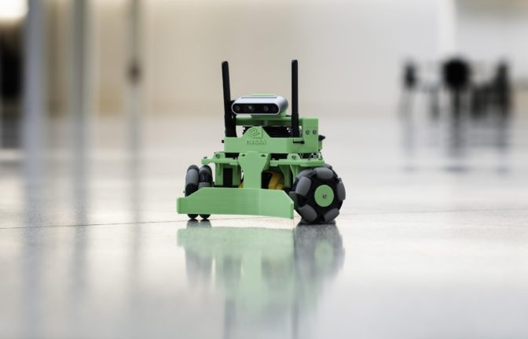

..
   Copyright (c) 2020, NVIDIA CORPORATION. All rights reserved.
   NVIDIA CORPORATION and its licensors retain all intellectual property
   and proprietary rights in and to this software, related documentation
   and any modifications thereto. Any use, reproduction, disclosure or
   distribution of this software and related documentation without an express
   license agreement from NVIDIA CORPORATION is strictly prohibited.

.. _kaya_hardware:

NVIDIA Kaya
======================

The Kaya robot is a platform to demonstrate the power and flexibility of the Isaac Robot
Engine running on the NVIDIA Jetson Nano™ platform. It has been designed with 3D-printed parts
and hobbyist components to be as accessible as possible.

`The Kaya Robot`

Kaya features a three-wheeled holonomic drive, which allows it to move in any direction, regardless
of the direction it is facing. A RealSense depth camera allows Kaya to see the world around it in 3D,
enabling features like mapping, localization, and object recognition. An on-board IMU and position
feedback from the wheel motors provide accurate odometry information. Power is provided via an
easily-swapped and fast-charging power tool battery. Outfitting the Jetson Nano with a
Wi-Fi/Bluetooth card allows you to interact with the robot using :ref:`sight-overview` over Wi-Fi,
and also allows you to connect a gamepad controller via Bluetooth.

Use the instructions in this section to build and operate your own Kaya robot.

.. _kaya_parts:

Kaya CAD Files
--------------

`Kaya Onshape document`_

The Kaya Onshape document contains CAD files describing all 3D-printed and off-the-shelf parts
required to build Kaya. The `Parts`_ section below describes the required off-the-shelf parts
in more detail.

You can use the Kaya Onshape document to export part files for 3D printing. You can also copy the
Kaya design to use as a template for your own robot or link to the design in another Onshape
project.

.. _Kaya Onshape document: https://cad.onshape.com/documents/03aa2560e7a40b2b7da40e12/w/001dbb6db63b0092c9ea5823/e/37043abce9062fab02c40889

Kaya Configurations
^^^^^^^^^^^^^^^^^^^

The Kaya Onshape document contains a number of configuration variants under the **Configurations**
heading:

* **Sensor Payload**: Switch between sensor types, which are described below.
* **Servo Motors**: Select a servo motor. If you select the XC-430 motor, you will need to modify
  the JSON configuration file for Kaya. See the `Dynamixel U2D2 & USB2AX Interchangeability`_
  section below for more details.
* **3D Printed Parts Only**: Check this box to isolate parts that need to be 3D printed.

.. Tip::

   The **3D Printed Parts Only** box may be hidden when you open the page: Use your mouse to expand
   the lower section of the **Configurations** section (as shown in the image below).

The **Sensor Payload** dropdown menu provides the following options:

* **RealSense Angled**: The standard version of Kaya. The Intel RealSense camera is angled
  downward so it can see objects that are in contact with its pusher.
* **RealSense Straight**: The standard version of Kaya with the Intel RealSense camera leveled
  horizontally. This configuration provides a better field of view than the **RealSense Angled**
  version.
* **RealSense & Helmet**: A Kaya variant with a 3D-printed helmet and apron to protect sensitive
  components. This version also requires a `90-degree adapter`_ for the camera USB cable and a
  sticky-back hook-and-loop fastener for the apron.
* **Lidar & Camera**: A version that uses a `YDLidar X4`_ lidar for navigation and a `Leopard IMX219`_
  for imaging.

.. Note::

   There are currently no assembly instructions or sample apps for the **Lidar & Camera** version
   of Kaya.

.. _90-degree adapter: https://www.amazon.com/Degree-Right-Extension-Charging-Oxsubor/dp/B07KWVG9KZ
.. _YDLidar X4: https://www.amazon.com/SmartFly-info-LIDAR-053-YDLIDAR-Frequency/dp/B07DBYHJVQ/
.. _Leopard IMX219: https://leopardimaging.com/product/nvidia-jetson-cameras/nvidia_nano_mipi_camera_kits/li-imx219-mipi-ff-nano/

Exporting Onshape Parts for 3D printing
^^^^^^^^^^^^^^^^^^^^^^^^^^^^^^^^^^^^^^^

Follow these steps to export part files from Onshape for 3D printing.

1. Under **Configurations**, select the **Sensor Payload** and **Servo Motors** you want to build
   with.
2. Check the **3D Printed Parts Only** box to isolate parts that need to be 3D printed.
3. On the toolbar at the bottom of the workspace, click the Export button (next to the "BOM"
   button).
4. Select a file format that is compatible with your 3D printer, which will be STL in most cases,
   and configure other file parameters as necessary.
5. Click **OK** to download the files for printing.

Parts
-----

The following is a list of the off-the-shelf components needed for building Kaya. Prices shown are
approximate and subject to change by vendors. Many of these components or suitable replacements are
available from a wide variety of sources, which you are encouraged to explore.

================================================= ========================================================== ======================================================================================================================================================================================================================================================================================================================================================================= ======= =============================================
**PART NAME**                                     **VENDOR PART #**                                          **SOURCE**                                                                                                                                                                                                                                                                                                                                                              **QTY** **APPROX COST**
================================================= ========================================================== ======================================================================================================================================================================================================================================================================================================================================================================= ======= =============================================
3D Printed Parts                                  -                                                          *See 3D Printed Parts List*                                                                                                                                                                                                                                                                                                                                             -       -
NVIDIA Jetson Nano Developer Kit                  945-13450-0000-000                                         `NVIDIA <https://developer.nvidia.com/buy-jetson?product=jetson_nano>`__                                                                                                                                                                                                                                                                                                1       $99.00
MicroSD Card (32GB)                               SDSQUNC-032G-GN6MA                                         `Amazon - SanDisk <https://www.amazon.com/SanDisk-microSDHC-Standard-Packaging-SDSQUNC-032G-GN6MA/dp/B010Q57T02/ref=sr_1_6?keywords=Micro+SD&qid=1550688765&s=gateway&sr=8-6>`__                                                                                                                                                                                        1       $8.00
Intel Dual Band Wireless-Ac 8265 W/Bt             8265NGW                                                    `Amazon - Intel <https://www.amazon.com/Intel-Dual-Band-Wireless-Ac-8265/dp/B01MZA1AB2/ref=sr_1_1?keywords=intel+8265ngw&qid=1553724227&s=electronics&sr=1-1>`__                                                                                                                                                                                                        1       $25.00
Dual Band Wi-Fi Antennas & IPEX4 to RP-SMA Cables CHAOHANG 6484109                                           `Amazon <https://www.amazon.com/CHAOHANG-RP-SMA-Antenna-Soldering-Wireless/dp/B01E29566W/ref=pd_bxgy_147_img_3/143-9820515-0065716?_encoding=UTF8&pd_rd_i=B01E29566W&pd_rd_r=24e8099a-325b-11e9-9916-7fe6d01b346e&pd_rd_w=Hz2rK&pd_rd_wg=eK9tl&pf_rd_p=6725dbd6-9917-451%22&%22d-beba-16af7874e407&pf_rd_r=0YDJ7K6AEJE56W35GHQB&psc=1&refRID=0YDJ7K6AEJE56W35GHQB>`__   1       $13.00
Intel RealSense Depth Camera D435                 961448                                                     `Intel <https://click.intel.com/intelr-realsensetm-depth-camera-d435.html>`__                                                                                                                                                                                                                                                                                           1       $179.00
Bosch GY-BMI160 6DOF IMU Board (Generic Breakout) GY-BMI160                                                  `Amazon / eBay / AliExpress <https://www.amazon.com/s?k=GY-BMI160>`__                                                                                                                                                                                                                                                                                                   1       $5.00
Dynamixel MX-12W Servo Motor (or XC430-W150-T)*   902-0086-000 (or 902-0155-000)                             `Robotis MX-12W <http://www.robotis.us/dynamixel-mx-12w/>`__ (or `Robotis XC430 <http://www.robotis.us/dynamixel-xc430-w150-t/>`__)                                                                                                                                                                                                                                      3       $197.70 (or 299.70)
USB2AX v3.2a (or U2D2)**                          XE-USB2AX (or RO-902-0132-000)                             `Trossen Robotics USB2AX v3.2a <https://www.trossenrobotics.com/usb2ax>`__ (or `Trossen Robotics U2D2 <https://www.trossenrobotics.com/dynamixel-u2d2.aspx>`__)                                                                                                                                                                                                         1       $39.95 (or $49.90)
Dynamixel 6 Port AX/MX Power Hub                  IL-3PHUB                                                   `Trossen Robotics <https://www.trossenrobotics.com/6-port-ax-mx-power-hub>`__                                                                                                                                                                                                                                                                                           1       $7.95
VEX 3.25" Omni-Directional Wheel                  217-4775                                                   `VEX Robotics <https://www.vexrobotics.com/omni-wheels.html>`__                                                                                                                                                                                                                                                                                                         3       $53.97
DeWALT 20V MAX 2AH Li-ion Battery                 DCB203                                                     `Amazon - DeWALT <https://www.amazon.com/DEWALT-DCB203-Compact-Li-Ion-Battery/dp/B00BYKVMES/ref=pd_day0_hl_469_4/143-9820515-0065716?_encoding=UTF8&pd_rd_i=B00BYKVMES&pd_rd_r=3f278334-46c0-11e9-969f-a1ee2b4b46aa&pd_rd_w=ntxfz&pd_rd_wg=BvWaf&pf_rd_p=ad07871c-e646-4161-82c7-%22&%225ed0d4c85b07&pf_rd_r=B544K119P03BHEB885K0&psc=1&refRID=B544K119P03BHEB885K0>`__ 1       $45.00
DeWALT 20V MAX Li-ion Battery Charger             DCB107                                                     `Amazon - DeWALT <https://www.amazon.com/dp/B06X94PH92/ref=psdc_8106529011_t1_B00X6BWHA6>`__                                                                                                                                                                                                                                                                            1       $34.75
5V 6A DC-DC Step-Down Regulator                   D24V60F5                                                   `Pololu <https://www.pololu.com/product/2865>`__                                                                                                                                                                                                                                                                                                                        1       $19.95
12V 5A DC-DC Step-Down Regulator                  EA60-12V                                                   `Amazon <https://www.amazon.com/gp/product/B01LY4RANA/ref=ppx_yo_dt_b_asin_title_o00_s00?ie=UTF8&psc=1>`__                                                                                                                                                                                                                                                              1       $9.50
2.1 x 5.5mm Male Barrel Plug Pigtail              B072BXB2Y8                                                 `Amazon <https://www.amazon.com/gp/product/B072BXB2Y8/ref=ppx_yo_dt_b_asin_title_o00_s00?ie=UTF8&psc=1>`__                                                                                                                                                                                                                                                              1       $0.94
Rocker Switch                                     7395K28                                                    `McMaster-Carr <https://www.mcmaster.com/7395k28>`__                                                                                                                                                                                                                                                                                                                    1       $6.76
Terminal Block                                    7527K44                                                    `McMaster-Carr <https://www.mcmaster.com/7527k44>`__                                                                                                                                                                                                                                                                                                                    1       $2.24
Terminal Block Jumpers                            7527K59                                                    `McMaster-Carr <https://www.mcmaster.com/7527k59>`__                                                                                                                                                                                                                                                                                                                    2       $0.49
Wire End/Terminal Kit                             HC28-6                                                     `Amazon <https://www.amazon.com/Accessbuy-Insulated-Electrical-Connector-Connectors/dp/B01L3MSLO0/ref=sr_1_7?keywords=terminal+connector&qid=1549832593&s=industrial&sr=1-7>`__                                                                                                                                                                                         -       $10.00
18AWG Electrical Wire (Red and Black)             -                                                          `Amazon <https://www.amazon.com/Electrical-Gauge-Silicone-Cable-Black/dp/B0746HMTPP/ref=sr_1_6?keywords=18+awg+red+black+wire&qid=1553726358&s=industrial&sr=1-6>`__                                                                                                                                                                                                    -       $5.00
Female-Female Electrical Jumper Wires             -                                                          `Amazon <https://www.amazon.com/GenBasic-Solderless-Dupont-Compatible-Breadboard-Prototyping/dp/B077NH83CJ/ref=sr_1_3?crid=3AWMVM5JYO01Y&keywords=female%2Bfemale%2Bjumper%2Bwires&qid=1553793205&refinements=p_85%3A2470955011&rnid=2470954011&rps=1&s=electronics&spre%22&%22%22&%22fix=female%2Bfemale%2B%2Celectronics%2C178&sr=1-3&th=1>`__                        4       $5.00
MakerBeam 150x10x10mm Beams                       bamb150p06                                                 `Amazon - MakerBeam <https://www.amazon.com/MakerBeam-150x10x10mm-beam-black-anodised/dp/B00G2DNT4I>`__                                                                                                                                                                                                                                                                 3       $5.00
MakerBeam 25 pieces T-slot nuts inc screws        101619                                                     `Amazon - MakerBeam <https://www.amazon.com/gp/product/B016OJNLJ2/ref=oh_aui_detailpage_o01_s01?ie=UTF8&psc=1>`__                                                                                                                                                                                                                                                       -       $17.00
M3 18mm threaded standoff                         95947A525                                                  `McMaster-Carr <https://www.mcmaster.com/95947a525>`__                                                                                                                                                                                                                                                                                                                  3       $3.66
M3 x 35mm Socket Head Screw                       91292A033                                                  `McMaster-Carr <https://www.mcmaster.com/91292a033>`__                                                                                                                                                                                                                                                                                                                  3       $3.54
M3 x 8mm Socket Head Screw                        91292A112                                                  `McMaster-Carr <https://www.mcmaster.com/91292a112>`__                                                                                                                                                                                                                                                                                                                  -       $4.29
M3 x 5mm Socket Head Screw                        91292A110                                                  `McMaster-Carr <https://www.mcmaster.com/91292a110>`__                                                                                                                                                                                                                                                                                                                  -       $4.72
M3 Hex Nuts                                       90591A250                                                  `McMaster-Carr <https://www.mcmaster.com/90591a250>`__                                                                                                                                                                                                                                                                                                                  -       $2.21
M2 x 6mm Phillips Screw                           92010A003                                                  `McMaster-Carr <https://www.mcmaster.com/92010a003>`__                                                                                                                                                                                                                                                                                                                  -       $4.39
\                                                                                                                                                                                                                                                                                                                                                                                                                                                                                            **$812.87**
================================================= ========================================================== ======================================================================================================================================================================================================================================================================================================================================================================= ======= =============================================

*Dynamixel MX-12W & XC-430-W150-T Servo Interchangeability
^^^^^^^^^^^^^^^^^^^^^^^^^^^^^^^^^^^^^^^^^^^^^^^^^^^^^^^^^^

Kaya has been tested with Dynamixel MX-12W and XC-430-W150-T servos. If you want use
the XC-430-W150-T servos, you will need to use the U2D2 serial converter and swap the Dynamixel
6 Port AX/MX Power Hub for the `RX/EX (4-pin) version <https://www.trossenrobotics.com/6-port-rx-power-hub>`_.

If no servo is specified in :code:`\apps\kaya\kaya_hardware.config.json`, then the MX-12W will
be used as a default. To use XC-430 servos, you must specify `XC430` in the :code:`servo_model`
parameter of the :code:`isaac.dynamixel.DynamixelDriver` component API.

In the following example, the XC-430 servo is specified:

.. code-block:: javascript

   {
      "dynamixels": {
         "driver": {
            "port": "/dev/ttyUSB0"
            "servo_model": "XC430"
         }
      }
   }

**Dynamixel USB2AX & U2D2 Interchangeability
^^^^^^^^^^^^^^^^^^^^^^^^^^^^^^^^^^^^^^^^^^^^

The Dynamixel MX-12W servos may be used with either the USB2AX or U2D2 serial converter, while
the XC-430-W150-T servos require the U2D2 serial converter.

You must specify the USB device name of the converter in the :code:`port` parameter of the
`isaac.dynamixel.DynamixelDriver` component API so that your application can communicate with it.
For the Kaya sample applications included in Isaac SDK, this is found in
:code:`\apps\kaya\kaya_hardware.config.json`. In the following example, the U2D2 serial
converter is specified.

.. code-block:: javascript

   {
      "dynamixels": {
         "driver": {
            "port": "/dev/ttyUSB0"
         }
      }
   }

The devices have the following USB device names.

- USB2AX: "ttyACM0"

- U2D2: "ttyUSB0"

See the :ref:`isaac.dynamixel.DynamixelDriver` Component API entry for more information.

.. _wiring_diagram:

Wiring Diagram
--------------

See below for a wiring diagram of the Kaya robot. You may find it useful to reference this during
the assembly process. Click for a larger version.

`Wiring Diagram for the Kaya Robot`

Assembly Instructions
---------------------

This section describes step-by-step assembly of the Kaya robot.

The underscore-delimited names that appear in parentheses in the steps below are the names of
3D-printed parts. See :ref:`kaya_parts` for links to that list.

.. Note::

   Some Kaya components, including the Jetson Nano and BMI160 IMU, have unprotected electronic
   components. When handling these devices, avoid contact that could lead to electrostatic discharge
   (ESD), which may damage the devices.

**1. Assign IDs to the Dynamixel Motors**

When first purchased, the Dynamixel motors are all assigned ID “1”, so they must be assigned unique
IDs and properly configured before being connected together on Kaya. This procedure requires a USB
serial adapter (USB2AX or U2D2), an external 12V power source (the 12V DC-DC converter on Kaya), and
a PC to run the RoboPlus v1 software.

.. note:: RoboPlus 2.0 does not work with MX-12W. You can download the RoboPlus v1 application
          `here`_.

.. _here: http://en.robotis.com/service/downloadpage.php?ca_id=10

You can also complete this step after the rest of Kaya is assembled. Just be aware that you should
only connect one motor at a time to avoid duplicate IDs.

To assign IDs to the motors:

1. Start the RoboPlus v1 application.

2. Connect the USB serial converter to the desktop.

3. Connect a Dynamixel motor to the serial adapter.

4. Connect the Dynamixel motor to external (12V) power.

5. Launch **Dynamixel Wizard** in the RoboPlus v1 application.

6. Open **Port** (top menu) to detect connected motors.

7. Click on the correct motor, assign the ID # below and wheel mode. Click Apply.

    - Left: ID 1

    - Rear: ID 2

    - Right: ID 3

8. Repeat step 7 for each motor, and annotate the ID placard for each motor accordingly.

.. tip::

   If you are having trouble configuring the Dynamixel Motors, see `this tutorial`_ provided
   by Trossen Robotics.

.. _this tutorial: https://learn.trossenrobotics.com/projects/194-setting-dynamixel-ax-and-mx-series-firmware-id-and-baud-with-roboplus-1-0.html

**2. Install Dynamixel Servo Motors (three per Robot)**

1. Insert four M2 nuts from the Dynamixel MX-12W motor kits into the second slot up from the horn
   (servo head) on all sides. Press firmly to secure.

   .. image:: images/kaya2.jpg
      :align: center

2. Install each motor into a motor bottom plate (Kaya_Motor_Bottom_Plate) using four M2 screws from
   the Dynamixel MX-12W motor kits.

   .. image:: images/kaya2a.jpg
      :align: center

**3. Assemble the Inside Wheel Hub (three per Robot)**

1. Insert an 18mm M3 standoff into the hex hole on the back side of the hub (Kaya_Wheel_Hub_Inside).

2. Using four M2 screws from the Dynamixel MX-12W motor kits, fasten the hub (Kaya_Wheel_Hub_Inside)
   to the horn of the Dynamixel. Tighten evenly. Be careful not to over-tighten.

3. Repeat for each motor.

   .. image:: images/kaya3.jpg
      :align: center

**4. Cut and Crimp Power Wiring**

1. Cut nine sections of 18 AWG (four black, five red) wire to length and strip 3-5mm of insulation
   from the ends.

2. Attach connectors according to the table using a suitable crimping tool. Ensure that
   all connectors are mechanically secure and make good electrical contact.

   Refer to the following image and table, as well as the :ref:`wiring_diagram`, when cutting and
   crimping wiring.

   .. image:: images/kaya4.jpg
      :align: center

+----------------+----------------+----------------+----------------+----------------+----------------+----------------+
| **Wire#**      | **Color**      | **Length**     | **Terminal 1   | **Terminal 1   | **Terminal 2   | **Terminal 2   |
|                |                |                | Connector**    | Connection**   | Connector**    | Connection**   |
+----------------+----------------+----------------+----------------+----------------+----------------+----------------+
| 1              | Black          | 140 mm         | Male Spade     | Battery B-     | Fork Spade     | Terminal Block |
|                |                |                |                |                |                | B-             |
+----------------+----------------+----------------+----------------+----------------+----------------+----------------+
| 2              | Red            | 80 mm          | Male Spade     | Battery B+     | Female Spade   | Switch IN      |
+----------------+----------------+----------------+----------------+----------------+----------------+----------------+
| 3              | Red            | 140 mm         | Female Spade   | Switch OUT     | Fork Spade     | Terminal Block |
|                |                |                |                |                |                | B+             |
+----------------+----------------+----------------+----------------+----------------+----------------+----------------+
| 4              | Black          | 120 mm         | Fork Spade     | Terminal Block | Fork Spade     | 12V Regulator  |
|                |                |                |                | B-             |                | -IN            |
+----------------+----------------+----------------+----------------+----------------+----------------+----------------+
| 5              | Red            | 120 mm         | Fork Spade     | Terminal Block | Fork Spade     | 12V Regulator  |
|                |                |                |                | B+             |                | +IN            |
+----------------+----------------+----------------+----------------+----------------+----------------+----------------+
| 6              | Black          | 120 mm         | Fork Spade     | Terminal Block | Bare Wire      | 5V Regulator   |
|                |                |                |                | B-             |                | -IN            |
+----------------+----------------+----------------+----------------+----------------+----------------+----------------+
| 7              | Red            | 120 mm         | Fork Spade     | Terminal Block | Bare Wire      | 5V Regulator   |
|                |                |                |                | B+             |                | +IN            |
+----------------+----------------+----------------+----------------+----------------+----------------+----------------+
| 8              | Black          | 120 mm         | Fork Spade     | 12V Regulator  | Bare Wire      | Dynamixel Hub  |
|                |                |                |                | -OUT           |                | -IN            |
+----------------+----------------+----------------+----------------+----------------+----------------+----------------+
| 9              | Red            | 120 mm         | Fork Spade     | 12V Regulator  | Bare Wire      | Dynamixel Hub  |
|                |                |                |                | +OUT           |                | +IN            |
+----------------+----------------+----------------+----------------+----------------+----------------+----------------+

**5. Connect Battery Terminals to the Battery Holder**

1. Place Battery terminal cables (wires #1 and #2) into slots in the battery holder
   (Kaya_Battery_Holder), paddles facing each other as depicted below. The B+ (red wire) should be
   seated in the slot nearest to the notch cut out of the battery holder. Push firmly on the top of
   the crimps to seat properly in the channels.

   .. image:: images/kaya5.jpg
      :align: center

2. Secure the cables using the terminal holder (Kaya_Battery_Terminal_Holder) and an M3 x 8mm screw.
   Check alignment with the battery, and use pliers to adjust the paddles until they align and seat
   properly. To avoid creating an electrical short between the battery terminals, cover any loose
   wire ends with electrical tape.

   .. image:: images/kaya5a.jpg
      :align: center

**6. Assemble the Frame**

1. Attach each motor top plate (Kaya_Motor_Top_Plate) to MakerBeams using four MakerBeam nuts and
   four M3 x 5mm screws at each corner. Slide the MakerBeam nuts into channels first, two per side,
   and then align with the holes before fastening with screws.

   .. image:: images/kaya6.jpg
      :align: center

2. Between two motor top plates (Kaya_Motor_Top_Plate), install the pusher mount
   (Kaya_Pusher_Mount), remembering to slide nuts into place before attaching the second motor
   top plate.

3. Assemble the full triangle and tighten all 12 screws evenly. For the rest of these installation
   steps, the side with the pusher mount (Kaya_Pusher_Mount) is referred to as the front of Kaya.

   .. image:: images/kaya6a.jpg
      :align: center

**7. Connect the Bottom Plate Assembly to the Motor Top Plate/MakerBeam Frame**

1. Attach each motor bottom plate (Kaya_Motor_Bottom_Plate) assembly to the frame in the correct
   configuration. The motor assembly tagged with Dynamixel ID 2 should sit opposite to the pusher
   mount (Kaya_Pusher_Mount), with the other two motor assemblies on the adjacent sides.

2. Insert four M3 nuts into a motor bottom plate (Kaya_Motor_Bottom_Plate), and attach to motor top
   plates (Kaya_Motor_Top_Plate) with four M3 x 8mm screws. Repeat for each motor. Tighten all 12
   screws evenly.

   .. image:: images/kaya7.jpg
      :align: center

**8. Connect Motor Wiring**

- When all of the Dynamixel MX-12W servo motors have been assigned IDs (see step 1) and have been
  installed in the proper locations, connect them for power and data transmission using the cables
  from the Dynamixel MX-12W motor kits.

  All servo motors share common power and data lines and communicate using data packets addressed
  by motor ID. For this reason, they may be connected in any order, or even wired individually to
  the Dynamixel Power Hub. For cable management purposes, the best connection order is 1 - 3 - 2.

  .. image:: images/kaya8.jpg
     :align: center

**9. Mount the IMU**

1. Solder the male header pins to the IMU board. Arrange them with long ends on the labeled side
   of the board. Pins for 3V3, GND, SCL, and SDA will be used for I2C communication.

2. Use two M2 x 6mm screws to mount the IMU board with header pins facing towards the center of the
   electronics bay (Kaya_Electronics_Bay), as shown below.

  .. image:: images/kaya9.jpg
     :align: center

**10. Mount DC Regulators**

1. Solder the blue screw terminals to the Pololu 5V 6A DC-DC Step-Down Regulator.

2. Fasten the 5V regulator and 12V regulator to the electronics bay (Kaya_Electronics_Bay) with
   six M2 x 6mm screws. Ensure the orientation of these regulators matches the image,
   with IN+/- on the 5V regulator on the same side as IN+/- on the 12V regulator.

   .. image:: images/kaya10.jpg
      :align: center

**11. Connect IMU Wiring**

1. Attach female-to-female electrical jumper wires to IMU leads (3V3, GND, SCL, and SDA). Make note
   of what color wires are attached to each pin: These will later be connected to the Jetson Nano
   GPIO pins.

2. Optionally, use a dab of hot glue on the middle side of the headers to hold the IMU pin
   headers firmly in place.

   .. image:: images/kaya11.jpg

See :ref:`wire-bmi160-imu` for more information.

**12. Install Wi-Fi Antennas**

1. Connect the antenna cables to the Wi-Fi antennas using the SMA screw terminal.

2. Bend antennas to 90 degrees and fit them in the designated channels on either side of the
   base (Kaya_Nano_Base).

3. Fasten antennas in place using zip-ties, as shown.

   .. image:: images/kaya12.jpg
      :align: center

**13. Attach the Jetson Nano Base to the Frame**

1. Orient the Jetson Nano Base (Kaya_Nano_Base) so that the NVIDIA logo faces the Kaya pusher mount
   (Kaya_Pusher_Mount).

2. Slide one MakerBeam nut onto the top of the front MakerBeam, and two onto the other two
   MakerBeams. Fasten the front screw first, then position the other four on the side beams.
   Tighten all screws evenly.

   .. image:: images/kaya13.jpg
      :align: center

**14. Connect the Battery Chassis Assembly to the New Frame Assembly**

1. Stack the electronics bay (Kaya_Electronics_Bay) on top of the battery holder
   (Kaya_Battery_Holder) with the flat faces together, DC regulators face-up.

2. Bring the top of the electronics bay (Kaya_Electronics_Bay) into contact with the bottom of the
   base (Kaya_Nano_Base), so that it sits in the center of the frame assembly, between the motors.

3. Ensure that no cables are being pinched. Check that the front Dynamixel cables are not on top of
   the 12V power supply. Then attach using four M3 x 35mm screws down through the base
   (Kaya_Nano_Base) and into four M3 nuts in the battery holder (Kaya_Battery_Holder).

   .. image:: images/kaya14.jpg
      :align: center

**15. Prepare the Terminal Block**

- Using terminal block jumpers, join the two leftmost terminal block connections together, then the
  two rightmost connections. This allows battery B+ and B- to be routed to the 12V and 5V DC
  regulators.

  Reference the :ref:`wiring_diagram` when making electrical connections as outlined in the
  following steps.

  .. image:: images/kaya15.jpg
     :align: center

**16. Install the Power Switch**

1. Locate the B+ wire (#2, Red) from the battery holder, and feed it through the switch hole at the
   rear of of the base (Kaya_Nano_Base). Connect the female spade connector to the middle switch
   terminal.

2. Attach a second wire (#3, Red, female spade to fork spade) to the outer switch terminal.

3. Orient the switch so that the two terminals are closest to the inside of Kaya. Slightly bend the
   connected terminal wires to face the outside of Kaya as in the image. This helps them to clear
   the battery holder (Kaya_Battery_Holder) once installed.

4. Feed the unattached fork spade connector through the switch hole and toward the rear of Kaya.

5. Snap the switch down into place, being careful to avoid pinched wires.

   .. image:: images/kaya16.jpg
      :align: center

**17. Connect Regulator Inputs**

1. Pull the B- wire (#1, Black) from the battery and the B+ wire from the switch (#3, Red) to the
   rear of Kaya. Connect the fork spade connectors of these wires to the terminal block, referencing
   the :ref:`wiring_diagram`. These wires should route neatly between the MakerBeams below the
   terminal block.

   .. image:: images/kaya17a.jpg
      :align: center
      :width: 640px

2. Connect wires #4 through #7 to the terminal block using fork spade connectors. Reference the
   photos and :ref:`wiring_diagram` for cable order. Bend the forks downward after they are
   connected onto the terminal block for a better fit.

   .. image:: images/kaya17b.jpg
      :align: center
      :width: 640px

3. Tuck the other cables underneath the base (Kaya_Nano_Base) and into the electronics bay
   (Kaya_Electronics_Bay). Connect cables #4 and #5 to the 12V regulator IN+/-, and cables #6 and #7
   to the 5V regulator IN+/-. Note that the connections on the 12V regulator are ordered +IN, -IN,
   -OUT, +OUT, as indicated in the :ref:`wiring_diagram`.

**18. Connect Regulator Outputs**

1. Attach a 2.1 x 5.5mm male barrel plug pigtail to the 5V regulator out screw terminals. Note that
   the Brown wire is +, and the Blue wire is - (Center positive polarity).

2. Connect the fork spade connectors of cables #8 and #9 to the 12V regulator OUT- and OUT+. Connect
   bare wire ends to the Dynamixel Power Hub screw terminals, routing the cables either back through
   or around the base (Kaya_Nano_Base).

   .. image:: images/kaya18.jpg
      :align: center

**19. Mount the Terminal Block**

1. Mount the terminal block to the frame with three MakerBeam nuts and two M3 x 8mm screws. Slide one
   extra nut ahead of right side of terminal block for later use with the terminal block cover
   (Kaya_Terminal_Block_Cover).

2. Position the Terminal Block as far back as possible by using only the front set of mounting
   holes.

   .. image:: images/kaya19.jpg
      :align: center

**20. Mount the Dynamixel Power Hub**

1. Connect the loose Dynamixel cable from servo motor ID3 to any port on the Dynamixel Power Hub.

2. Use another Dynamixel cable to connect the USB2AX to the Dynamixel Power Hub. Mount the Dynamixel
   Power Hub to the base (Kaya_Nano_Base) with two M2x6 screws, as shown below.

   .. image:: images/kaya20.jpg
      :align: center

**21. Connect the Wi-Fi Card**

Connect the small antenna cable connectors (U.FL / AMC / UMCC / IPX) to the Wi-Fi card. These
should snap into place with vertical pressure, but can be difficult to work with. It may be
helpful to lay the card on a flat surface for best leverage. Take care not to damage the
connectors on the card, and avoid disconnecting and reconnecting if possible.

   .. image:: images/kaya21.jpg
      :align: center

**22 Install the Wi-Fi Card**

1. Remove the Jetson Nano module from the carrier board by first removing two Phillips screws, then
   the 2 side latches.

2. Connect the Wi-Fi card and secure with the included screw.

  .. image:: images/kaya22a.jpg
     :align: center

3. Reattach and secure the Jetson Nano module to the carrier board.

**23. Mount the Jetson Nano**

1. Mount the Jetson Nano Developer Kit to Kaya_Nano_Base using four M2 x 6mm screws, as shown in the
   image below. For cable management, it may be helpful to coil the antenna cables beneath the
   Jetson Nano.

2. Add a jumper across the header pins labeled “ADD JMPR TO DISABLE USB PWR” on the carrier board to
   allow the Jetson Nano to be powered via the 5V barrel jack connection.

  .. image:: images/kaya23.jpg
     :align: center

**24. Mount the RealSense Camera**

1. Attach the RealSense camera to the camera mount (Kaya_Realsense_Mount) with two M3 x 5mm screws.

2. Use three M3 x 8mm screws and three M3 nuts to attach the camera mount (Kaya_Realsense_Mount)
   to the camera bridge (Kaya_Realsense_Bridge).

3. Connect the USB-C cable to the RealSense camera.

   .. image:: images/kaya24a.jpg
      :align: center

   .. image:: images/kaya24b.jpg
      :align: center

**25. Attach the RealSense Bridge to the Jetson Nano Base**

- Use four M3 x 8mm and four M3 nuts to attach the camera bridge (Kaya_Realsense_Bridge) to the base
  (Kaya_Nano_Base).

   .. image:: images/kaya25.jpg
      :align: center

**26. Mount the Wheels**

- Attach each Omniwheel using one M3 x 35mm screw through the outside wheel hub
  (Kaya_Wheel_Hub_Outside), the wheel itself, and then into the inside hub (Kaya_Wheel_Hub_Inside).
  Take care not to over-tighten.

  Threadlocker may be used to prevent loosening of these fasteners.

   .. image:: images/kaya26.jpg
      :align: center

**27. Attach the Terminal Block Cover**

- Using the extra MakerBeam nut from step 19, attach the terminal block cover
  (Kaya_Terminal_Block_Cover) using a M3 x 5mm screw.

   .. image:: images/kaya27.jpg
      :align: center

**28. Connect Cables to Jetson Nano**

1. Connect the RealSense camera and USB2AX to the top two USB ports on the Nano.

2. Ensure the power switch is *not* set to “ON”.

3. Route the barrel plug cable from the 5V regulator behind the terminal block cover
   (Kaya_Terminal_Block_Cover) and plug it into the barrel jack input of Jetson Nano.

   .. note:: **Never connect the 5V barrel plug cable to the barrel jack input of the Dynamixel
             Power Hub.** This may cause irreversible damage to the voltage regulators.

4. Connect the jumper wires from the IMU to the Jetson Nano GPIO pins, referencing the
   :ref:`wiring_diagram` and your earlier notes on wire colors.

   .. image:: images/kaya28.jpg
      :align: center

**29. Clean Up Cables and Power On**

1. Tuck the front Dynamixel cables up in front of the 12V regulator and MakerBeam.

2. Zip-tie other Dynamixel and power supply cables as desired.

3. Install Battery and ensure it snaps into place. If there is resistance, check for cables and any
   remaining 3D printed support material, then ensure your terminals are not bent.

4. Install the pusher (Kaya_Pusher) by sliding it down into the pusher mount (Kaya_Pusher_Mount).

   Congratulations, you have fully assembled a Kaya robot! Have fun tinkering with your new creation
   and the Isaac Robot Engine!

   .. image:: images/kaya29.jpg
      :align: center

Notes on Power-Hungry Applications
----------------------------------

You may encounter issues when running more demanding applications on Jetson Nano, especially when
running in “MAX-N” mode.

Be careful that 3D printed PLA plastic parts do not come into contact with the heatsink if there are
concerns with Jetson Nano overheating. Kaya is not equipped with a fan to aid with cooling. The
Jetson Nano Developer Kit provides a 4-pin connector to accommodate 5V PWM fans. However, adding a
fan to Kaya requires removal or custom modification of several 3D printed parts.

Raising the nominal output voltage of the 5V regulator can help safeguard against the effects of
transient voltage dips. This can be accomplished by soldering a thru-hole resistor between the FB
and GND pins on the Pololu 5V regulator board. A resistor value of 82.5 kOhm increases the nominal
output voltage to 5.143V.

   .. image:: images/kaya_opt_a.jpg
      :align: center

The following image shows the resistor correctly installed:

   .. image:: images/kaya_opt_b.jpg
      :align: center

A capacitor (100-1000 uF) may also be placed across the regulator output terminals to further
safeguard against transient voltage fluctuations. For more information, please reference the
datasheet for the Microchip MIC2101.

Running Isaac SDK on Kaya
-------------------------

Once you have assembled your Kaya, use the procedures in :ref:`kaya_software` to get started with
Isaac on the Jetson Nano and run a couple of sample applications.
