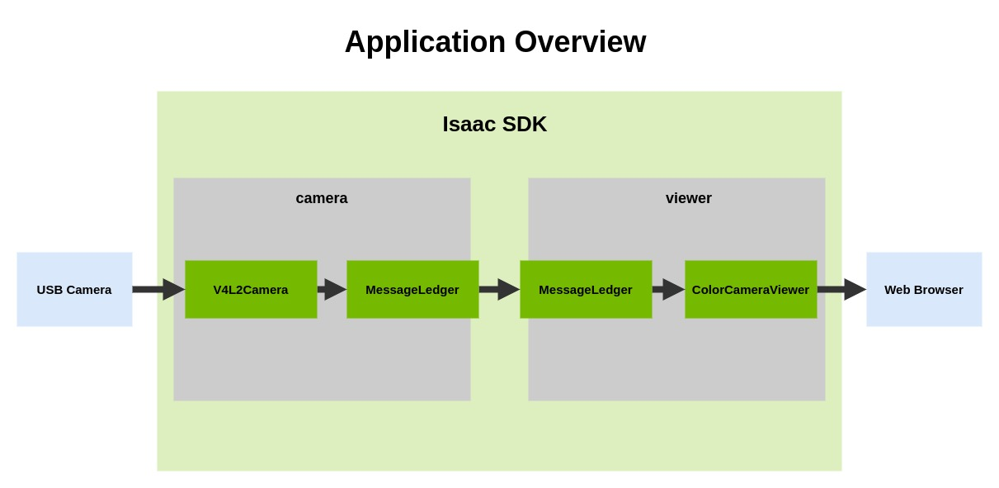
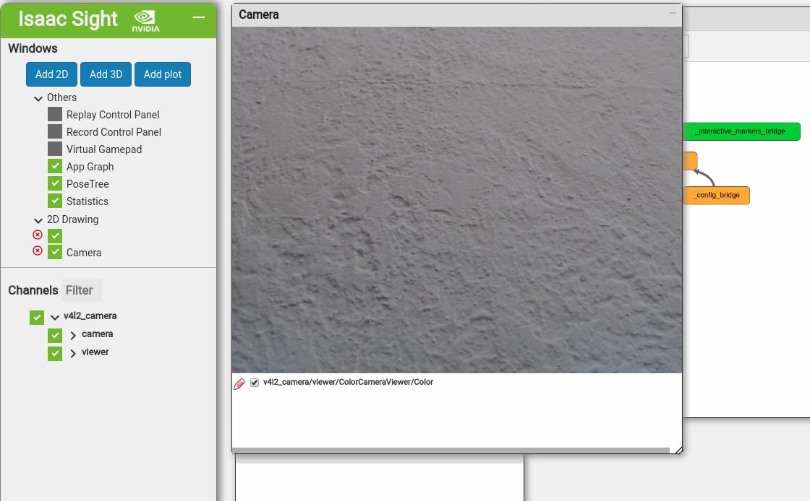
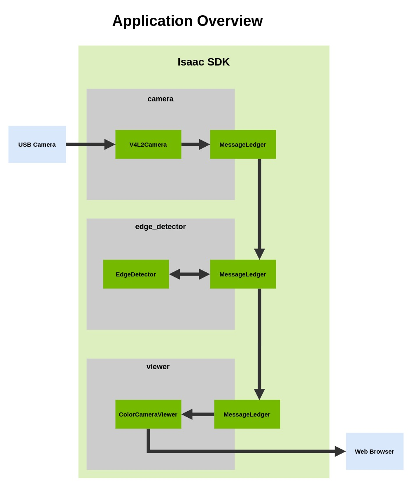
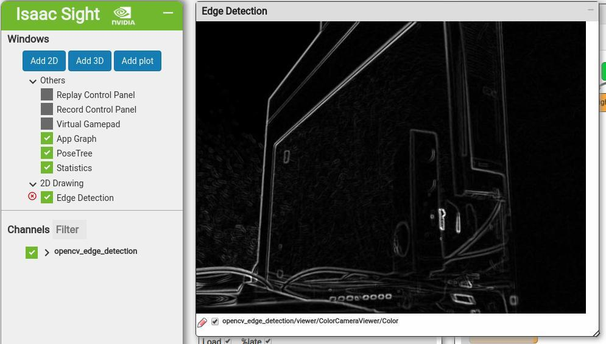
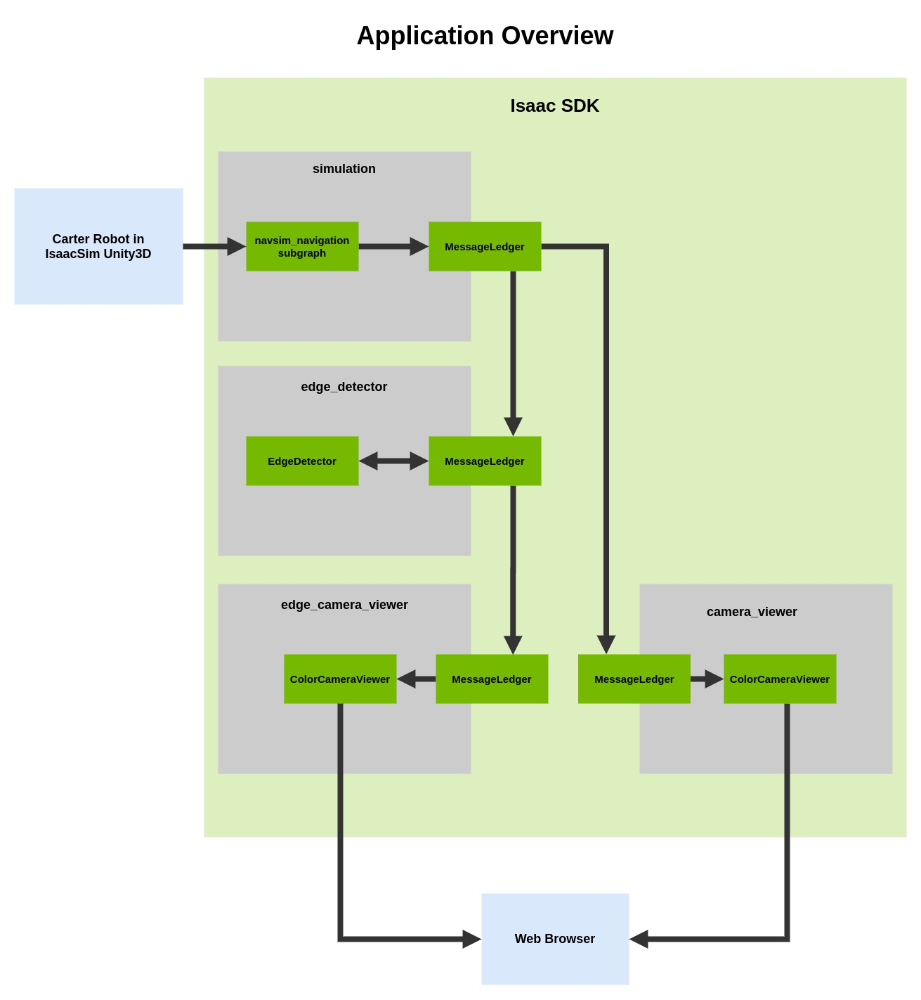
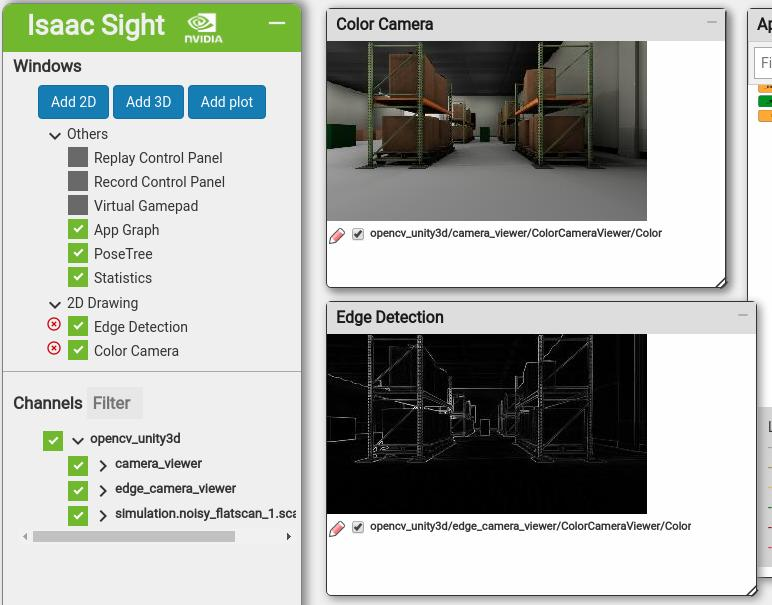

.. _building_apps_tutorial:

Building Isaac Applications
===========================

This tutorial will guide you through the process of creating robotics apps with Isaac SDK, using
`OpenCV edge detection`_ processing of video input as an example.

.. _OpenCV edge detection: https://docs.opencv.org/trunk/da/d22/tutorial_py_canny.html

This tutorial will guide you through the following steps:

1. Using Isaac SDK to display a USB camera feed.
2. Processing the camera feed using OpenCV edge detection and displaying the processed feed.
3. Using OpenCV edge detection to process simulated input from Isaac Sim Unity3D.

Prerequisites
-------------

This tutorial requires the following hardware/software:

* A Linux x86 machine installed with Issac SDK and all prerequisites, as well
  as Isaac Sim Unity3D. See the :ref:`Setup <setup-isaac>` page for more details.
* A USB camera that is compatible with the Video4Linux2 (V4L2) drivers

Displaying a Camera Feed
------------------------

As a first step, we'll capture a camera feed on a Linux x86 machine using the Isaac V4L2 component
and display it in Websight.

.. Note:: Complete JSON and BUILD files for this application are available at
          :code:`//apps/samples/v4l2_camera`.

Create an Application File
^^^^^^^^^^^^^^^^^^^^^^^^^^

Create a JSON application file named :code:`v4l2_camera.app.json` in a new folder in the Isaac
:code:`//apps` directory. Add the contents shown below:

.. code::

   {
      "name": "v4l2_camera",
      "modules": [
        "sensors:v4l2_camera",
        "sight",
        "viewers"
      ],
      "graph": {
          "nodes": [
            {
              "name": "camera",
              "components": [
                {
                  "name": "V4L2Camera",
                  "type": "isaac::V4L2Camera"
                }
              ]
            },
            {
              "name": "viewer",
              "components": [
                {
                  "name": "ImageViewer",
                  "type": "isaac::viewers::ImageViewer"
                }
              ]
            }
          ]
   }

The application "graph" defines two nodes: a "camera" node, which captures the camera feed
using the V4L2Camera component, and a "viewer" node, which displays the feed in Websight
using the ImageViewer component. The "modules" section includes these components in the
application.

Enable Communication between Nodes
^^^^^^^^^^^^^^^^^^^^^^^^^^^^^^^^^^

To enable communication between the "camera" and "viewer" nodes, add the MessageLedger component
to both of them:

.. code::

   {
      "name": "v4l2_camera",
      "modules": [
        "sensors:v4l2_camera",
        "sight",
        "viewers"
      ],
      "graph": {
          "nodes": [
            {
              "name": "camera",
              "components": [
                {
                  "name": "MessageLedger",
                  "type": "isaac::alice::MessageLedger"
                },
                {
                  "name": "V4L2Camera",
                  "type": "isaac::V4L2Camera"
                }
              ]
            },
            {
              "name": "viewer",
              "components": [
                {
                  "name": "MessageLedger",
                  "type": "isaac::alice::MessageLedger"
                },
                {
                  "name": "ImageViewer",
                  "type": "isaac::viewers::ImageViewer"
                }
              ]
            }
          ],
   }

Use the "edges" subsection to connect the source "camera" node to the target "viewer" node.

.. code::

      "graph": {
          "nodes": [
            ...
          ],
          "edges": [
            {
              "source": "camera/V4L2Camera/frame",
              "target": "viewer/ImageViewer/image"
            }
          ]

Configure the Components
^^^^^^^^^^^^^^^^^^^^^^^^

Add a "config" section to set parameters for the USB camera and Websight server. Within the
"websight" section, the "windows" subsection creates a window to render the camera feed in Websight.

.. code::

   {
     "name": "v4l2_camera",
     "modules": [
       "sensors:v4l2_camera",
       "sight",
       "viewers"
     ],
     "graph": {
     ...
     },
     "config": {
       "camera": {
         "V4L2Camera": {
           "device_id": 0,
           "rows": 480,
           "cols": 640,
           "rate_hz": 30
         }
       },
       "websight": {
         "WebsightServer": {
           "port": 3000,
           "ui_config": {
             "windows": {
               "Camera": {
                 "renderer": "2d",
                 "channels": [
                   { "name": "v4l2_camera/viewer/ImageViewer/image" }
                 ]
               }
             }
           }
         }
       }
     },

Create a Bazel BUILD File
^^^^^^^^^^^^^^^^^^^^^^^^^

Create a file named :code:`BUILD` in the same directory as your JSON application file. The BUILD
file specifies the "name" of the application and the Isaac modules used by the application. The
application name should match the :code:`<name>` of the :code:`<name>.app.json` application
filename.

.. code::

   load("//bzl:module.bzl", "isaac_app")

   isaac_app(
       name = "v4l2_camera",
       modules = [
           "sensors:v4l2_camera",
           "sight",
           "viewers",
       ],
   )

Run the Application
^^^^^^^^^^^^^^^^^^^

Open a console window, navigate to the :code:`Isaac` directory, and run the application as
described on the :ref:`Getting Started <running_an_app>` page:

.. code-block:: bash

   bob@desktop:~/isaac/sdk$ bazel run //apps/samples/v4l2_camera

The application may take a minute to compile and run.

View the Camera Feed
^^^^^^^^^^^^^^^^^^^^

Open Websight in a web browser by navigating to :code:`http://localhost:3000/`. You should see
the video stream in a window in Websight. If you don't, ensure the **Channels > v4l2_camera** box
is checked on the left.

To stop the application, press **Ctrl+C** in the console.

Processing the Camera Feed
--------------------------

Next, we'll build off the application graph created in the previous section to perform edge
detection on the camera feed.

.. Note:: Complete JSON and BUILD files for this application are available at
          :code:`//apps/tutorials/opencv_edge_detection`. The JSON filename
          is :code:`opencv_edge_detection.app.json`.

Add an Edge Detection Node
^^^^^^^^^^^^^^^^^^^^^^^^^^

Add a third node, "edge_detector", to the application graph. This node will perform edge
detection on the V4L2 camera feed using the Isaac EdgeDetector component.

.. code::

   "graph": {
       "nodes": [
         {
           "name": "camera",
           "components": [
             {
               "name": "MessageLedger",
               "type": "isaac::alice::MessageLedger"
             },
             {
               "name": "V4L2Camera",
               "type": "isaac::V4L2Camera"
             }
           ]
         },
         {
           "name": "edge_detector",
           "components": [
             {
               "name": "MessageLedger",
               "type": "isaac::alice::MessageLedger"
             },
             {
               "name": "EdgeDetector",
               "type": "isaac::opencv::EdgeDetector"
             }
           ]
         },
         {
           "name": "viewer",
           "components": [
             {
               "name": "MessageLedger",
               "type": "isaac::alice::MessageLedger"
             },
             {
               "name": "ImageViewer",
               "type": "isaac::viewers::ImageViewer"
             }
           ]
         }
       ],

You'll also need to add the EdgeDetector component in the "modules" section:

.. code::

   "modules": [
       "//apps/tutorials/opencv_edge_detection:edge_detector",
       "sensors:v4l2_camera",
       "sight",
       "viewers"
   ],

Modify the Application Edges
^^^^^^^^^^^^^^^^^^^^^^^^^^^^

Modify the "edges" section so that the "camera" node passes the feed to the "edge_detector" node,
which then sends the processed feed to the "viewer" node.

.. code::

      "graph": {
          "nodes": [
            ...
          ],
          "edges": [
            {
              "source": "camera/V4L2Camera/frame",
              "target": "edge_detector/EdgeDetector/input_image"
            },
            {
              "source": "edge_detector/EdgeDetector/output_image",
              "target": "viewer/ImageViewer/image"
            }
          ]

Modify the BUILD File
^^^^^^^^^^^^^^^^^^^^^

Include the EdgeDetector codelet in the application BUILD file:

.. code::

   load("//bzl:module.bzl", "isaac_app", "isaac_cc_module")

   isaac_app(
       name = "opencv_edge_detection",
       modules = [
           "//apps/tutorials/opencv_edge_detection:edge_detector",
           "sensors:v4l2_camera",
           "sight",
           "viewers",
       ],
   )

Run the Application
^^^^^^^^^^^^^^^^^^^

Run the application:

.. code-block:: bash

   bob@desktop:~/isaac/sdk$ bazel run //apps/tutorials/opencv_edge_detection

Open Websight. You should see the video stream with edge detection. If you don't, ensure the
**Channels > opencv_edge_detection** box is checked on the left.

Processing Input from Simulation
--------------------------------

In this final section, we will integrate our edge-detection application with a simulated robot.

.. Note:: Complete JSON and BUILD files for this application are available at
          :code:`//apps/tutorials/opencv_edge_detection`. The JSON filename
          is :code:`opencv_unity3d.app.json`.

Replace the Camera Node
^^^^^^^^^^^^^^^^^^^^^^^

Remove the "camera" node from the application graph. Replace it with a "simulation" node as shown
below. The subgraph in this node allows the application to access various data streams from the
Unity3D simulation as if they were real sensors. This subgraph also enables sending commands to
the Carter robot in simulation, though this topic is not covered in the Building Apps tutorial.

.. code::

   "graph": {
     "nodes": [
       {
         "name": "simulation",
         "subgraph": "packages/navsim/apps/navsim_navigation.subgraph.json"
       },
       {
         "name": "edge_detector",
         "components": [
           {
             "name": "MessageLedger",
             "type": "isaac::alice::MessageLedger"
           },
           {
             "name": "EdgeDetector",
             "type": "isaac::opencv::EdgeDetector"
           }
         ]
       },
      ...

Add a Second Camera_Viewer Node
^^^^^^^^^^^^^^^^^^^^^^^^^^^^^^^

To compare edge detection output with the standard camera, we'll want to see both streams in
Websight. To do this, add a second node that uses the ImageViewer component. In the
example below, the two nodes are named "edge_camera_viewer" and "camera_viewer".

.. code::

   "graph": {
     "nodes": [
       {
         "name": "simulation",
         "subgraph": "packages/navsim/apps/navsim_navigation.subgraph.json"
       },
       {
         "name": "edge_detector",
         "components": [
           {
             "name": "MessageLedger",
             "type": "isaac::alice::MessageLedger"
           },
           {
             "name": "EdgeDetector",
             "type": "isaac::opencv::EdgeDetector"
           }
         ]
       },
       {
         "name": "edge_camera_viewer",
         "components": [
           {
             "name": "MessageLedger",
             "type": "isaac::alice::MessageLedger"
           },
           {
             "name": "ImageViewer",
             "type": "isaac::viewers::ImageViewer"
           }
         ]
       },
       {
         "name": "camera_viewer",
         "components": [
           {
             "name": "MessageLedger",
             "type": "isaac::alice::MessageLedger"
           },
           {
             "name": "ImageViewer",
             "type": "isaac::viewers::ImageViewer"
           }
         ]
       }
     ...

Modify the Application Edges
^^^^^^^^^^^^^^^^^^^^^^^^^^^^

In the "edges" section, modify the first edge so the "edge_detector" node receives input from the
simulation. Include one edge for each of your "viewer" nodes: The "edge_camera_viewer" node connects
to the "edge_detector" node, while the "camera_viewer" receives its stream directly from simulation.

.. code::

   "edges": [
         {
           "source": "simulation.interface/output/color",
           "target": "edge_detector/EdgeDetector/input_image"
         },
         {
           "source": "edge_detector/EdgeDetector/output_image",
           "target": "edge_camera_viewer/ImageViewer/image"
         },
         {
           "source": "simulation.interface/output/color",
           "target": "camera_viewer/ImageViewer/image"
         }
       ]

Add WebSight Configuration
^^^^^^^^^^^^^^^^^^^^^^^^^^

In the "config" section, add another window to display another camera feed. Note that you'll need to
change the channel "name" to match revised node names.

.. code::

   "config": {
      "websight": {
            "WebsightServer": {
              "port": 3000,
              "ui_config": {
                "windows": {
                  "Edge Detection": {
                    "renderer": "2d",
                    "dims": {
                      "width": 640,
                      "height": 480
                    },
                    "channels": [
                      {
                        "name": "opencv_unity3d/edge_camera_viewer/ImageViewer/image"
                      }
                    ]
                  },
                  "Color Camera": {
                    "renderer": "2d",
                    "dims": {
                      "width": 640,
                      "height": 480
                    },
                    "channels": [
                      {
                        "name": "opencv_unity3d/camera_viewer/ImageViewer/image"
                      }
                    ]
                  }
                }
              }
            }
          }

We also recommend configuring each ImageViewer component to reduce resource consumption and
make the video size manageable:

.. code::

   "config": {
       "edge_camera_viewer": {
         "ImageViewer": {
           "target_fps": 20,
           "reduce_scale": 4
         }
       },
       "camera_viewer": {
         "ImageViewer": {
           "target_fps": 20,
           "reduce_scale": 4
         }
       },

Modify the BUILD File
^^^^^^^^^^^^^^^^^^^^^^^^^^^^^^^^^^^^^^^^^^^^^

To use the "navsim_navigation" subgraph that interfaces with Unity3D, you'll need to add it to the
BUILD file:

.. code::

       data = [
           "//packages/navsim/apps:navsim_navigation_subgraph",
       ],
       modules = [
           "//apps/tutorials/opencv_edge_detection:edge_detector",
           "viewers"
       ],

Start Unity3D
^^^^^^^^^^^^^

Before running your application, you need to start the "small_warehouse" sample scene in Unity3D:

.. code-block:: bash

   bob@desktop:~/isaac_sim_unity3d$ cd builds
   bob@desktop:~/isaac_sim_unity3d/builds$ ./sample.x86_64 --scene small_warehouse

A Unity window should open displaying a top-down view of a warehouse with a Carter robot.

Run the Application
^^^^^^^^^^^^^^^^^^^

Run the Isaac application, which will receive sensor data from the simulation:

.. code-block:: bash

   bob@desktop:~/isaac/sdk$ bazel run //apps/tutorials/opencv_edge_detection:opencv_unity3d

In Websight, you should see a standard camera view from the simulated Carter, as well as one
processed with edge detection.

.. Note:: In this application, Carter is immobile because it has no "brain". See the **Getting
          Started with Play Mode** section of the :ref:`Isaac Sim Unity3D documentation <isaac_sim_unity3d>`
          for a sample application that gives Carter interactive navigation and path-planning
          capabilities.

Next Steps
----------

Now that you've built a couple of applications, you're ready to explore other aspects of Isaac SDK:

* **Create codelets**: This tutorial used pre-existing codelets to build applications.
  Follow the :ref:`cplusplus_ping` tutorial to learn how to build your own codelets.
* **Run applications on a real robot**: After simulation, the next step is to get your application
  running on a real robot. Isaac SDK provides the :ref:`kaya_hardware` and :ref:`carter_hardware`
  reference designs to build a robot with full navigation and perception abilities. See the
  :ref:`get-started-nano` page to learn how to publish Isaac applications to a Jetson device.
* **Explore Isaac Sim Unity3D**: Go to the :ref:`isaac_sim_unity3d` page to learn how to create and
  test simulation environments for robotics.

