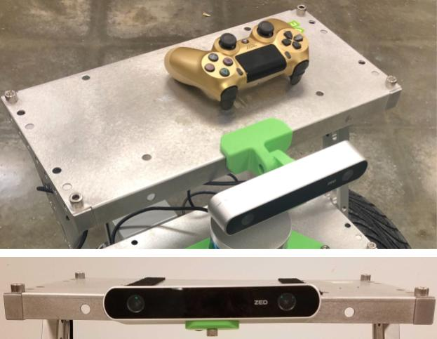
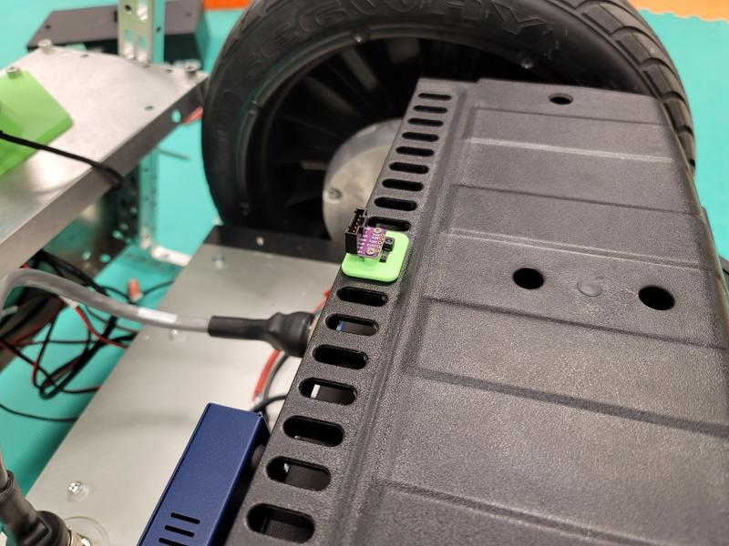

..
   Copyright (c) 2020, NVIDIA CORPORATION. All rights reserved.
   NVIDIA CORPORATION and its licensors retain all intellectual property
   and proprietary rights in and to this software, related documentation
   and any modifications thereto. Any use, reproduction, disclosure or
   distribution of this software and related documentation without an express
   license agreement from NVIDIA CORPORATION is strictly prohibited.

.. _carter_hardware:

NVIDIA Carter
======================

Carter is a robot developed as a platform to demonstrate the capabilities
of the Isaac SDK. It is based on a differential drive and uses lidar and a camera to perceive the
world.

This document walks you through hardware assembly and software setup for Carter.

   .. image:: images/carter.jpg

Required Parts
--------------

The following components are required to build the Carter hardware platform:

**Devices**

+----------------------------------------------------------------------------------------+-----+
| Part                                                                                   | Qty |
+========================================================================================+=====+
| Jetson AGX Xavier Developer Kit                                                        |  1  |
+----------------------------------------------------------------------------------------+-----+
| Segway RMP 210                                                                         |  1  |
+----------------------------------------------------------------------------------------+-----+
| Segway RMP E-Stop (included with Segway RMP 210)                                       |  1  |
+----------------------------------------------------------------------------------------+-----+
| Network switch: `Netgear 8-Port (GS108)  or `Netgear 5-Port (GS105)                    |  1  |
+----------------------------------------------------------------------------------------+-----+
| USB hub (powered): StarTech ST7300USBME                                                |  1  |
+----------------------------------------------------------------------------------------+-----+
| WiFi card: Intel 8265NGW                                                               |  1  |
+----------------------------------------------------------------------------------------+-----+
| WiFi antennas (pair, M.2): CHAOHANG 6484109                                            |  1  |
+----------------------------------------------------------------------------------------+-----+

**Sensors**

+----------------------------------------------------------------------------------------+-----+
| Part                                                                                   | Qty |
+========================================================================================+=====+
| Stereolabs ZED Camera                                                                  |  1  |
+----------------------------------------------------------------------------------------+-----+
| Velodyne VLP-16 (Puck) lidar                                                           |  1  |
+----------------------------------------------------------------------------------------+-----+
| Intel RealSense Depth Camera D435                                                      |  1  |
+----------------------------------------------------------------------------------------+-----+
| Bosch BMI160 IMU                                                                       |  1  |
+----------------------------------------------------------------------------------------+-----+

**Power/Control**

+----------------------------------------------------------------------------------------+-----+
| Part                                                                                   | Qty |
+========================================================================================+=====+
| Power distribution block: `McMaster-Carr 7527K44`_                                     |  2  |
+----------------------------------------------------------------------------------------+-----+
| Spade connectors: `McMaster-Carr 69145K811`_                                           |  10 |
+----------------------------------------------------------------------------------------+-----+
| Blade contact: `Digi-Key part no. 1744042-1-ND`_                                       |  4  |
+----------------------------------------------------------------------------------------+-----+
| Blade housing - black: `Digi-Key part no. A106633-ND`_                                 |  2  |
+----------------------------------------------------------------------------------------+-----+
| Blade housing - red: `Digi-Key part no. A111896-ND`_                                   |  2  |
+----------------------------------------------------------------------------------------+-----+
| Bluetooth Controller: NVIDIA SHIELD or DualShock 4                                     |  1  |
+----------------------------------------------------------------------------------------+-----+

**Hardware -- Custom Parts**

+--------------------------------------------+------------------+------------------------+-----+
| Part                                       | Mfg method       | Mfg material           | Qty |
+============================================+==================+========================+=====+
| `T bracket`_                               | Machined (CNC)   | AL 6061-T6             |  6  |
+--------------------------------------------+------------------+------------------------+-----+
| `Small mount plate`_                       | Sheet metal      | AL 5052 or steel       |  2  |
+--------------------------------------------+------------------+------------------------+-----+
| `Large mount plate`_                       | Sheet metal      | AL 5052 or steel       |  1  |
+--------------------------------------------+------------------+------------------------+-----+
| `Lidar mount and depth-camera bracket`_    | 3D-printed (FDM) | PLA or ABS plastic     |  1  |
+--------------------------------------------+------------------+------------------------+-----+
| `E-stop mount bracket`_                    | 3D-printed (FDM) | PLA or ABS plastic     |  1  |
+--------------------------------------------+------------------+------------------------+-----+
| `IMU mount`_                               | 3D-printed (FDM) | PLA or ABS plastic     |  1  |
+--------------------------------------------+------------------+------------------------+-----+
| `Depth camera bracket`_                    | 3D-printed (FDM) | PLA or ABS plastic     |  1  |
+--------------------------------------------+------------------+------------------------+-----+
| `Stereo camera mount`_                     | 3D-printed (FDM) | PLA or ABS plastic     |  1  |
+--------------------------------------------+------------------+------------------------+-----+
| `Stereo camera plate mount`_               | 3D-printed (FDM) | PLA or ABS plastic     |  1  |
+--------------------------------------------+------------------+------------------------+-----+

**Hardware -- Standard Parts**

+----------------------------------------------------------------------------------------+-----+
| Part                                                                                   | Qty |
+========================================================================================+=====+
| M8x40 socket head screw                                                                |  4  |
+----------------------------------------------------------------------------------------+-----+
| M8x30 socket head screw                                                                |  8  |
+----------------------------------------------------------------------------------------+-----+
| M8x12 or M8x20 socket head screw                                                       |  16 |
+----------------------------------------------------------------------------------------+-----+
| M8 locknut                                                                             |  2  |
+----------------------------------------------------------------------------------------+-----+
| M6x20 SOC or button head screw                                                         |  2  |
+----------------------------------------------------------------------------------------+-----+
| M6 hex nut                                                                             |  2  |
+----------------------------------------------------------------------------------------+-----+
| M5x20 SOC or button head screw                                                         |  1  |
+----------------------------------------------------------------------------------------+-----+
| M5 locknut                                                                             |  1  |
+----------------------------------------------------------------------------------------+-----+
| M3x35 socket head screw                                                                |  4  |
+----------------------------------------------------------------------------------------+-----+
| M3 washer                                                                              |  4  |
+----------------------------------------------------------------------------------------+-----+
| M2x6 screw                                                                             |  2  |
+----------------------------------------------------------------------------------------+-----+
| 1/4"-20x1" socket head screw                                                           |  2  |
+----------------------------------------------------------------------------------------+-----+
| 1/4-20x1/2" socket head screw                                                          |  1  |
+----------------------------------------------------------------------------------------+-----+
| Dowel pins: 4mm (`McMaster-Carr 91585A454`_) or 5/32" (`McMaster-Carr 90145A488`_)     |  2  |
+----------------------------------------------------------------------------------------+-----+
| 2x20 Connector Housing: `Digi-Key part no. 23-0022552401-ND`_                          |  1  |
+----------------------------------------------------------------------------------------+-----+
| 6-pin 0.1” connector housing w/ latch: `Digi-Key part no. WM2904-ND`_                  |  1  |
+----------------------------------------------------------------------------------------+-----+
| 6-pin connector header through hole: `Digi-Key part no. WM4804-ND`_                    |  1  |
+----------------------------------------------------------------------------------------+-----+
| Socket contact gold 22-24 AWG crimp: `Digi-Key part no. WM2512-ND`_                    |  8  |
+----------------------------------------------------------------------------------------+-----+

**Cables and Wiring**

+----------------------------------------------------------------------------------------+-----+
| Part                                                                                   | Qty |
+========================================================================================+=====+
| 2.5mm barrel plug: `Digi-Key part no. CP-2186-ND`_                                     |  1  |
+----------------------------------------------------------------------------------------+-----+
| 2.1mm barrel plug: `Digi-Key part no. CP-2187-ND`_                                     |  2  |
+----------------------------------------------------------------------------------------+-----+
| Ethernet cable (Cat 5e or better)                                                      |  2  |
+----------------------------------------------------------------------------------------+-----+
| 18 Gauge Wire (various lengths)                                                        |     |
+----------------------------------------------------------------------------------------+-----+

.. _McMaster-Carr 7527K44: https://www.mcmaster.com/7527k44
.. _McMaster-Carr 69145K811: https://www.mcmaster.com/69145k811
.. _Digi-Key part no. 1744042-1-ND: https://www.digikey.com/product-detail/en/te-connectivity-amp-connectors/1744042-1/1744042-1-ND/2329862
.. _Digi-Key part no. A106633-ND: https://www.digikey.com/product-detail/en/te-connectivity-amp-connectors/1445715-2/A106633-ND/806271
.. _Digi-Key part no. A111896-ND: https://www.digikey.com/product-detail/en/te-connectivity-amp-connectors/1-1445715-0/A111896-ND/806279
.. _NVIDIA SHIELD: https://www.amazon.com/NVIDIA-SHIELD-Controller-Android/dp/B01N7DQ0L6/ref=sr_1_2?keywords=nvidia%2Bshield%2Bcontroller&qid=1571653638&sr=8-2&th=1&tag=52378_campaignid_1129_34089-20
.. _DualShock 4: https://www.amazon.com/DualShock-Wireless-Controller-PlayStation-Black-4/dp/B00BGA9X9W/ref=asc_df_B00BGA9X9W/?tag=hyprod-20&linkCode=df0&hvadid=243547695837&hvpos=1o2&hvnetw=g&hvrand=6705749794491425737&hvpone=&hvptwo=&hvqmt=&hvdev=c&hvdvcmdl=&hvlocint=&hvlocphy=9032151&hvtargid=pla-384290340623&psc=1

.. _T bracket: https://cad.onshape.com/documents/bef0b0a6d4df0112cf8d96a9/v/b18a8acd0b89e941740b4e33/e/7670c990e7944bd2f13f5673
.. _Small mount plate: https://cad.onshape.com/documents/f1ea4c5d485dec31ab8c0ca0/v/6db55a6f22531cd7cb365a85/e/ccd866b95fdd6cb253ac66a7
.. _Large mount plate: https://cad.onshape.com/documents/4d81ac003ce1675fec57433d/v/f5938451803d79943b9ed1a5/e/10b869591e959eb412ac795d
.. _Lidar mount and depth-camera bracket: https://cad.onshape.com/documents/1e3758d4c5075064e3c33f68/v/67a245b6d30ad318d0e3a844/e/bd9e507685608416b1b0bb93
.. _E-stop mount bracket: https://cad.onshape.com/documents/f11518d14ec4edb9760f5c55/v/618b9efd57c7057b2d04c556/e/6522f386590fadb79f1b3756
.. _IMU mount: https://cad.onshape.com/documents/c8320011168777a52efd9668/v/16a8f30be4a9d1b60756230c/e/52f7f9c8b7a0c35aa5ab6ce0
.. _Depth camera bracket: https://cad.onshape.com/documents/678c7e6e6e5f112b7f2d1b0d/v/a912438a756f146a53051da4/e/dcd12cd1fe80791d1dfb996a
.. _Stereo camera mount: https://cad.onshape.com/documents/063253b0372f9d50294c3e9a/v/debf6167622940a7d7329490/e/593a6276c493d94702bc36e0
.. _Stereo camera plate mount: https://cad.onshape.com/documents/f75a6a2282228f6f62fb2ab7/v/a81819664d99cd61fce24c35/e/c030660c5fe10be25664cf63

.. _McMaster-Carr 91585A454: https://www.mcmaster.com/91585a454
.. _McMaster-Carr 90145A488: https://www.mcmaster.com/90145a488
.. _Digi-Key part no. 23-0022552401-ND: https://www.digikey.com/product-detail/en/molex/0022552401/23-0022552401-ND/171975
.. _Digi-Key part no. WM2904-ND: https://www.digikey.com/product-detail/en/molex/0050579406/WM2904-ND/115038
.. _Digi-Key part no. WM4804-ND: https://www.digikey.com/product-detail/en/molex/0705430005/WM4804-ND/114930
.. _Digi-Key part no. WM2512-ND: https://www.digikey.com/product-detail/en/molex/0016020103/WM2512-ND/115063

.. _Digi-Key part no. CP-2186-ND: https://www.digikey.com/product-detail/en/tensility-international-corp/CA-2186/CP-2186-ND/568577
.. _Digi-Key part no. CP-2187-ND: https://www.digikey.com/product-detail/en/tensility-international-corp/CA-2187/CP-2187-ND/568578

Required Tools
--------------

The following tools are required to build the Carter hardware platform:

* Screwdriver set
* Socket wrench set
* Metric hex driver set
* Wire cutters
* Wire terminal crimping tool (for Anderson Powerpole or equivalent connectors)
* Multimeter

Host Machine Requirements
-------------------------

You will need a Linux host machine to deploy applications to Carter. System requirements for this
host machine are described in the `System Requirements section`_ of the SDK Manager documentation.

.. _System Requirements section: https://docs.nvidia.com/sdk-manager/system-requirements/index.html

Amount of Time Required
-----------------------

It takes, on average, three business days for first-time assembly of a Carter robot. This time
period does not include receiving shipped parts or machining custom parts.

Hardware Overview
-----------------

   Carter - front view

|

   Carter - rear view

Carter Wiring Diagram
---------------------

The following diagram shows the wiring for Carter. It may be useful to reference this diagram
during assembly.

.. Note:: 600mm (24in) length wires should be sufficient for all power connections.

   Carter wiring diagram

Assembly Instructions
------------------------------

Follow these steps to assemble Carter:

**1. Assemble T Brackets into Legs**

Carter has two legs that connect to the Segway RMP. Each leg consists of three T brackets and
five M8x30 screws.

For each leg, secure three T brackets together using two screws on the inner side and three screws
on the outer side, arranged as shown in the image below.

The two legs should be mirrored after assembly.

   Left leg - inner view (L) and outer view (R)

|

   Right leg - inner view (L) and outer view (R)

**2. Attach Legs to RMP**

Secure each leg to the Segway RMP platform using two M8x40 screws in the inner holes of the bottom
bracket. The image below shows the right leg.

   Carter right leg

**3. Attach Terminal Blocks and Wiring to Xavier Plate**

A small mount plate will serve as the mount plate for the Jetson AGX Xavier board.

.. Important:: The small mount plate has a set of four holes that are smaller than the rest of the
               holes. For these instructions, the edge of the plate that is closer to these
               holes is referred to as the "top" edge of the plate.

Attach the two power distribution blocks to the top half of the plate using sticky-back
hook-and-loop strips. These blocks break out power from the 12V RMP battery to other devices in the
system. The RMP wiring harness uses 18-gauge wires.

Use a crimping tool to crimp the Anderson spade connectors to ten 18-gauge wires (five red and
five black), and use these connectors to connect the wires to the terminal blocks. Use a positive
and negative wire to wire each of the following connectors:

* The 2.5mm barrel plug for Xavier
* The blade contact for the Power1+ and Power1- wires on the RMP CONNECTOR I Breakout Harness,
  which supplies 12V from the RMP battery
* The 2.1mm barrel plug for the GS108 or GS105 Ethernet switch
* The 2.1mm barrel plug for the VLP-16 lidar
* The 5mm pitch terminal block plug for the Startech USB hub

.. Note:: All devices outlined in the **Parts** section can accept 12V input. If you substitute
          other devices for those in the parts list, you may need to use additional step up/down
          regulators. You can also purchase regulators from Segway to expand the auxiliary power
          capacity of the RMP 210 beyond 150W and provide alternative voltage levels from the
          RMP CONNECTOR I Breakout Harness.

.. Note:: All barrel plugs should have positive on the inner contact of the barrel.

Screw the WiFi antennas into the two holes on the top flange of the plate; use a single washer
to secure each antenna. Feed the wiring through the two nearby large holes on the face of the plate.
This will allow the wires to reach the Xavier board on the other side of the plate.

Attach the Ethernet cable to the plate. One end will be attached to the Xavier board and the other
to the Ethernet switch. The connections will be made in a later step.

The image below shows the various connections from the power distribution blocks, the Ethernet
cable, and WiFi antennas on the back of the Xavier plate.

   Carter power breakout

**4. Prepare RMP CONNECTOR I Harness**

Cut the factory crimps off of the Power1+ (red) and Power1- (Return, green) wires on the RMP
CONNECTOR I harness. Add a red blade-housing connector to these wires for Power1 wiring to the
power distribution blocks on the Xavier plate.

.. Note:: You will only use the Power1+/Power1- wires and Ethernet cable on the RMP Connector I
          harness.

   Modified RMP CONNECTOR I harness wiring

**5. Prepare the Xavier board**

Install the WiFi card in the J505 M.2 slot on the bottom of the Xavier board.

Verify that the jumper on the J514 Voltage Select shorts pins 1 and 2 (denoted by the small green
box in the diagram below).

Position the Xavier plate near the Xavier board and attach the antenna cables to the WiFi card.

   Location of the J505 M.2 slot on the Xavier board

.. Tip:: If you would like the Jetson AGX Xavier to automatically power on with the Segway RMP, you
   may use a jumper to short pins 5 and 6 on the automation header. This will cause the Xavier to
   automatically start up when connected to power. See the `Jetson AGX Xavier Specification`_
   document (section 3.5 (pg 29) table 3-7) for more details.

.. _Jetson AGX Xavier Specification: https://developer.nvidia.com/embedded/dlc/Jetson_AGX_Xavier_Developer_Kit_Carrier_Board_Specification

**6. Attach the Xavier Board to the Xavier Plate**

Remove the four screws shown below from the Xavier board.

   Location of screws on the Xavier board

Leave the Xavier board upside down. Align the side of the Xavier board with the power jack and
Ethernet and USB connectors, shown at the top of the image above, with the top edge of the Xavier
Plate. With the Xavier Plate facing downward, lift the plate, place the M3 washers on the Xavier mounting
holes, and insert the M3x35 screws.

Lower the plate onto the Xavier board. Ensure you are aligning the screws with the holes in the feet
and avoiding the antenna wires. Secure the M3 screws to mount the Xavier board to the plate.

The photo below shows the face of the Xavier plate with the Xavier board mounted. Note the USB,
Ethernet, and power connectors on the top edge and the unused PCIe connector on the left side.

   Xavier plate with Xavier board mounted

**7. Attach Lidar and RealSense Camera to Mount and Plate**

The other small mount plate carries the VLP-16 lidar. The 3D-printed lidar mount has two small
holes on the top for the alignment dowels and a through hole in the center for securing the lidar
with the 1/4"-20x1" bolt. The default orientation of the lidar is pointing away from the caster
(i.e. the small third wheel) of the RMP, with the USB cable on the back pointed toward the caster.

Secure the lidar to the lidar mount with the 1/4"-20x1" bolt. Then, secure the lidar mount to the
small mount plate with two M8x30 screws and M8 locknuts.

Use two M3x6 screws to secure the RealSense camera to its mount. This mount attaches to the
front portion of the lidar mount with a M6x20 screw and nut. The mount angle should be set to 0
degrees by default, and can be adjusted in 15 degree steps. Plug the Type C end of a USB Type C
to Type A cable into the RealSense camera.

Secure the lidar wiring and components to the bottom of the lidar plate.

.. Note:: This mount places the RealSense camera in the following location relative to the robot
          base: :code:`"translation": [0.150, 0, 0.573]`. See the `Setting up Software on Carter`_
          section for more information on capturing translation in the Carter JSON configuration.

.. Important:: Mounting the lidar and depth camera in this step, the stereo camera in step 9, or the
          IMU in step 14 differently than instructed will cause unexpected behavior with the default
          Carter application. If there are any discrepancies, you will need to update the JSON
          configuration for Carter. Refer to the `Setting up Software on Carter`_ section for
          further information.

   Lidar wiring and components secured to lidar plate

.. Note:: See Figure 4 for an image of the RealSense camera, mount, and lidar plate assembled.

**8. Attach Lidar Plate to Carter**

Use four M8x12 or M8x20 screws in the corners to secure the lidar plate to the middle T bracket,
as shown in the photo below. Connect one end of an Ethernet cable to the lidar. The connections to
the Ethernet switch and power will be made in a later step.

   Lidar plate attached to Carter

**9. Connect ZED Camera to Camera Plate**

Attach the ZED camera to the stereo camera mount using a 1/4"-20x1/2" mount bolt. Attach the stereo
camera mount to the center of the stereo camera plate mount using an M6x20 screw. There is a small
notch at the rear edge of the part that indicates the center and helps with alignment.

Use double-stick tape to
attach the stereo camera plate mount to the large mounting plate (camera plate). The mount angle
should be set to 0 degrees (horizontal) by default and can be adjusted in 15-degree steps.

Secure the camera plate to the top T bracket with four M8x12 or M8x20 screws in the corners.

.. Note:: This mount places the left lens of the ZED camera in the following location relative to
          the robot base: :code:`"translation": [0.098, 0.06, 0.763]`. See the `Setting up Software on Carter`_
          section for more information on capturing translation in the Carter JSON configuration.

   Camera plate attached to the top of Carter

**10. Attach E-Stop button**

Use double-stick tape to attach the E-Stop mount bracket to the side of the RMP E-Stop Button housing
that contains the cable. Route the cable through the cut-out in the mount bracket.

.. Note:: You can also use hook and loop fasteners to secure the E-Stop mount bracket to the RMP
          battery cover on which it rests.

Use a M5x20 screw and M5 locknut, along with double-sided tape, to secure the top right of the
E-Stop Button housing to the lidar plate.

Connect the E-Stop cable to CONNECTOR II on the RMP Centralized Control Unit (CCU). Secure the
cable so that it doesn’t interfere with the wheels.

   E-Stop button attached to the lidar plate

**11. Attach USB Hub to RMP Battery**

Use hook and loop fasteners to attach the USB hub to the RMP battery cover. The USB hub should be
located to the left of the E-Stop. This location will make it easier to connect devices for
development and debugging in the future.

The photo below shows the hub after all connections are made, but you don't need to connect anything
in this step.

   USB hub with all connections made

**12. Attach Ethernet Switch to Front of RMP CCU**

Use hook and loop fasteners on the bottom of the Ethernet switch to attach it vertically to the
front right of the CCU, with the Ethernet ports facing to the left. Leave enough room for the
barrel plug to connect on the right side.

The photo below shows the Ethernet switch after all connections are made, but you don't need to
connect anything in this step.

.. Note:: Newer versions of the Segway RMP 210 may have different connector locations, requiring
          a different position for the Ethernet switch than shown below.

   Ethernet switch with all connections made

**13. Make Connections on the Xavier Plate**

Route the cabling from the RMP harness below the CCU to the Xavier plate. The Ethernet cable
and power1+/power1- wires (12V source) are the only connections that you need to make.

Now is a good to time to check voltages: Power on the RMP and use a multimeter to verify that the
polarity and voltage is correct on all power connectors. Power off the RMP before continuing.

Move the Xavier plate close to the front of Carter and make these connections from the back of the
Xavier plate:

1. power1+/power1- wires (with spade connector) from power distribution block to power1+/power1- wires
   (with blade-housing connector) from RMP CONNECTOR I harness
2. 2.1mm barrel plug from power distribution block to Ethernet switch
3. 2.1mm barrel plug from power distribution block to lidar
4. Power terminal from power distribution block to the USB hub
5. USB cable from USB hub (Type B end), routed toward the Xavier Plate

.. Tip:: At this point, you may find it more convenient to perform steps 2-3 in the `Setting up Software on Carter`_
         section (i.e configuring the IP addresses of the lidar and RMP 210) because all the
         components and connections are easily accessible. If you do so, you will need to use
         the Linux host machine, rather than the Xavier, to connect to and configure these devices
         as described.

**14. Set up IMU**

Add a 6-pin socket or header to the VIN, 3V3, GND, SCL, and SDA signals. Solder the 6-pin socket or
header to the BMI160 board. See the :ref:`BMI160 wiring guide<wire-bmi160-imu>` for more details.

Secure the BMI160 board to the IMU mount with two M2x6 screws, with the socket oriented as shown
below.

   BMI160 board attached to IMU mount

Depending on the resolution of the 3D printer, the mounting holes may need to be drilled to allow
the screws to fit. The two cutouts in the mount next to the board allow you to use a zip tie to
secure the mount to the RMP battery cover.

+-------------------------------------+-------------------------------------+
| BMI 160                             | Jetson AGX J30 40-pin               |
+------+------------------------------+------+------------------------------+
| Pin  | Signal                       | Pin  | Signal                       |
+======+==============================+======+==============================+
| 1    | VIN                          |      | NC                           |
+------+------------------------------+------+------------------------------+
| 2    | 3V3                          | 17   | 3V3                          |
+------+------------------------------+------+------------------------------+
| 3    | GND                          | 25   | GND                          |
+------+------------------------------+------+------------------------------+
| 4    | SCL                          | 28   | I2C_GP2_CLK_3V3              |
+------+------------------------------+------+------------------------------+
| 5    | SDA                          | 27   | ISC_GP2_DAT_3V3              |
+------+------------------------------+------+------------------------------+
| 6    | CS                           |      | NC                           |
+------+------------------------------+------+------------------------------+

Use jumper wires or create a cable to connect the 3V3, GND, SCL, and SDA pins of the BMI 160 to the
Xavier J30 40-pin connector. If you are using a 40-pin socket for the Xavier side, take care to note
the location of pin 1.

.. figure:: images/carter14.jpg

   BMI 160 with example harness

   BMI 160 wiring to Xavier 40-pin socket

The bottom of the 3D-printed mount has two tabs that insert into two vent holes on top of the RMP
battery cover. It should be installed in the two center holes with the connector side closer to the
edge of the cover and secured with a zip tie.

   IMU mount attached to RMP battery cover with zip tie

Route the Xavier side of the IMU cable to the bottom of the RMP platform. It will curl under the
Xavier plate to make its connection.

**15. Make Final Connections**

Make the following connections:

1. USB cable (Type A end) to Xavier
2. Ethernet cable from the back of the Xavier plate to Xavier
3. 2.5mm barrel plug to Xavier jack
4. Ethernet from lidar to Ethernet switch
5. Ethernet from RMP CONNECTOR I harness to Ethernet switch
6. One end of the Ethernet cable on the Xavier Plate to the Ethernet switch
7. ZED Camera USB to USB Hub
8. RealSense camera USB to USB Hub

.. Tip:: To make future debugging easier, add labels with device names to all cables connected
         to the USB hub and Ethernet switch.

**16. Attach Xavier Plate and IMU**

Use four M8x12 or M8x20 screws to secure the Xavier plate to the lowest bracket of each
leg. Attach the IMU 40-pin connector to the Xavier board. Pin 1 of the connector is on the right
when facing the Xavier board.

   Xavier plate with IMU 40-pin connector connected

.. Note:: Newer versions of the Segway RMP 210 may have different connector locations.
   In particular, the cable from Connector V may require mounting the Xavier Plate in
   a higher position. If this is the case, you can mount the WiFi antennas in different
   locations on the Xavier Plate in order to avoid interference with other parts-- see the
   image below for an example. A heat gun may also be used to soften and bend the heat shrink
   on the cable for Connector V, though this risks damaging the cable.

   Alternative mounting for WiFi antennas

**17. Secure Cables**

Use zip ties to secure the USB cables for the RealSense and ZED cameras--and any other loose cables
as needed.

Setting up Software on Carter
-----------------------------

After you assemble Carter, go through the following steps to configure the software on it.

.. Note:: All commands should be executed from the host development workstation, unless the
          instructions state to run them from the Jetson AGX Xavier.

**1. Configure the Jetson AGX Xavier**

1. Install the Jetson operating system on the Jetson AGX Xavier as described in the
   `SDK Manager documentation`_.

2. Obtain the IP address of the robot as described in the :ref:`get-started-nano` guide.

  .. Tip:: Alternatively, you can configure your wireless network to assign a static IP address to
           Carter. Consult your network administrator for proper implementation.

3. Follow the :ref:`setup-isaac` guide to install Isaac SDK, along with all of its dependencies,
   on the Xavier.

4. Follow the steps in the :ref:`deployment_device` section to register your SSH key with
   the Xavier.

.. _SDK Manager documentation: https://docs.nvidia.com/sdk-manager/install-with-sdkm-jetson/index.html

**2. Configure the VLP-16 Lidar**

Out of the box, the VLP-16 lidar is configured with an IP address of 192.168.1.201. You will need
to change this address:

1. Set the Jetson AGX Network to 192.168.1.5.
2. Use a web browser to navigate to http://192.168.1.201. This should open the configuration page
   for the VLP-16 lidar.

   a. Change the **Host (Destination)** IP address from "255.255.255.255" to "192.168.0.5"
      (i.e. the IP address of the Xavier) and click the **Set** button. Note that each section has
      its own **Set** button.
   b. Change the IP address of the **Network (Sensor)** (i.e. the Lidar itself) to "192.168.0.201"
      and click the **Set** button.
   c. Click the **Save Configuration** button.

3. Change the Jetson AGX Network back to 192.168.0.5.
4. Ping the VLP-16 lidar from the Xavier to confirm the new configuration:

   .. code-block:: bash

      $ ping 192.168.0.201

   If the ping fails, refer to **Appendix J - Network Configuration** in the  `VLP-16 User Manual`_
   for help.

.. _VLP-16 User Manual: https://greenvalleyintl.com/wp-content/uploads/2019/02/Velodyne-LiDAR-VLP-16-User-Manual.pdf

**3. Configure the RMP 210**

Out of the box, the RMP 210 has a default IP address of 192.168.0.40. Ping the RMP 210 from the
Xavier to confirm these devices can see each other:

.. code-block:: bash

   $ ping 192.168.0.40

**4. Configure the Xavier**

1. Connect the Jetson AGX Xavier to a display and connect a keyboard and mouse to the USB hub.
2. Log in to the Xavier.
3. Connect to a strong WiFi network.
4. Install dependencies on the Xavier:

   a. Install "ssh" on the Xavier:

      .. code-block:: bash

         sudo apt-get install ssh

   b. Install "jstest-gtk" on the Xavier. This is required to configure and calibrate the joystick
      controller.

      .. code-block:: bash

         sudo apt-get install jstest-gtk

5. Set the controller to pairing mode (refer to the controller manual for instructions).
   From Bluetooth Settings, pair and connect the joystick.
6. Set up the RealSense camera:

   a. Configure the RealSense camera codelet as described on the :ref:`realsense_camera` page.
   b. From the host machine, deploy the sample application to verify that the RealSense camera is
      working (from the :code:`sdk/` subdirectory):

      .. code-block:: bash

         ./../engine/engine/build/deploy.sh --remote_user <username_on_robot> -p //apps/samples/realsense_camera:realsense_camera-pkg -d jetpack44 -h <robot_ip>

      Where :code:`<username_on_robot>` is your username on the Xavier and :code:`<robot_ip>` is
      the IP address of the Xavier.

   c. Log in to the Xavier from the host machine using SSH and run the sample application as
      follows:

      .. code-block:: bash

         cd deploy/user_name/realsense_camera
         ./apps/samples/realsense_camera/realsense_camera

   d. On the host machine, navigate to :code:`http://<robot_ip>:3000/`. Check the "realsense camera"
      channel to verify that the camera is running.

7. Configure the ZED camera as described on the :ref:`zed_camera` page.
8. On the Xavier, edit the sensor configuration files for Carter to accurately reflect the position
   of the sensors. The following are file locations and sample configurations for the different
   sensors:

   .. Tip:: See :ref:`this FAQ <pose_3d_syntax>` for a description of 3D pose values.

   a. Lidar: :code:`isaac/apps/carter/robots/`

      .. code-block:: json

         "2d_carter.carter_hardware.vlp16_initializer": {
            "lidar_initializer": {
              "lhs_frame": "robot",
              "rhs_frame": "lidar",
              "pose": [1.0, 0.0, 0.0, 0.0, 0.022, 0.0, 0.625]
            }
          }

   b. RealSense camera: :code:`isaac/apps/samples/realsense_camera`

      .. code-block:: json

         "2d_carter.carter_hardware.camera": {
            "realsense_pose": {
              "lhs_frame": "robot",
              "rhs_frame": "camera",
              "pose": [0.5, -0.5, 0.5, -0.5, 0.150, 0, 0.573]
            }

      .. Tip:: Refer to the :ref:`realsense_camera` document for more information on using the
               RealSense camera with Isaac applications.

   c. ZED camera: :code:`isaac/apps/samples/follow_me`

      .. code-block:: json

         "camera": {
              "zed_left_camera_initializer": {
                "lhs_frame": "robot",
                "rhs_frame": "left_camera",
                "pose": [0.5, -0.5, 0.5, -0.5, 0.098, 0.06, 0.763]
              }

      .. Tip:: Refer to the :ref:`zed_camera` document for more information on using the
               ZED camera with Isaac applications.

Creating a Map for Carter
-------------------------

Follow the steps below to create a map and configure it for the Carter application:

1. Set up the Isaac SDK on your host machine as described on the :ref:`setup-isaac` page.
2. From the Isaac SDK repository on your host machine, deploy either the :ref:`gmapping_application`
   or the :ref:`cartographer_doc` application to Carter.
3. Use the :ref:`map-editor-visualization` to create waypoints and restricted areas on your map.
4. Create a config and graph file for the map. Refer to the sample files in the Isaac SDK.

Running Isaac Applications on Carter
--------------------------------------

This section describes how to run four different sample applications on Carter.

Application 1: Random
^^^^^^^^^^^^^^^^^^^^^

This application instructs Carter to travel from one waypoint to another using randomly
chosen waypoints.

1. From the host machine, deploy the Carter application to the robot (from the :code:`sdk/`
   subdirectory):

   .. code-block:: bash

      ./../engine/engine/build/deploy.sh -p //apps/carter:carter-pkg -d jetpack44 -h <robot_ip> --remote_user <username_on_robot> -s

2. SSH into the robot (using the Xavier IP).
3. Go to the :code:`/deploy/<host_username>/carter-pkg` directory.
4. Run the application:

   .. code-block:: bash

      ./apps/carter/carter --map_json <map_file> --robot_json <robot_file>

5. To create a map of large environments, you need to tune the map to create a dense graph. This
   will speed up path planning for the robot. Refer to the **Global Planner** section of the :ref:`tuning_the_navigation_stack`
   document for more details.
6. Go to the Isaac Websight visualization tool (https://<robot_ip>:3000) to visualize the
   application.
7. Switch to a different goal behavior in Websight:

   a. Go to the "goals.goal_behavior" node.
   b. Change the  "desired_behavior" from "Random" to "WayPoint", "Pose", "Route" etc.
   c. Go to "goals.pose_as_goal", "goals.waypoint_as_goal", or "goals.patrol" and click **Submit**
      to activate the application with that configuration.

Application 2: Waypoint
^^^^^^^^^^^^^^^^^^^^^^^

This application moves Carter to a given goal using the :ref:`isaac.navigation.MapWaypointAsGoal`
component.

To use the Waypoint application, add the sample Flatsim delivery application to your
Carter application. This sample application is located at :code:`isaac/apps/carter/carter_delivery/carter_delivery_flatsim.app.json`.

Application 3: Pose
^^^^^^^^^^^^^^^^^^^

This application moves Carter to a given goal in Websight.

The "pose_as_goal" config is part of the "goal_generators.subgraph.json" file by default. Follow
these steps to enable this application:

1. Open Websight.
2. Under "goals.goal_behavior", change the "desired_behavior" to "pose_as_goal".
3. Add the "pose_as_goal" marker to navigate the robot using the pose.

   Changing the "desired_behavior" to "pose_as_goal"

Refer to the **Additional Notes** section of the :ref:`interactive-markers` document for more
details.

Application 4: Patrol
^^^^^^^^^^^^^^^^^^^^^

This application instructs Carter to patrol along a pre-defined route.

First, modify the config for “patrol” mode in :code:`isaac/sdk/packages/navigation/apps/goal_generators.subgraph.json`:
To define a route, add waypoints that are defined in your map.

.. code-block:: json

   "patrol": {
     "MapWaypointsAsPlan": {
       "waypoints": [
           "kitchen",
           "atrium"
       ],

After adding the route to the sample JSON, run the Carter application and open Websight. Under the
“goals.goal_behavior” configuration, change the “desired_behavior” to “patrol”.

   Changing the “desired_behavior” to “patrol”

Troubleshooting
---------------

**RMP 210 does not move**

Ensure the RMP 210 has the correct IP address (192.168.0.40) and you are able to ping that address
from the Xavier. If the RMP 210 cannot connect to its host, it will power down automatically after
a timeout.

**VLP-16 lidar does not connect**
Ensure the lidar has been programmed with the correct IP addresses: 192.168.0.201 for itself and
192.168.0.5 for the host/Xavier. Ping the VLP-16 from the Xavier to ensure the connection is
working.

**Isaac application cannot access the IMU**

Check the continuity of the cable from the Xavier to the pins on the IMU board.

**USB hub is not working**

Check the power- and ground-wire mapping and continuity to the terminal.

**RealSense camera not working**

Ensure that the StarTech USB hub is externally powered and that you are using properly rated
USB 3.1 cables. Double-check that any issues can be reproduced with the RealSense camera connected
directly to the Xavier using its original USB cable.

**Wires are coming loose**

Use ferrules to attach wires to the barrel plugs and USB hub power terminal. They make for a
more secure connection than bare wire.

