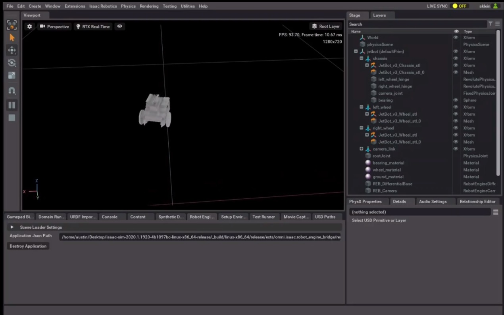
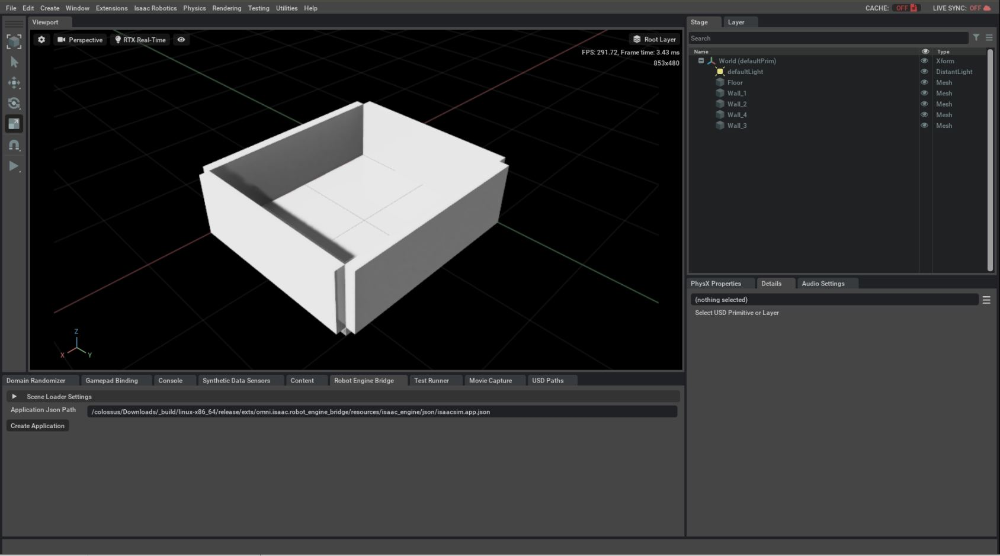
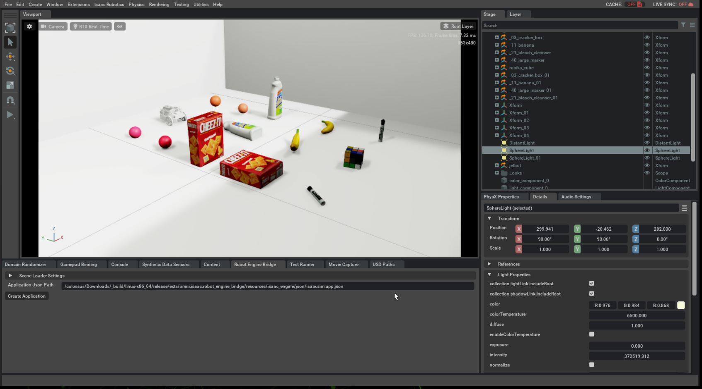
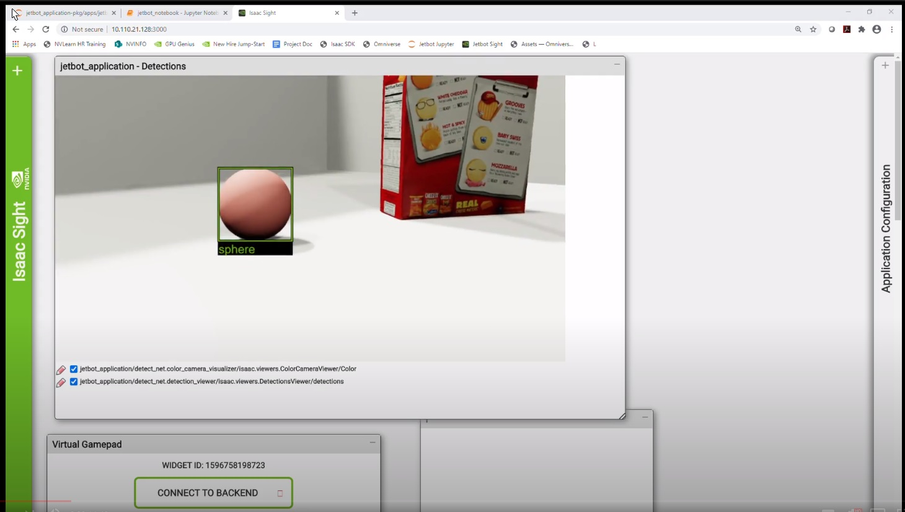
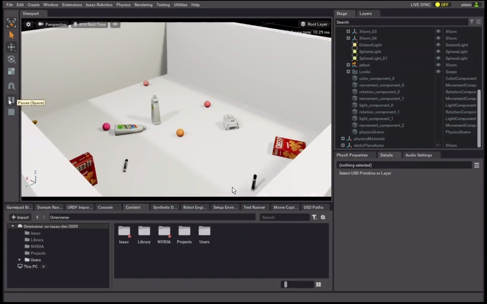

..
   Copyright (c) 2020, NVIDIA CORPORATION. All rights reserved.
   NVIDIA CORPORATION and its licensors retain all intellectual property
   and proprietary rights in and to this software, related documentation
   and any modifications thereto. Any use, reproduction, disclosure or
   distribution of this software and related documentation without an express
   license agreement from NVIDIA CORPORATION is strictly prohibited.

.. _jetbot_sample_applications:

Jetbot Sample Applications
===================================================

This section describes how to integrate the Isaac SDK with Omniverse, NVIDIA’s new high-performance
simulation platform, to get a Jetbot_ to follow a ball in simulation. This section serves
as a valuable entry point both into Omniverse and the Python API of Isaac SDK using three Jetbot_
applications. All sample applications are present in :code:`jetbot_jupyter_notebook` notebook.

.. _Jetbot: https://www.nvidia.com/en-in/autonomous-machines/embedded-systems/jetbot-ai-robot-kit/

Build and Run Jetbot Jupyter Notebook
-------------------------------------

In the Isaac SDK repository, run the :code:`jetbot_jupyter_notebook` Jupyter notebook app:

   .. code-block:: bash

      bob@desktop:~/isaac/sdk$ bazel run apps/jetbot:jetbot_jupyter_notebook

Your web browser should open the Jupyter notebook document. If it does not, search for a link on
the console: It looks like :code:`http://localhost:8888/notebooks/jetbot_notebook.ipynb`.
Open that link in your browser.

Remote control Jetbot using Virtual gamepad
^^^^^^^^^^^^^^^^^^^^^^^^^^^^^^^^^^^^^^^^^^^^

This sample demonstrates how to control Jetbot remotely using Omniverse and Jupyter notebook.

* **Jetbot in Omniverse**: Follow the documentation Isaac Sim built on NVIDIA Omniverse to start the
  simulator and open the stage at :code:`omni:/Isaac/Samples/Isaac_SDK/Robots/Jetbot_REB.usd`.
  Start the simulation and Robot Engine Bridge.

  In the Jupyter notebook, follow the cells to start the SDK application. Once it is connected to
  the simulator, you can move Jetbot using the virtual gamepad from site in Omniverse.

Now we are going to build a training environment in Omniverse.

Building a Training Environment
^^^^^^^^^^^^^^^^^^^^^^^^^^^^^^^

With the Jetbot model working properly and ability to control it through the Isaac SDK, we can now
train the detection model, which allows the robot to identify and subsequently
follow a ball. As we look to eventually deploy a trained model and accompanying control logic to a
real Jetbot, it is very important for the training scene built in Omniverse to be recreatable in
the physical world.
The simulation environment built in this section was made to mimic the real world environment we
create, so you may choose to design your environment differently. NVIDIA recommends using the edges
of a cardboard box or pillows as the boundaries of your environment.

We begin building the scene by adding 5 cube meshes, corresponding to 1 floor and 4 walls, by
navigating to
Create_ > Mesh > Sphere in the Menu_ toolbar.  By default, the dimensions of the cube are 100cm,
so scale and translate them appropriately using the Details panel to create a box of the desired
size. As the silver default mesh color of the walls are difficult to recreate in reality, we
`create a new material`_, and adjust the coloring and roughness properties of the new OmniPBR_
material to resemble paper, `applying it`_ to the 5 cube meshes.
The resulting scene is shown as follows:

.. _Create: https://docs.omniverse.nvidia.com/app_create/app_create/interface.html#create-menu
.. _Menu: https://docs.omniverse.nvidia.com/app_create/app_create/interface.html#menu-bar
.. _create a new material: https://docs.omniverse.nvidia.com/app_create/app_create/materials.html#creating-materials
.. _OmniPBR: https://docs.omniverse.nvidia.com/app_create/app_create/materials.html#omnipbr
.. _applying it: https://docs.omniverse.nvidia.com/app_create/app_create/materials.html#applying-materials

Assets can then be added to introduce obstacles that the detection model; the detection model cannot
mistake these assets as spheres.
From the `Content Manager`_, several assets representing common household items were dragged and dropped onto the stage.
The meshes of the added assets were positioned to not intersect with the floor.

.. _Content Manager: https://docs.omniverse.nvidia.com/app_create/app_create/interface.html#content-manager

Next, we create representations in simulation of the balls our Jetbot will follow. Sphere meshes were added to the
scene and were placed within Xform elements to allow domain randomization to be used. Class labels for object detection
were added using `Semantic Schema Editor`_. Lastly, `Sphere Lights`_ and the *jetbot.usd* file were added to the scene.

.. _Semantic Schema Editor: https://docs.omniverse.nvidia.com/app_isaacsim/app_isaacsim/camera.html#semantic-schema-editor
.. _Sphere Lights: https://docs.omniverse.nvidia.com/app_create/app_create/lighting.html#sphere-light

If the scene shown above were used to generate training data and train a detection model, then the ability of the real
Jetbot to perform inference using the trained model would suffer unless the physical environment the Jetbot was deployed
in exactly matched the above simulation scene. Recreating the intricate details of the scene in the physical world would
be exceedingly difficult. Therefore, it is important to create a detection model with the ability to generalize and apply
its training to similar physical environments. To accomplish this, `Domain Randomization`_ (DR) components are added to the
entities in the scene, creating a more diverse training dataset, and thus improving the robustness of the detection model.

.. _Domain Randomization: https://docs.omniverse.nvidia.com/app_isaacsim/app_isaacsim/domain-randomization.html

All items shown in the scene were free to move within the confines of the paper box, and to rotate about their Z-axis,
using DR Movement_ and Rotation_ components, respectively. A Color_ component was applied to the sphere meshes, allowing
the detection model to be trained to detect a ball of any color. Light_ and movement components were added to the sphere
lights, so training data could be captured with a variety of shadows and light intensities. Note that the Jetbot model
was allowed to move and rotate, so training data could be captured from many locations and angles. The durations of all
domain randomization components were set to 0.3 seconds. Save the scene as *jetbot_inference.usd*. With the simulation
environment in place, data can now be collected, and a detection model trained.

.. _Movement: https://docs.omniverse.nvidia.com/app_isaacsim/app_isaacsim/domain-randomization.html#movement-component
.. _Rotation: https://docs.omniverse.nvidia.com/app_isaacsim/app_isaacsim/domain-randomization.html#rotation-component
.. _Color: https://docs.omniverse.nvidia.com/app_isaacsim/app_isaacsim/domain-randomization.html#color-component
.. _Light: https://docs.omniverse.nvidia.com/app_isaacsim/app_isaacsim/domain-randomization.html#light-component

Training the Detection Model
^^^^^^^^^^^^^^^^^^^^^^^^^^^^

To generate a dataset and train a detection model, refer to the :ref:`object_detection_with_detect_net`
pipeline in the Isaac SDK documentation, taking note of the following differences. Rather than using Unity3D
to generate training images, use Omniverse. The generate_kitti_dataset.app.json file, located in
Isaac SDK under packages/ml/apps/generate_kitti_dataset, was altered to instead generate 50000 training images
and 500 test images. Before running the generate_kitti_dataset application, be sure that the camera in the Omniverse
viewport is switched to the Jetbot’s first person view, the Robot Engine Bridge application is created, and the simulation
is started. Note that you must install TensorRT, CUDA, and CuDNN prior to training the detection model with
the Transfer Learning Toolkit (TLT), and be sure to follow all installation instructions.

The text files used with the Transfer Learning Toolkit were modified to only detect “sphere” objects. Additionally, as
duplicate images are often created during the dataset generation process, the number of epochs was reduced from 100 to 20.
The Object Detection pipeline was followed up until the train model (.etlt file) was exported. You are now able to utilize the
trained model in our Isaac application to perform inference.

Running Inference in Simulation
^^^^^^^^^^^^^^^^^^^^^^^^^^^^^^

This sample demonstrates how to run inference on an object using an existing trained model,
Omniverse, and Jupyter Notebook.

* **Jetbot in Omniverse**: Follow the documentation Isaac Sim built on NVIDIA Omniverse to start the
  simulator and open the stage at :code:`omni:/Isaac/Samples/Isaac_SDK/Scenario/jetbot_inference.usd`.
  Start the simulation and Robot Engine Bridge.

  In the Jupyter notebook, follow the cells to start the SDK application. Once it is connected to
  the simulator, you can check on sight window that inferencing output.

Jetbot Autonomously Following Objects in Simulation
^^^^^^^^^^^^^^^^^^^^^^^^^^^^^^^^^^^^^^^^^^^^^^^^^^

This sample demonstrates Autonomoulsy Follow Ball Object using Omniverse and Jupyter notebook.

* **Jetbot in Omniverse**: Follow the documentation Isaac Sim built on NVIDIA Omniverse to start the
  simulator and open the stage at :code:`omni:/Isaac/Samples/Isaac_SDK/Scenario/jetbot_follow_me.usd`.
  Start the simulation and Robot Engine Bridge.

  In the Jupyter notebook, follow the cells to start the SDK application. Once it is connected to
  the simulator, you can move the ball in Omniverse and check on sight window that Jetbot is
  following the ball.

