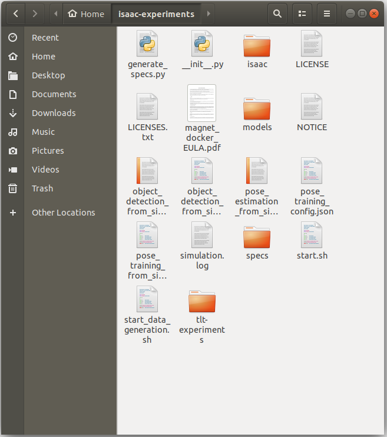

..
   Copyright (c) 2020, NVIDIA CORPORATION. All rights reserved.
   NVIDIA CORPORATION and its licensors retain all intellectual property
   and proprietary rights in and to this software, related documentation
   and any modifications thereto. Any use, reproduction, disclosure or
   distribution of this software and related documentation without an express
   license agreement from NVIDIA CORPORATION is strictly prohibited.

.. _training_in_docker:

Training Pose Estimation from Simulation in Docker
===================================================

Object detection and 3D pose estimation play a crucial role in robotics.
They are needed in a variety of applications such as navigation, object
manipulation, and inspection. The 3D Object Pose Estimation application
in the Isaac SDK provides the framework to train pose estimation for any
model completely in simulations, and to test and run the inference in
simulations, as well as the real world.

To learn more about the inner workings of pose_cnn_decoder in the Isaac SDK,
you can consult the documentation:

Using this Docker image, you will be able to train a pose estimation network
and use it for inference in an Isaac SDK application.

How it works
------------

Using a combination of simulation, Isaac SDK applications, and your own 3D models,
we'll first create an object detection network using :ref:`training_in_docker`.

Then we'll use the Isaac SDK's pose estimation training application, along with
a simulation scene, to generate samples for the application to use.

After enough samples have been generated, training stops and a trained network is
stored. You have access to the data and models generated by the application.

Finally, we'll convert this trained model into a format that can be used for inference,
and set up a video feed to be processed.

Host Setup
----------

Hardware Requirements
^^^^^^^^^^^^^^^^^^^^^

NVIDIA Pascal GPU or newer. GTX 1080Ti and Titan V are the minimum recommended GPUs.

Software Requirements
^^^^^^^^^^^^^^^^^^^^^

* Ubuntu 18.04
* Docker 19.03 or newer
* NVIDIA CUDA drivers
* NVIDIA NGC Account and API key

Run the following script to install the software requirements on your Ubuntu 18.04 desktop.
You can copy and paste the following commands to a terminal window:

.. code-block:: bash

  #Docker CE repository
  sudo apt-get install apt-transport-https ca-certificates curl gnupg-agent software-properties-common
  curl -fsSL https://download.docker.com/linux/ubuntu/gpg | sudo apt-key add -
  sudo add-apt-repository "deb [arch=amd64] https://download.docker.com/linux/ubuntu $(lsb_release -cs) stable"

  #NVIDIA CUDA Drivers
  wget https://developer.download.nvidia.com/compute/cuda/repos/ubuntu1804/x86_64/cuda-ubuntu1804.pin
  sudo mv cuda-ubuntu1804.pin /etc/apt/preferences.d/cuda-repository-pin-600
  wget http://developer.download.nvidia.com/compute/cuda/10.2/Prod/local_installers/cuda-repo-ubuntu1804-10-2-local-10.2.89-440.33.01_1.0-1_amd64.deb
  sudo dpkg -i cuda-repo-ubuntu1804-10-2-local-10.2.89-440.33.01_1.0-1_amd64.deb
  sudo apt-key add /var/cuda-repo-10-2-local-10.2.89-440.33.01/7fa2af80.pub

  #NVIDIA Docker
  distribution=$(. /etc/os-release;echo $ID$VERSION_ID)
  curl -s -L https://nvidia.github.io/nvidia-docker/gpgkey | sudo apt-key add -
  curl -s -L https://nvidia.github.io/nvidia-docker/$distribution/nvidia-docker.list | sudo tee /etc/apt/sources.list.d/nvidia-docker.list

  #Install packages
  sudo apt-get update
  sudo apt-get install docker-ce
  sudo apt-get -y install cuda
  sudo apt-get install -y nvidia-container-toolkit

  #Add yourself to the docker group
  sudo usermod -a -G docker $(id -nu)
  echo "All installed"

Once all the software is installed, restart your machine to load the NVIDIA CUDA drivers:

.. code-block:: bash

  sudo shutdown -r now

Log back in to your Ubuntu desktop environment and open a new terminal window. Use the following
command to verify that the installation was successful:

.. code-block:: bash

  docker run --gpus all nvidia/cuda:10.0-base nvidia-smi

You should see a message indicating some statistics from your GPU and CUDA libraries.
The following is an example output from this command.

.. code-block:: bash

  +-----------------------------------------------------------------------------+
  | NVIDIA-SMI 440.33.01    Driver Version: 440.33.01    CUDA Version: 10.2     |
  |-------------------------------+----------------------+----------------------+
  | GPU  Name        Persistence-M| Bus-Id        Disp.A | Volatile Uncorr. ECC |
  | Fan  Temp  Perf  Pwr:Usage/Cap|         Memory-Usage | GPU-Util  Compute M. |
  |===============================+======================+======================|
  |   0  TITAN V             On   | 00000000:17:00.0 Off |                  N/A |
  | 30%   44C    P8    26W / 250W |      0MiB / 12066MiB |      0%      Default |
  +-------------------------------+----------------------+----------------------+
  |   1  TITAN V             On   | 00000000:65:00.0  On |                  N/A |
  | 30%   44C    P8    27W / 250W |    404MiB / 12063MiB |      0%      Default |
  +-------------------------------+----------------------+----------------------+

  +-----------------------------------------------------------------------------+
  | Processes:                                                       GPU Memory |
  |  GPU       PID   Type   Process name                             Usage      |
  |=============================================================================|
  |    1      2983      G   /usr/lib/xorg/Xorg                           256MiB |
  |    1      3117      G   /usr/bin/gnome-shell                         145MiB |
  +-----------------------------------------------------------------------------+

If you have trouble, see the :ref:`Isaac FAQs <faqs>` or visit the forums.

NGC Docker Registry Setup
^^^^^^^^^^^^^^^^^^^^^^^^^

The NGC registry hosts Docker images for AI as well as models, datasets, and tools for HPC, AI, and
other technologies from NVIDIA and partners. To use this tutorial, you need to
have an account and create an API key. This lets you download the `isaac-ml-3dpose` image,
as well as pre-trained models for transfer learning.

Visit NGC_ to set up a new account. Once you are logged in, visit the `API Key creation page`_ and
follow the on-screen instructions.

.. _NGC: https://ngc.nvidia.com
.. _API Key creation page: https://ngc.nvidia.com/setup/api-key

Keep the API key stored safely; it is used several times during setup.

Use the following command with your API key to log in to the NGC Docker registry:

.. code-block:: bash

  docker login -u '$oauthtoken' nvcr.io

First Run
_________

The image creates many files to provide you with opportunities to customize and to
control the behavior of the simulation and training. NVIDIA recommends creating a
separate folder to hold your experiments.

Run the following commands to create an :code:`isaac-experiments` folder and to create the startup
script for the container.

.. code-block:: bash

  #Create a new folder to hold the generated data and trained models.
  mkdir ~/isaac-experiments
  cd ~/isaac-experiments
  #Deploy the startup helper script to your experiments folder.
  docker run -u $(id -u) -v $PWD:/workspace nvcr.io/nvidia/isaac-ml-3dpose:2020.2 -s

A new script named :code:`start.sh` is created in your :code:`isaac-experiments` folder.

Start training
______________

To start the container, run the following command in the same terminal window as above:

.. code-block:: bash

  ./start.sh

Finally, you will see the following message:

.. code-block:: bash

  Login Succeeded

  **************************************************************************************************
  * Open your browser and go to:                                                                   *
  * http://localhost:8888/notebooks/pose_estimation_from_sim.ipynb?token=pose_estimation_from_sim  *
  *                                                                                                *
  **************************************************************************************************

  Press Ctrl-C twice to exit

CONTROL-click on the link to open your browser. This link takes you to a Jupyter notebook that
you can run. The Jupyter notebook is the main way you control pose estimation training.

Your Workspace
^^^^^^^^^^^^^^

Note that inside the Docker container, your `~/isaac-experiments` folder is mounted as
`/workspace`.

Whenever you see this folder being called from inside docker, it actually refers
to a folder in your host machine, and any changes you do to files in this folder is reflected
immediately. This is a great way to pass files, executables, and scripts between the container and
your machine.

Adding Your Own 3D Models
^^^^^^^^^^^^^^^^^^^^^^^^^

If you have a 3D model that you want to train on, place it in the
`isaac-experiments/models` folder in **FBX** format. The file name, without the extension, is
used as the label on the dataset. Keep the objects around the size of the Industrial Dolly from
the pose_cnn_decoder documentation.

There are some restrictions on the type of models you can add.

* **Transparent textures** are not supported in this mode. If you have transparent textures in
  your models, they may not render or be labeled correctly.
* **Textures should be embedded** in the FBX model. If your textures look like they are missing,
  try regenerating your model with embedded textures. Adding model textures as additional
  files is not supported.
* **Only one model is supported** The pose estimation only works for a single object. You are
  asked to choose which 3D model to use in the notebook.

Where to Go from Here
---------------------

If you want to explore developing robotics applications with Isaac, take a
look at other tutorials in this documentation.

You can keep using this Docker image as your development container, but you have better
performance if you perform a  :ref:`full installation<getting_started>` on your host machine.