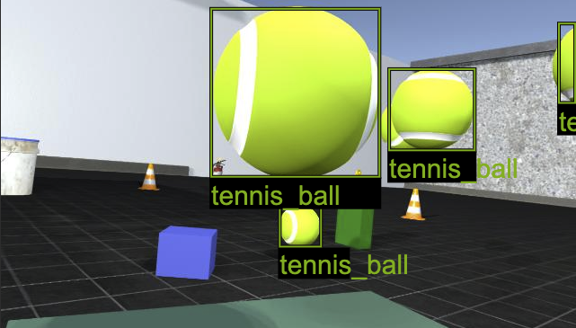
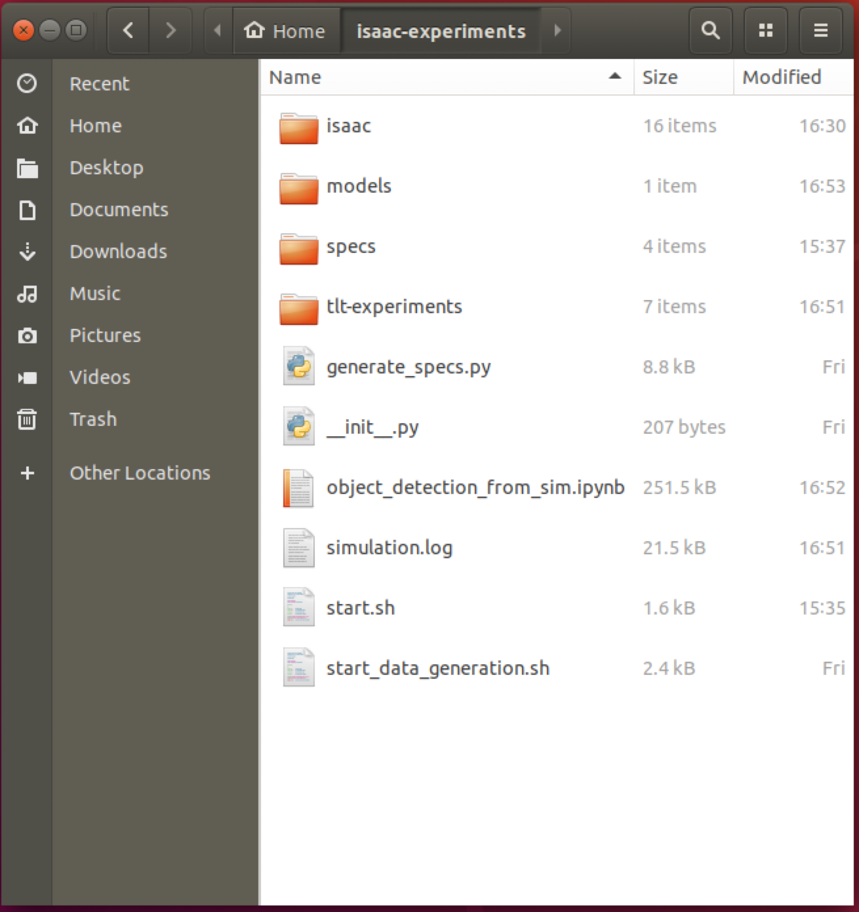

..
   Copyright (c) 2020, NVIDIA CORPORATION. All rights reserved.
   NVIDIA CORPORATION and its licensors retain all intellectual property
   and proprietary rights in and to this software, related documentation
   and any modifications thereto. Any use, reproduction, disclosure or
   distribution of this software and related documentation without an express
   license agreement from NVIDIA CORPORATION is strictly prohibited.

.. _training_in_docker:

Training Object Detection from Simulation in Docker
===================================================

A common problem in AI is data collection and tagging of training samples. Collecting this
data is usually a manual process that is time and resource consuming, and hard to reproduce
situations are often not covered. Isaac SDK provides a solution to this problem by
generating datasets from simulated environments using :ref:`Isaac Sim Unity3D<isaac_sim_unity3d>`.

In this tutorial, you will train an object detection network using Transfer Learning with a dataset
from a simulation. We have built a Docker image that contains all the tools you need, as well
as a Jupyter notebook that you will use for training.

Using this Docker image, you will be able to quickly start exploring the capabilities of Isaac SDK,
but we recommended that you install the complete Isaac SDK on your host machine, as described in the
:ref:`setup-isaac` section, for optimal performance.

How It Works
------------

By setting up a simulation scenario and placing a simulated robot in this environment, you can use
the Isaac SDK to extract samples as if there was a real robot taking pictures or video.

Along with images, the simulation environment provides exact information about what the robot is
capturing on camera. This information is then used to automatically tag the pictures.

Once a picture is taken, a new scenario is set up randomly, and the process repeats until enough
images and tags are generated. You will also learn how to set the size of this dataset.

Host Setup
----------

Hardware Requirements
^^^^^^^^^^^^^^^^^^^^^

NVIDIA Pascal GPU or newer. GTX 1080Ti and Titan V are the minimum recommended GPUs.

Software Requirements
^^^^^^^^^^^^^^^^^^^^^

* Ubuntu 18.04
* Docker 19.03 or newer
* NVIDIA CUDA drivers
* NVIDIA NGC Account and API key

Run the following script to install the software requirements on your Ubuntu 18.04 desktop.
You can copy and paste the following commands to a terminal window:

.. code-block:: bash

  #Docker CE repository
  sudo apt-get install apt-transport-https ca-certificates curl gnupg-agent software-properties-common
  curl -fsSL https://download.docker.com/linux/ubuntu/gpg | sudo apt-key add -
  sudo add-apt-repository "deb [arch=amd64] https://download.docker.com/linux/ubuntu $(lsb_release -cs) stable"

  #NVIDIA CUDA Drivers
  wget https://developer.download.nvidia.com/compute/cuda/repos/ubuntu1804/x86_64/cuda-ubuntu1804.pin
  sudo mv cuda-ubuntu1804.pin /etc/apt/preferences.d/cuda-repository-pin-600
  wget http://developer.download.nvidia.com/compute/cuda/10.2/Prod/local_installers/cuda-repo-ubuntu1804-10-2-local-10.2.89-440.33.01_1.0-1_amd64.deb
  sudo dpkg -i cuda-repo-ubuntu1804-10-2-local-10.2.89-440.33.01_1.0-1_amd64.deb
  sudo apt-key add /var/cuda-repo-10-2-local-10.2.89-440.33.01/7fa2af80.pub

  #NVIDIA Docker
  distribution=$(. /etc/os-release;echo $ID$VERSION_ID)
  curl -s -L https://nvidia.github.io/nvidia-docker/gpgkey | sudo apt-key add -
  curl -s -L https://nvidia.github.io/nvidia-docker/$distribution/nvidia-docker.list | sudo tee /etc/apt/sources.list.d/nvidia-docker.list

  #Install packages
  sudo apt-get update
  sudo apt-get install docker-ce
  sudo apt-get -y install cuda
  sudo apt-get install -y nvidia-container-toolkit

  #Add yourself to the docker group
  sudo usermod -a -G docker $(id -nu)
  echo "All installed"

Once all the software is installed, restart your machine to load the NVIDIA CUDA Drivers:

.. code-block:: bash

  sudo shutdown -r now

Log back in to your Ubuntu desktop environment and open a new terminal window. Use the following
command to verify that the installation went well:

.. code-block:: bash

  docker run --gpus all nvidia/cuda:10.0-base nvidia-smi

You should see a message indicating some statistics from your GPU and CUDA libraries.
The following is an example output from this command.

.. code-block:: bash

  +-----------------------------------------------------------------------------+
  | NVIDIA-SMI 440.33.01    Driver Version: 440.33.01    CUDA Version: 10.2     |
  |-------------------------------+----------------------+----------------------+
  | GPU  Name        Persistence-M| Bus-Id        Disp.A | Volatile Uncorr. ECC |
  | Fan  Temp  Perf  Pwr:Usage/Cap|         Memory-Usage | GPU-Util  Compute M. |
  |===============================+======================+======================|
  |   0  TITAN V             On   | 00000000:17:00.0 Off |                  N/A |
  | 30%   44C    P8    26W / 250W |      0MiB / 12066MiB |      0%      Default |
  +-------------------------------+----------------------+----------------------+
  |   1  TITAN V             On   | 00000000:65:00.0  On |                  N/A |
  | 30%   44C    P8    27W / 250W |    404MiB / 12063MiB |      0%      Default |
  +-------------------------------+----------------------+----------------------+

  +-----------------------------------------------------------------------------+
  | Processes:                                                       GPU Memory |
  |  GPU       PID   Type   Process name                             Usage      |
  |=============================================================================|
  |    1      2983      G   /usr/lib/xorg/Xorg                           256MiB |
  |    1      3117      G   /usr/bin/gnome-shell                         145MiB |
  +-----------------------------------------------------------------------------+

If you have trouble, please see the :ref:`Isaac FAQs <faqs>` or visit the forums.

NGC Docker Registry Setup
^^^^^^^^^^^^^^^^^^^^^^^^^

The NGC registry hosts Docker images for AI as well as models, datasets, and tools for HPC, AI, and
other technologies from NVIDIA and partners. To use this tutorial, you will need to
have an account and create an API key. This will let you download the `isaac-experiments` image,
as well as pre-trained models for Transfer Learning.

Visit NGC_ to set up a new account. Once you are logged in, visit the `API Key creation page`_ and
follow the on-screen instructions.

.. _NGC: https://ngc.nvidia.com
.. _API Key creation page: https://ngc.nvidia.com/setup/api-key

Keep the API key stored safely; we'll use it a couple times during setup.

Use the following command, including your API key to log in to the NGC Docker Registry:

.. code-block:: bash

  docker login -u '$oauthtoken' nvcr.io

First Run
_________

The image creates many files to provide you with opportunities to customize and
control the behavior of the simulation and training. We recommend creating a
separate folder to hold your experiments.

Run the following commands to create an :code:`isaac-experiments` folder and create the startup
script for the container.

.. code-block:: bash

  mkdir ~/isaac-experiments
  cd ~/isaac-experiments
  docker run -u $(id -u) -v $PWD:/workspace nvcr.io/nvidia/isaac-ml-training:2020.1 -s

A new script named :code:`start.sh` will be created in your :code:`isaac-experiments` folder.

The `root` password will be required every time you run the :code:`start.sh` script, since
it will be used to configure your X-server to allow communication from inside Docker.

To start, run the following command in the same terminal window as above:

.. code-block:: bash

  ./start.sh

Finally, you will see the following message:

.. code-block:: bash

  ***************************************************************************************************
  * Open your browser and go to:                                                                    *
  * http://localhost:8888/notebooks/object_detection_from_sim.ipynb?token=object-detection-from-sim *
  *                                                                                                 *
  ***************************************************************************************************
  Press Ctrl-C twice to exit

Control-click on the link to open your browser. This link will take you to a Jupyter notebook that
you can run. The Jupyter notebook will be the main way you control dataset generation and the flow
of your experiments.

Dataset Generation Configuration
--------------------------------

Your Workspace
^^^^^^^^^^^^^^

Note that inside the Docker container, your `~/isaac-experiments` folder is mounted as
`/workspace`.

Whenever you see this folder being called from inside docker, it actually refers
to a folder in your host machine, and any changes you do to files in this folder will be reflected
immediately. This is a great way to pass files, executables and scripts between the container and
your machine.

Jupyter Variable Setup
^^^^^^^^^^^^^^^^^^^^^^

At the top of the Jupyter notebook, you have a few variables to configure. These control the way
the dataset is generated:

* **KEY** This can be any string. We've provided a default key, but you should set a unique one.
  You don't need to change it for every experiment, but you will need to provide it to the apps
  that make use of your trained model for inference.
* **USER_EXPERIMENT_DIR** The location where the files generated during training will be saved
* **DATA_DIR** The location of the dataset will be located.
* **SPECS_DIR** The folder for your experiment specs, which control all advanced parameters for
  training
* **TRAINING_TESTS** The number of test images to generate. Used during evaluation of your trained
  model.
* **TRAINING_SAMPLES** The number of training images and tags to generate. Larger sets mean more
  precision to a point, but take longer to process.

Start Training
--------------

Once you have set up your parameters in the Jupyter notebook, follow the instructions on each cell
to run it.

Adding Your Own 3D Models
^^^^^^^^^^^^^^^^^^^^^^^^^

If you have a 3D model that you would like to include in the image dataset, just place it in the
`isaac-experiments/models` folder in **FBX** format. The file name, without the extension, will be
used as the label on the dataset. Please keep the 3D models at around the same scale as the tennis
ball model; a good rule of thumb is to use objects that you would find on a desk or table.

There are some restrictions on the type of models you can add.

* **Transparent textures** are not supported in this mode. If you have transparent textures in
  your models, they may not render or be labeled correctly.
* **Textures should be embedded** in the FBX model. If your textures look like they are missing,
  try regenerating your model with embedded textures. Adding model textures as additional
  files is not supported.

Customizing Your Scenarios
^^^^^^^^^^^^^^^^^^^^^^^^^^

The Isaac SDK can run larger simulations and generate datasets for complicated scenarios. Refer to
the :ref:`isaac_sim_unity3d` documentation for more details.

Troubleshooting
---------------

* **Accidentally deleted a file and now nothing works**: If you have deleted one of the provided
  files, there is a chance that the notebook will start throwing errors. If this happens, you don't
  need to lose all your work. Just restart the Docker container, and the startup script will
  replace any of the required files with a fresh copy.

* **A black window appears when generating the dataset**: This is normal, as the simulation needs
  access to a real display that is connected to the GPU. To provide this, we connect the internal
  simulation to the real X server on your host. You can safely ignore this window--it will
  disappear once dataset generation is done.

* **When looking at Isaac Websight, there are no graphs or no information is displayed**: Try to
  enable any disabled channels on the left-hand sidebar. This should restore the graphs.

Where to Go from Here
---------------------

If you want to explore developing robotics applications with Isaac, take a
look at other tutorials in this documentation.

You can keep using this Docker image as your development container, but you will have better
performance if you perform a  :ref:`full installation<getting_started>` on your host machine.
