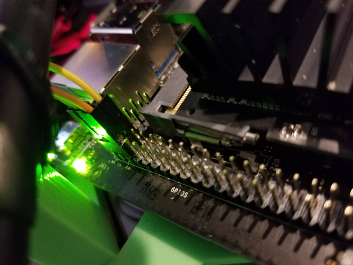
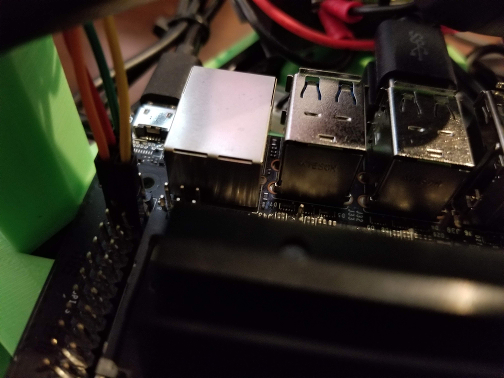
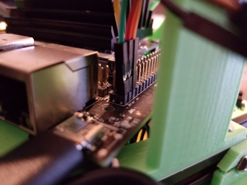
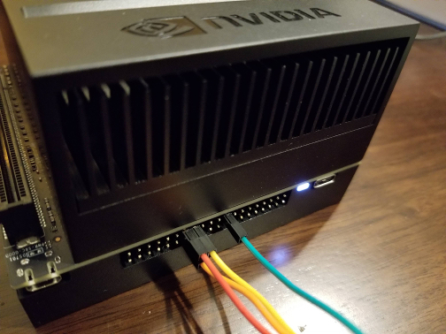

..
   Copyright (c) 2020, NVIDIA CORPORATION. All rights reserved.
   NVIDIA CORPORATION and its licensors retain all intellectual property
   and proprietary rights in and to this software, related documentation
   and any modifications thereto. Any use, reproduction, disclosure or
   distribution of this software and related documentation without an express
   license agreement from NVIDIA CORPORATION is strictly prohibited.

.. _wire-bmi160-imu:

Wire the BMI160 IMU to the Jetson Nano or Xavier
===================================================

The Bosch Sensortec BMI160 Inertial Measurement Unit attaches to the Jetson
board via the 40 pin GPIO Expansion Header. The IMU sample app is configured to
look for the BMI160 on I2C bus 1. Here are instructions on how to wire the IMU
to I2C bus 1.

.. Note::

   The BMI160 IMU is an exposed PCB. When handling this device, avoid contact that could lead to
   electrostatic discharge (ESD), which may damage the device.

Jetson Nano
----------------------------------

From the BMI160 to the Jetson Nano 40 pin connector attach VIN to GPIO 1, GND to
GPIO 6, SCL to GPIO 5, and SDA to GPIO 3.

+--------+------+
| BMI160 | GPIO |
+========+======+
| VIN    |    1 |
+--------+------+
| GND    |    6 |
+--------+------+
| SCL    |    5 |
+--------+------+
| SDA    |    3 |
+--------+------+

It is a little hard to see the wiring in these photos since the Nano is attached
to a robot, so multiple photos are included.

Wiring::

    Green wire:  VIN => GPIO 1
    Red wire:    SDA => GPIO 3
    Orange wire: SCL => GPIO 5
    Yellow wire: GND => GPIO 6

Jetson Xavier
----------------------------------

From the BMI160 to the Jetson Xavier 40 pin connector attach VIN to GPIO 17, GND
to GPIO 25, SCL to GPIO 28, and SDA to GPIO 27.

+--------+------+
| BMI160 | GPIO |
+========+======+
| VIN    |   17 |
+--------+------+
| GND    |   25 |
+--------+------+
| SCL    |   28 |
+--------+------+
| SDA    |   27 |
+--------+------+

Wiring::

    Green wire:  VIN => GPIO 17
    Yellow wire: GND => GPIO 25
    Red wire:    SDA => GPIO 27
    Orange wire: SCL => GPIO 28

User Permissions
----------------------------------

On the Jetson, ``/dev/i2c-*`` is owned by the user ``root``, and are in the
group ``i2c``. The sample app will need to run as either root, or by a
user in the i2c group.

To add the current user to the i2c group, use the following command:

.. code-block:: bash

    sudo usermod -a -G i2c $USER
