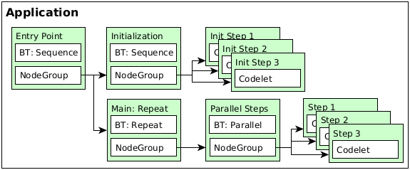
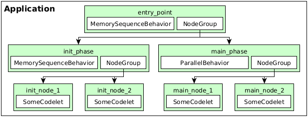
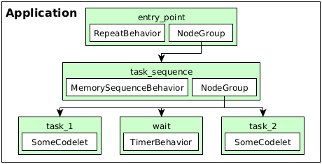

..
   Copyright (c) 2020, NVIDIA CORPORATION. All rights reserved.
   NVIDIA CORPORATION and its licensors retain all intellectual property
   and proprietary rights in and to this software, related documentation
   and any modifications thereto. Any use, reproduction, disclosure or
   distribution of this software and related documentation without an express
   license agreement from NVIDIA CORPORATION is strictly prohibited.

Behavior Trees
==============

Behavior tree codelets are one of the primary mechanisms to control the flow of tasks in Isaac SDK.
They follow the same general behavior as classical behavior trees, with some useful additions for
robotics applications. This document gives an overview of the general concept, the available
behavior tree node types, and some examples of how to use them individually or in conjunction with
each other.

General Concept
***************

Behavior trees consist of n-ary trees of nodes that can have zero or more children, depending on the
type of node. In Isaac SDK, one node in a behavior tree is reflected as one node in the
application definition. The actual behavior tree codelet is added as a codelet to that node. If the
behavior tree node has children, the application node also requires a codelet of type
:code:`NodeGroup`.

The general structure of such a tree looks like this:

In this example, the entry point of the application contains two child nodes that are run in
sequence: An initialization sequence consisting of arbitrary codelets that are executed in the order
in which they are defined, and a main node that keeps repeating its single child node. The repeated
node runs three nodes in parallel and only finishes once all parallel nodes have finished their
execution.

Running behavior tree nodes can have two outcomes: success or failure. This information is used by
parent nodes to steer the control flow (e.g. trigger error handling upon failure or move to the next
processing step upon success). The actual effect of child-node success or failure depends on the
parent codelet. This is described in the respective sections below.

For child nodes that should be started in the context of a parent node, it is generally advisable to
set their :code:`disable_automatic_start` field to ``true`` to ensure that they are not started upon
application startup. The examples below exemplify this.

Using this machinery, arbitrarily complex behaviors can be produced. Any Isaac SDK codelet can be
used as a child node to any behavior tree node that accepts child nodes. The available behavior tree
codelets are explained in the following section.

Codelets Overview
*****************

Each behavior tree codelet can have a set of parameters defining how it should behave, and any
behavior tree codelet that accepts child nodes expects the same application node to contain a
codelet of type :code:`NodeGroup`.

ConstantBehavior
~~~~~~~~~~~~~~~~

**Description**: After each tick period, switches its own status to the configured desired
:code:`status`.

+----------------------------------------------------------------------------------------+
| **Parameters**                                                                         |
+---------------+-------------------+----------------------------------------------------+
| **Parameter** | **Default Value** | **Description**                                    |
+---------------+-------------------+----------------------------------------------------+
| status        | success           | String value denoting the desired status to switch |
|               |                   | to during each tick. This value can be changed     |
|               |                   | dynamically and will be evaluated during each tick |
|               |                   | of this codelet. Possible values: "success",       |
|               |                   | "failure".                                         |
+---------------+-------------------+----------------------------------------------------+

+-------------------------------------------+
| **Child Nodes**                           |
+-------------------------------+-----------+
| Accepts child nodes           | No        |
+-------------------------------+-----------+
| Minimum number of child nodes | none      |
+-------------------------------+-----------+
| Maximum number of child nodes | none      |
+-------------------------------+-----------+

**Example**

Upon application start, start the node :code:`constant_node`. During the next tick, switch status to
"failure".

.. code-block:: json

   {
     "name": "constant_example",
     "graph": {
       "nodes": [
         {
           "name": "constant_node",
           "components": [
             {
               "name": "ConstantBehavior",
               "type": "isaac::behavior_tree::ConstantBehavior"
             }
           ]
         }
       ]
     },
     "config": {
       "constant_node": {
         "ConstantBehavior": {
           "status": "failure"
         }
       }
     }
   }

MemorySelectorBehavior
~~~~~~~~~~~~~~~~~~~~~~

**Description**: Runs all child nodes in sequence until one succeeds, then reports success. If all
child nodes fail (or no child nodes are present), this codelet fails.

**Parameters:** None

+-------------------------------------------+
| **Child Nodes**                           |
+-------------------------------+-----------+
| Accepts child nodes           | Yes       |
+-------------------------------+-----------+
| Minimum number of child nodes | 0         |
+-------------------------------+-----------+
| Maximum number of child nodes | unlimited |
+-------------------------------+-----------+

**Example**

Upon application start, start the :code:`selector_node` node, which then starts the
:code:`child_node_1` and :code:`child_node_2` child nodes in sequence. Depending on their results,
it will succeed or fail.

.. code-block:: json

   {
     "name": "selector_example",
     "graph": {
       "nodes": [
         {
           "name": "selector_node",
           "components": [
             {
               "name": "NodeGroup",
               "type": "isaac::behavior_tree::NodeGroup"
             },
             {
               "name": "MemorySelectorBehavior",
               "type": "isaac::behavior_tree::MemorySelectorBehavior"
             }
           ]
         },
         {
           "name": "child_node_1",
           "components": [
             {
               "name": "SomeCodelet",
               "type": "isaac::SomeCodeletType"
             }
           ],
           "disable_automatic_start": true
         },
         {
           "name": "child_node_2",
           "components": [
             {
               "name": "SomeCodelet",
               "type": "isaac::SomeCodeletType"
             }
           ],
           "disable_automatic_start": true
         }
       ]
     },
     "config": {
       "selector_node": {
         "NodeGroup": {
           "node_names": [
             "child_node_1",
             "child_node_2"
           ]
         }
       }
     }
   }

MemorySequenceBehavior
~~~~~~~~~~~~~~~~~~~~~~

**Description**: Runs its child nodes in sequence, in the order in which they are defined. Succeeds
when all child nodes succeed, or fails as soon as one child node fails.

**Parameters:** None

+-------------------------------------------+
| **Child Nodes**                           |
+-------------------------------+-----------+
| Accepts child nodes           | Yes       |
+-------------------------------+-----------+
| Minimum number of child nodes | 1         |
+-------------------------------+-----------+
| Maximum number of child nodes | unlimited |
+-------------------------------+-----------+

**Example**

Upon application start, start the node :code:`sequence_node`. The node then runs the
:code:`child_node_1` and :code:`child_node_2` child nodes in sequence.

.. code-block:: json

   {
     "name": "sequence_example",
     "graph": {
       "nodes": [
         {
           "name": "sequence_node",
           "components": [
             {
               "name": "NodeGroup",
               "type": "isaac::behavior_tree::NodeGroup"
             },
             {
               "name": "MemorySequenceBehavior",
               "type": "isaac::behavior_tree::MemorySequenceBehavior"
             }
           ]
         },
         {
           "name": "child_node_1",
           "components": [
             {
               "name": "SomeCodelet",
               "type": "isaac::SomeCodeletType"
             }
           ],
           "disable_automatic_start": true
         },
         {
           "name": "child_node_2",
           "components": [
             {
               "name": "SomeCodelet",
               "type": "isaac::SomeCodeletType"
             }
           ],
           "disable_automatic_start": true
         }
       ]
     },
     "config": {
       "sequence_node": {
         "NodeGroup": {
           "node_names": [
             "child_node_1",
             "child_node_2"
           ]
         }
       }
     }
   }

ParallelBehavior
~~~~~~~~~~~~~~~~

**Description**: Runs its child nodes in parallel. By default, succeeds when all child nodes
succeed, and fails when all child nodes fail. This behavior can be customized using the parameters
below.

+--------------------------------------------------------------------------------------------------+
| **Parameters**                                                                                   |
+-------------------+-------------------+----------------------------------------------------------+
| **Parameter**     | **Default Value** | **Description**                                          |
+-------------------+-------------------+----------------------------------------------------------+
| success_threshold | -1                | Number of successful children required for success.      |
|                   |                   | -1 means all children must succeed for this node to      |
|                   |                   | succeed.                                                 |
+-------------------+-------------------+----------------------------------------------------------+
| failure_threshold | -1                | Number of failed children required for failure.          |
|                   |                   | -1 means all children must fail for this node to fail.   |
+-------------------+-------------------+----------------------------------------------------------+

+-------------------------------------------+
| **Child Nodes**                           |
+-------------------------------+-----------+
| Accepts child nodes           | Yes       |
+-------------------------------+-----------+
| Minimum number of child nodes | 1         |
+-------------------------------+-----------+
| Maximum number of child nodes | unlimited |
+-------------------------------+-----------+

**Example**

Upon application start, start the :code:`parallel_node` node, which then runs the
:code:`child_node_1` and :code:`child_node_2` child nodes in parallel.

.. code-block:: json

   {
     "name": "parallel_example",
     "graph": {
       "nodes": [
         {
           "name": "parallel_node",
           "components": [
             {
               "name": "NodeGroup",
               "type": "isaac::behavior_tree::NodeGroup"
             },
             {
               "name": "ParallelBehavior",
               "type": "isaac::behavior_tree::ParallelBehavior"
             }
           ]
         },
         {
           "name": "child_node_1",
           "components": [
             {
               "name": "SomeCodelet",
               "type": "isaac::SomeCodeletType"
             }
           ],
           "disable_automatic_start": true
         },
         {
           "name": "child_node_2",
           "components": [
             {
               "name": "SomeCodelet",
               "type": "isaac::SomeCodeletType"
             }
           ],
           "disable_automatic_start": true
         }
       ]
     },
     "config": {
       "parallel_node": {
         "NodeGroup": {
           "node_names": [
             "child_node_1",
             "child_node_2"
           ]
         }
       }
     }
   }

RepeatBehavior
~~~~~~~~~~~~~~

**Description**: Repeats its only child node, with a :code:`wait_duration` optional time delay
between repetitions. By default, won't repeat when the child node fails. This can be customized
using the parameters below.

+-------------------------------------------------------------------------------------------------+
| **Parameters**                                                                                  |
+----------------------+-------------------+------------------------------------------------------+
| **Parameter**        | **Default Value** | **Description**                                      |
+----------------------+-------------------+------------------------------------------------------+
| repeat_after_failure | false             | Denotes whether to repeat the child after it has     |
|                      |                   | failed. Fail otherwise when child node fails.        |
+----------------------+-------------------+------------------------------------------------------+
| wait_duration        | 1.0               | Duration in seconds to wait between two repetitions. |
+----------------------+-------------------+------------------------------------------------------+

+-------------------------------------------+
| **Child Nodes**                           |
+-------------------------------+-----------+
| Accepts child nodes           | Yes       |
+-------------------------------+-----------+
| Minimum number of child nodes | 1         |
+-------------------------------+-----------+
| Maximum number of child nodes | 1         |
+-------------------------------+-----------+

**Example**

Upon application start, start the :code:`repeat_node` node, which then runs the :code:`child_node`
node repetitively. The node :code:`repeat_node` is configured to repeat its child node
even when it reports a failure.

.. code-block:: json

   {
     "name": "repeat_example",
     "graph": {
       "nodes": [
         {
           "name": "repeat_node",
           "components": [
             {
               "name": "NodeGroup",
               "type": "isaac::behavior_tree::NodeGroup"
             },
             {
               "name": "RepeatBehavior",
               "type": "isaac::behavior_tree::RepeatBehavior"
             }
           ]
         },
         {
           "name": "child_node",
           "components": [
             {
               "name": "SomeCodelet",
               "type": "isaac::SomeCodeletType"
             }
           ],
           "disable_automatic_start": true
         }
       ]
     },
     "config": {
       "repeat_node": {
         "NodeGroup": {
           "node_names": [
             "child_node"
           ]
         },
         "RepeatBehavior": {
           "repeat_after_failure": true
         }
       }
     }
   }

SwitchBehavior
~~~~~~~~~~~~~~

**Description**: Runs the child node with the name defined as :code:`desired_behavior`. The child
can optionally be referenced by an alias defined in :code:`node_alias_map`. In both cases, the
referenced child node must be part of the :code:`node_names` list of the node :code:`NodeGroup`.

+---------------------------------------------------------------------------------------------+
| **Parameters**                                                                              |
+------------------+-------------------+------------------------------------------------------+
| **Parameter**    | **Default Value** | **Description**                                      |
+------------------+-------------------+------------------------------------------------------+
| desired_behavior |                   | Child node name or alias present in "node_alias_map".|
|                  |                   | The referenced node will be run when this node runs  |
|                  |                   | and returns its result status. May not be empty.     |
+------------------+-------------------+------------------------------------------------------+
| node_alias_map   | {}                | JSON associative array mapping node alias names to   |
|                  |                   | existing node names.                                 |
+------------------+-------------------+------------------------------------------------------+

+-------------------------------------------+
| **Child Nodes**                           |
+-------------------------------+-----------+
| Accepts child nodes           | Yes       |
+-------------------------------+-----------+
| Minimum number of child nodes | 1         |
+-------------------------------+-----------+
| Maximum number of child nodes | unlimited |
+-------------------------------+-----------+

**Example**

Upon application start, start the node :code:`switch_node`. That node then starts its child node
:code:`child_node_1` as its :code:`desired_behavior` is set to :code:`alias_1`, which points to
:code:`child_node_1`.

.. code-block:: json

   {
     "name": "switch_example",
     "graph": {
       "nodes": [
         {
           "name": "switch_node",
           "components": [
             {
               "name": "NodeGroup",
               "type": "isaac::behavior_tree::NodeGroup"
             },
             {
               "name": "SwitchBehavior",
               "type": "isaac::behavior_tree::SwitchBehavior"
             }
           ]
         },
         {
           "name": "child_node_1",
           "components": [
             {
               "name": "SomeCodelet",
               "type": "isaac::SomeCodeletType"
             }
           ],
           "disable_automatic_start": true
         },
         {
           "name": "child_node_2",
           "components": [
             {
               "name": "SomeCodelet",
               "type": "isaac::SomeCodeletType"
             }
           ],
           "disable_automatic_start": true
         }
       ]
     },
     "config": {
       "switch_node": {
         "NodeGroup": {
           "node_names": [
             "child_node_1",
             "child_node_2"
           ]
         },
         "SwitchBehavior": {
           "node_alias_map": {
             "alias_1": "child_node_1",
             "alias_2": "child_node_2"
           },
           "desired_behavior": "alias_1"
         }
       }
     }
   }

TimerBehavior
~~~~~~~~~~~~~

**Description**: Waits for a specified amount of time :code:`delay`, and switches to the configured
result :code:`status` afterwards.

+---------------------------------------------------------------------------------------------+
| **Parameters**                                                                              |
+------------------+-------------------+------------------------------------------------------+
| **Parameter**    | **Default Value** | **Description**                                      |
+------------------+-------------------+------------------------------------------------------+
| delay            | 1.0               | Duration in seconds to wait before switching to the  |
|                  |                   | desired status.                                      |
+------------------+-------------------+------------------------------------------------------+
| status           | success           | String value denoting the desired status to switch   |
|                  |                   | to after the timer delay runs out.                   |
|                  |                   | Possible values: "success", "failure", "running",    |
|                  |                   | "invalid". Setting this value to "running" or        |
|                  |                   | "invalid"  will lead to undefined behavior in the    |
|                  |                   | application.                                         |
+------------------+-------------------+------------------------------------------------------+

+-------------------------------------------+
| **Child Nodes**                           |
+-------------------------------+-----------+
| Accepts child nodes           | No        |
+-------------------------------+-----------+
| Minimum number of child nodes | none      |
+-------------------------------+-----------+
| Maximum number of child nodes | none      |
+-------------------------------+-----------+

**Example**

Upon application start, start the :code:`timer_node` node. After 5.0 seconds, report a failure.

.. code-block:: json

   {
     "name": "timer_example",
     "graph": {
       "nodes": [
         {
           "name": "timer_node",
           "components": [
             {
               "name": "TimerBehavior",
               "type": "isaac::behavior_tree::TimerBehavior"
             }
           ]
         }
       ]
     },
     "config": {
       "timer_node": {
         "TimerBehavior": {
           "delay": 5.0,
           "status": "failure"
         }
       }
     }
   }

Examples
********

These examples showcase how to combine different behaviors described above.

Sequential initialization phase, parallel main phase
~~~~~~~~~~~~~~~~~~~~~~~~~~~~~~~~~~~~~~~~~~~~~~~~~~~~

This example shows how to combine instances of the :code:`MemorySequenceBehavior` and
:code:`ParallelBehavior` behaviors to form a hierarchical sequence of task phases. After the
:code:`entry_point` node is started, first the :code:`init_phase` child node runs, which then runs
a sequence of initialization nodes (:code:`init_node_1` and :code:`init_node_2`). After that, the
:code:`main_phase` node is started, which runs two nodes in parallel: :code:`main_node_1` and
:code:`main_node_2`. The below image depicts this app structure.

.. code-block:: json

   {
     "name": "init_main_phases_example",
     "graph": {
       "nodes": [
         {
           "name": "entry_point",
           "components": [
             {
               "name": "NodeGroup",
               "type": "isaac::behavior_tree::NodeGroup"
             },
             {
               "name": "MemorySequenceBehavior",
               "type": "isaac::behavior_tree::MemorySequenceBehavior"
             }
           ]
         },
         {
           "name": "init_phase",
           "components": [
             {
               "name": "NodeGroup",
               "type": "isaac::behavior_tree::NodeGroup"
             },
             {
               "name": "MemorySequenceBehavior",
               "type": "isaac::behavior_tree::MemorySequenceBehavior"
             }
           ],
           "disable_automatic_start": true
         },
         {
           "name": "main_phase",
           "components": [
             {
               "name": "NodeGroup",
               "type": "isaac::behavior_tree::NodeGroup"
             },
             {
               "name": "ParallelBehavior",
               "type": "isaac::behavior_tree::ParallelBehavior"
             }
           ],
           "disable_automatic_start": true
         },
         {
           "name": "init_node_1",
           "components": [
             {
               "name": "SomeCodelet",
               "type": "isaac::SomeCodeletType"
             }
           ],
           "disable_automatic_start": true
         },
         {
           "name": "init_node_2",
           "components": [
             {
               "name": "SomeCodelet",
               "type": "isaac::SomeCodeletType"
             }
           ],
           "disable_automatic_start": true
         },
         {
           "name": "main_node_1",
           "components": [
             {
               "name": "SomeCodelet",
               "type": "isaac::SomeCodeletType"
             }
           ],
           "disable_automatic_start": true
         },
         {
           "name": "main_node_2",
           "components": [
             {
               "name": "SomeCodelet",
               "type": "isaac::SomeCodeletType"
             }
           ],
           "disable_automatic_start": true
         }
       ]
     },
     "config": {
       "entry_point": {
         "NodeGroup": {
           "node_names": [
             "init_phase",
             "main_phase"
           ]
         }
       },
       "init_phase": {
         "NodeGroup": {
           "node_names": [
             "init_node_1",
             "init_node_2"
           ]
         }
       },
       "main_phase": {
         "NodeGroup": {
           "node_names": [
             "main_node_1",
             "main_node_2"
           ]
         }
       }
     }
   }

Segmented task execution with waiting period
~~~~~~~~~~~~~~~~~~~~~~~~~~~~~~~~~~~~~~~~~~~~

This example shows how to segment a more complex task into multiple steps that require waiting
periods between them. After the :code:`entry_point` node is started, it runs its only child node,
:code:`task_sequence`. In the task sequence, the :code:`task_1` node is run, followed by a 2.5
second waiting period performed by the :code:`wait` node. Afterwards, the child node :code:`task_2`
is run. The whole sequence is repeated by :code:`entry_point` after a period of 5.0 seconds.

.. code-block:: json

   {
     "name": "tasks_wait_example",
     "graph": {
       "nodes": [
         {
           "name": "entry_point",
           "components": [
             {
               "name": "NodeGroup",
               "type": "isaac::behavior_tree::NodeGroup"
             },
             {
               "name": "RepeatBehavior",
               "type": "isaac::behavior_tree::RepeatBehavior"
             }
           ]
         },
         {
           "name": "task_sequence",
           "components": [
             {
               "name": "NodeGroup",
               "type": "isaac::behavior_tree::NodeGroup"
             },
             {
               "name": "MemorySequenceBehavior",
               "type": "isaac::behavior_tree::MemorySequenceBehavior"
             }
           ],
           "disable_automatic_start": true
         },
         {
           "name": "task_1",
           "components": [
             {
               "name": "SomeCodelet",
               "type": "isaac::SomeCodelet"
             }
           ],
           "disable_automatic_start": true
         },
         {
           "name": "task_2",
           "components": [
             {
               "name": "SomeCodelet",
               "type": "isaac::SomeCodelet"
             }
           ],
           "disable_automatic_start": true
         },
         {
           "name": "wait",
           "components": [
             {
               "name": "TimerBehavior",
               "type": "isaac::behavior_tree::TimerBehavior"
             }
           ],
           "disable_automatic_start": true
         }
       ]
     },
     "config": {
       "entry_point": {
         "NodeGroup": {
           "node_names": [
             "task_sequence"
           ]
         },
         "RepeatBehavior": {
           "wait_duration": 5.0
         }
       },
       "task_sequence": {
         "NodeGroup": {
           "node_names": [
             "task_1",
             "wait",
             "task_2"
           ]
         }
       },
       "wait": {
         "TimerBehavior": {
           "delay": 2.5
         }
       }
     }
   }
