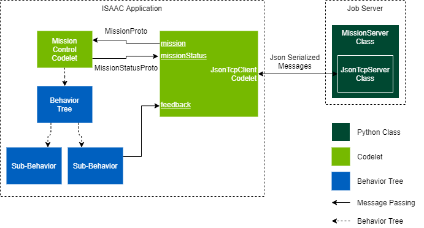
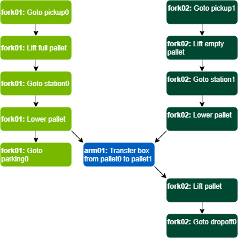

..
   Copyright (c) 2020, NVIDIA CORPORATION. All rights reserved.
   NVIDIA CORPORATION and its licensors retain all intellectual property
   and proprietary rights in and to this software, related documentation
   and any modifications thereto. Any use, reproduction, disclosure or
   distribution of this software and related documentation without an express
   license agreement from NVIDIA CORPORATION is strictly prohibited.

Mission Submission
=================================

Managing a fleet of robots requires the ability to programmatically send tasks to robots and
receive feedback in realtime. In addition, it is often necessary to coordinate tasks between
multiple robots to accomplish a single goal. The mission submission system addresses these two
needs.

Missions
--------

In ISAAC, a mission is defined by two parts:

1. A behavior tree (see :ref:`Behavior Trees`) that defines the overall behavior of the mission
  (i.e., navigate to a waypoint).
2. An ISAAC application configuration that sets the parameters of the mission (i.e., which waypoint
   to navigate to).

Once a mission is started, it has three possible states:

:RUNNING:
    The mission is in progress and the behavior tree that defines the mission is currently running.
:FAILED:
    The behavior tree that defines the mission has stopped via :code:`reportFailure`.
:SUCCESS:
    The behavior tree that defines the mission has stopped via :code:`reportSuccess`.

The :ref:`MissionProto` message is used to encode a mission, and the :ref:`MissionStatusProto`
message encodes a mission status.

Mission Client Subsystem
------------------------

The mission client subsystem is an ISAAC subgraph that can be added to an application to enable it
to receive missions. It is located at :code:`//packages/behavior_tree/apps:missions`

The following applications use the mission client subsystem and can be used as examples on how to
integrate it into an application:

:flatsim: :code:`//packages/flatsim/apps:flatsim`
:navsim: :code:`//apps/navsim:navsim_navigate`
:carter: :code:`//apps/carter:carter`

The mission client subsystem consists of the following parts:

- A :ref:`Mission Codelet` that starts a mission by triggering a behavior tree and reports the
  status of a running mission.
- A :ref:`JsonTcpClient Codelet` that allows the robot to connect to an external mission server
  to receive and report missions.
- A JsonMockup codelet that periodically transmits the name of the robot to the JsonTcpClient
  codelet to facilitate robot identification.

Mission Codelet
^^^^^^^^^^^^^^^

The mission codelet is a special type of behavior that enables a robot to run missions. The mission
codelet attaches to a behavior tree. When a mission codelet receives a MissionProto, the following
happens:

1. The mission codelet reads the config parameter of the MissionProto and uses it to set the
   ISAAC application configuration.
2. The mission codelet starts the underlying behavior tree.
3. While the underlying behavior tree is running, the mission codelet periodically transmits a
   MissionStatusProto with a "RUNNING" status to indicate that the mission is in progress.
4. When the behavior tree finishes, the mission codelet sends a final MissionStatusProto
   containing either a "SUCCESS" or "FAILURE" status depending on whether the behavior tree
   reported success or failure, respectively.
5. The mission codelet listens for a new MissionProto message to start a new mission.

Additionally, a mission may be preempted. If the mission codelet receives a MissionProto while a
mission is already running, it stops the behavior tree and sends a MissionStatusProto with a
status of "FAILURE" for the currently running mission. It then proceeds to run the new mission
normally.

JsonTcpClient Codelet
^^^^^^^^^^^^^^^^^^^^^

The JsonTcpClient allows bidirectional communication with a TCP server through JSON serialized
proto messages. Using the JsonTcpClient in conjunction with a mission codelet provides several
benefits:

- JSON is both machine and human readable. This makes it possible to implement a mission server
  using a framework other than ISAAC, such as web framework.
- A :ref:`JsonTcpServer` GEM is provided, which allows easy development of an ISAAC based mission
  server.
- The client/server networking model is better suited to a system with a dynamic number of robots
  than the publisher/subscriber networking model.

Any capnp messages received by the JsonTcpClient are serialized into newline separated JSON
objects and sent to the TCP Server. Similarly, any JSON objects received from the TCP server are
deserialized into capnp messages and transmitted by the JsonTcpClient codelet.

Messages are serialized to JSON as follows:

.. code::

    {"header": {...}, "payload": {...}}

Where

:header:
    A JSON serialized :ref:`MessageHeaderProto` that contains metadata about the message, such as UUID, publishing
    time, and the channel it belongs to.
:payload:
    The JSON serialized capnp proto message.

.. note::
    All 64 bit integers must be serialized as strings to match the behavior of the protocol
    buffer library (See https://developers.google.com/protocol-buffers/docs/proto3#json).

.. note::
    The JsonTcpClient does not currently support data buffers. Protos that use data buffers, such
    as :ref:`TensorProto` or :ref:`ImageProto`, are currently not supported by JsonTcpClient.

Mission Server Subsystem
------------------------

The mission server subsystem consists of two Python classes: MissionServer and JsonTcpServer. For
an ISAAC application, these classes may be incorporated as GEMs in a Python codelet. The classes
may be used directly by non ISAAC applications as well.

The mission server subsystem is present in the source code at :code:`//packages/missions:missions`.

JsonTcpServer Class
^^^^^^^^^^^^^^^^^^^

The JsonTcpServer class is the server side counterpart to the JsonTcpClient codelet. The
JsonTcpServer creates a TCP Server and listens for connections from TCP clients. The TCP protocol
allows multiple clients to be connected to a single server at the same time, and likewise, a
JsonTcpServer allows multiple JsonTcpClients to be connected at once. The JsonTcpServer class
instantiates a JsonTcpClientConnection class for each connected client to handle the communication
with that client.

MissionServer Class
^^^^^^^^^^^^^^^^^^^

The MissionServer class provides a convenient interface to submit missions to robots, track the status of submitted missions, and coordinate missions between different robots. Internally, the MissionServer instantiates a JsonTcpServer class that is used to listen for connections from robots.

Mission Dependencies
""""""""""""""""""""

Oftentimes, many missions spread between multiple robots must be coordinated to achieve a single
goal. The MissionServer class facilitates this by allowing directed acyclic graph (DAG) based
mission dependencies. When a mission is defined, it may have a list of "upstream" missions that it
depends on. A mission is not scheduled to run until all of its "upstream" missions are
completed successfully. If any "upstream" mission fails, the mission is canceled.

The below diagram shows a sample usecase where mission dependencies are used. Two robotic
forklifts ("fork01", and "fork02") and one robotic arm ("arm01") coordinate to complete a single
goal: transferring a box from one pallet to another.

Robot Identification
""""""""""""""""""""

When the MissionServer receives a connection, it is important to identify which robot has
connected so that the correct missions can be dispatched to it. This is accomplished through the
usage of a special "name channel".  When the robot first connects to the MissionServer, the
MissionServer waits for the robot to sends a TextProto on the "name channel". The content of the
TextProto is then parsed and interpreted as the name of the robot that the connection belongs to.
All missions queued for that robot is then be submitted on that connection.

Sample Usage
""""""""""""

The below code shows an example of how to use the MissionServer class:

.. code::

    from packages.missions import Mission, MissionServer

    # Status codes that indicate a mission hasn't yet completed
    INCOMPLETE_STATUSES = (Mission.Status.CREATED,
                           Mission.Status.QUEUED,
                           Mission.Status.STARTED,
                           Mission.Status.RUNNING)

    # Create the mission server, listen on port 9998, and listen for robot
    # names on the "name" channel.
    server = MissionServer(port=9998, name_channel="name")

    # Create 2 missions: The first mission is "upstream" to the second mission,
    # which means that the first mission must finish before the second mission
    # can be scheduled.
    mission_1_config = {
        # ISAAC Node config JSON to configure the mission.
        # ...
    }

    mission_2_config = {
        # ISAAC Node config JSON to configure the mission.
        # ...
    }

    mission_1 = Mission(robot="carter-01", channel="mission",
                        config=mission_1_config)

    mission_2 = Mission(robot="carter-02", channel="mission",
                        config=mission_1_config,
                        upstream=[mission_1])

    # Submit the missions to the server.
    server.submit(mission_1)
    server.submit(mission_2)

    # Wait for all missions to complete. Since mission_2 is downstream from
    # mission_1, if mission_2 is complete, then mission_1 must be complete.
    while (mission_2.status in INCOMPLETE_STATUSES)
        time.sleep(1)

Sample Applications
-------------------

A sample mission server application is provided at :code:`//packages/missions/apps:mission_server`.
This application creates a MissionServer class, reads a list of missions from a JSON file, submits
the missions to the mission server, and waits for the missions to complete. The input json file
must adhere to the following schema:

.. code::

    {
        "missions": [
            {...},
            {...},
            {...},
            {...}
        ]
    }

Each entry in the "missions" array is a json object that defines a mission and may contain the
following fields:

============== ================ ================ ==================================================
Key            Type             Default          Description
============== ================ ================ ==================================================
robot          string           None             The name of the robot to submit the mission to.
channel        string           "mission"        The JsonTcpServer channel to send the MissionProto
                                                 on.
status_channel string           "mission_status" The JsonTcpServer channel the MissionStatusProto
                                                 is received on.
config         json object      {}               The ISAAC application config to embed in the
                                                 MissionProto.
start_timeout  float            5                The start timeout of the mission, in seconds. If
                                                 the mission is not acknowledged by the robot
                                                 before this timeout elapses, then the mission is
                                                 aborted.
timeout        float            inf              The run timeout of the mission, in seconds. If the
                                                 mission is not completed by the robot before this
                                                 timeout elapses, then the mission is aborted.
upstream       list of integers []               A list of missions that are "upstream" from this
                                                 mission. Missions are provided as non-negative
                                                 integers, which are indices into the "missions"
                                                 array in the JSON. A mission is not scheduled
                                                 until all "upstream" missions are complete.
============== ================ ================ ==================================================

Running with Flatsim
--------------------

A sample mission json file is provided for the flatsim application. This file contains four
missions that are coordinated between two different robots. To test this scenario, open three
different terminals and enter the following commands:

.. code::

    # Terminal 1: Start Mission Server
    cd isaac/sdk
    bazel run packages/missions/apps:mission_server -- $PWD/packages/missions/apps/flatsim.json

    # Terminal 2: Start flatsim for carter-01
    bazel run //packages/flatsim/apps:flatsim -- --demo demo_1 --mission_robot_name carter-01

    # Terminal 3: Start flatsim for carter-02
    bazel run //packages/flatsim/apps:flatsim -- --demo demo_1 --mission_robot_name carter-02

Running with Carter
-------------------

A sample mission json file is provided for the carter application. This file contains three
missions that are coordinated on one robot. To test this scenario, first, deploy the carter
application onto your Carter robot.

Next, identify three waypoints on the map for carter to traverse, marking down the x position,
y position, and rotation for each. Open the :code:`sdk/packages/missions/apps/carter.json` file
and replace the waypoints in each mission with your map waypoints. The below example shows where
to place the :code:`x_position`, :code:`y_position`, and :code:`rotation` for the first mission

.. code::

    {
        "robot": "carter-01",
        "channel": "mission",
        "status_channel": "mission_status",
        "config": {
            "goals.goal_behavior": {
                "isaac.navigation.SelectorBehavior": {
                    "desired_behavior": "path",
                    "report_child_status": true
                }
            },
            "goals.path": {
                "Plan2Generator": {
                    "waypoints": [
                        [rotation, x_position, y_position]
                    ],
                    "report_success": true
                },
                "FollowPath": {
                    "report_success_on_arrival": true
                }
            }
        }
    }

Start the mission server on your x86 machine with the following command:

.. code::

    cd isaac/sdk
    bazel run //packages/missions/apps:mission_server packages/missions/apps/carter.json

Then, ssh into carter and start the carter application

.. code::

    # Set to the IP address of the x86 machine that is running the mission server
    MISSION_HOST=...

    # The full path of the map json file
    MAP=...

    # The full path of the robot json file
    ROBOT=...

  ./run apps/carter/carter.py --map_json $MAP --robot_json $ROBOT \
  --mission_host $MISSION_HOST --mission_robot_name carter-01

Now carter should start accepting and completing missions from the mission server.
