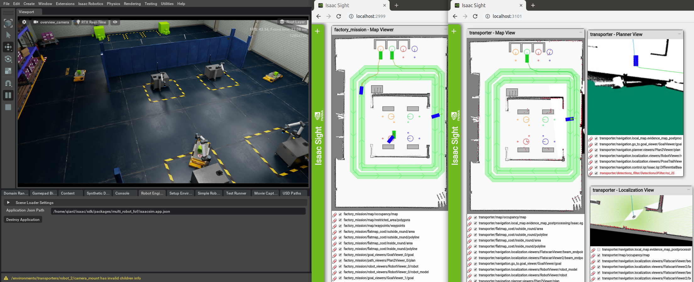
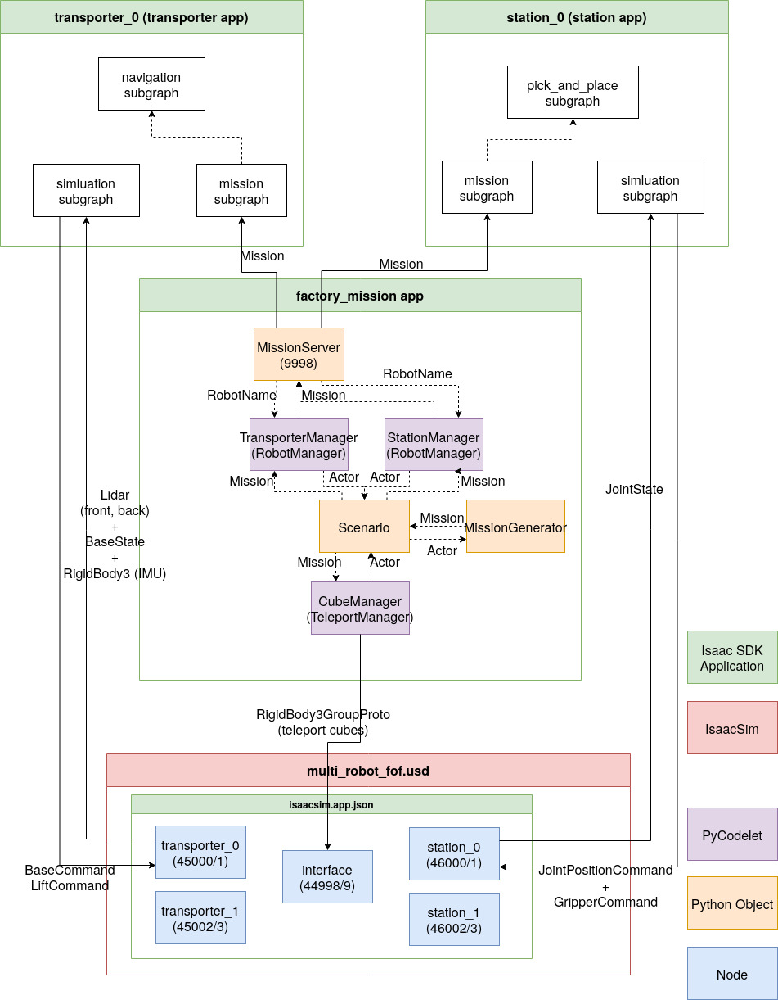
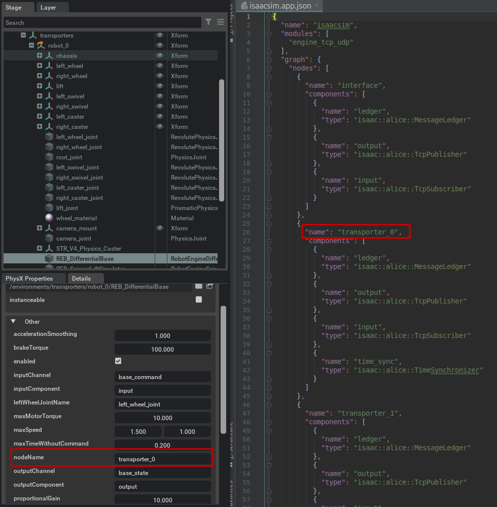
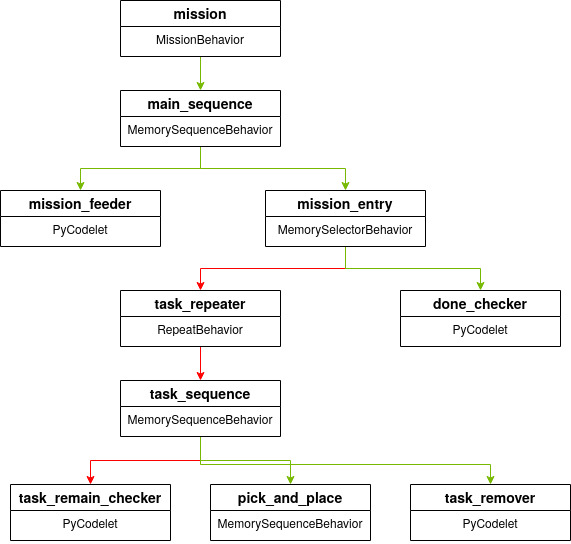

..
   Copyright (c) 2020, NVIDIA CORPORATION. All rights reserved.
   NVIDIA CORPORATION and its licensors retain all intellectual property
   and proprietary rights in and to this software, related documentation
   and any modifications thereto. Any use, reproduction, disclosure or
   distribution of this software and related documentation without an express
   license agreement from NVIDIA CORPORATION is strictly prohibited.

Matrix Production
==================================

This package demonstrates a factory scenario with software-defined assembly workflow. In a
simulated factory environment, multiple AMRs transport materials between assembly stations, while
the robotic arm at each assembly station picks the requested material and places it on the docked
AMR. The multiple robots are each controlled by an Isaac SDK application, and the missions of
each application are assigned by a centralized mission coordinator.

.. image:: images/simulator.png

Running the simulation
-----------------------------------------

This example uses NVIDIA Omniverse Isaac Sim. To set up and start Omniverse, refer to the
respective documentation:

* https://docs.omniverse.nvidia.com/app_isaacsim/app_isaacsim/overview.html

* https://docs.omniverse.nvidia.com/app_isaacsim/app_isaacsim/robot_engine_bridge.html

Once Omniverse is running, from the **Content** panel load the stage:

.. code-block:: bash

   omni:/Isaac/Samples/Isaac_SDK/Scenario/multi_robot_fof.usd

On the **Robot Engine Bridge** panel, change the **Application Json Path** to:

.. code-block:: bash

   <your isaac folder>/sdk/packages/multi_robot_fof/isaacsim.app.json

Click **Create Application** to the Isaac SDK backend, then click **Play** to start the simulation.

.. Note:: Make sure you update the application JSON Path before clicking **Create Application**.
          If you see an error message "Application Was Not Started Successfully" at the bottom of
          Omniverse window, check that the application JSON Path is a valid file.

Running the factory mission
-----------------------------------------
Once the simulation is started, open a new terminal, navigate to the Isaac SDK folder, and run:

.. code-block:: bash

   bob@desktop:~/isaac/sdk$ bazel run packages/multi_robot_fof:factory_mission

This launches the mission coordinator.

Open a second new terminal, navigate to Isaac SDK folder, and run:

.. code-block:: bash

   bob@desktop:~/isaac/sdk$ ./packages/multi_robot_fof/launch_robots.sh

This launches seven Isaac SDK applications: three transporter apps
(//packages/multi_robot_fof:transporter) to control the three AMRs and four station apps
(//packages/multi_robot_fof:station) to control the UR10 arms at the assembly stations.

.. Note:: This script runs packages/multi_robot_fof:build_graph first to generate the pose2
          planner graph, which may take a few seconds. After this, it proceeds to launch the
          transporter and station apps, which may take a while to build when running the first
          time.

Once all the applications are started, open Sight for mission coordinate at localhost:2999. The
"Map Viewer" window shows the current pose, goal, and planned global path for all the AMRs. You
can also check Sight for individual robot's apps at localhost:4000-4006. The screenshot below
shows Sight for mission coordinate and transport robot 1.

How does it work?
-----------------------------------------
The figure below shows how the multiple Isaac SDK apps and the simulator are connected. Solid lines
with arrow represent data flow through Isaac Capnp Proto messages over TCP.

In the Omniverse simulator, each AMRs and robotic arms publish sensor data and receive actuation
command from the respective Isaac SDK app (transporter/station) on a different pair of TCP ports,
as noted in the figure. The node name in the packages/multi_robot_fof/isaacsim.app.json matches
the **nodeName** for the RobotEngine components in Omniverse simulator.

The factory mission app uses MissionServer :ref:`MissionServer <Mission Submission>` to publish
missions to and receive mission status from individual transporter or station apps.  For the
transporter app, the mission behavior controls `navigation.go_to.go_to_behavior` node and
specifies the goal waypoint and arrival tolerance. For station app, the mission behavior
specifies the name of the picked object on pose tree and the dropoff pose. The figure below shows
the behavior tree of the station app.

.. Note:: When the station app complete a mission, you see the error message
          **Component 'task_remain_checker/PyCodelet' of type 'isaac::alice::PyCodelet' reported
          FAILURE: All tasks are done.'**, and subsequent error message from other behavior tree
          components. This is the expected behavior given the behavior tree construct shown above.
