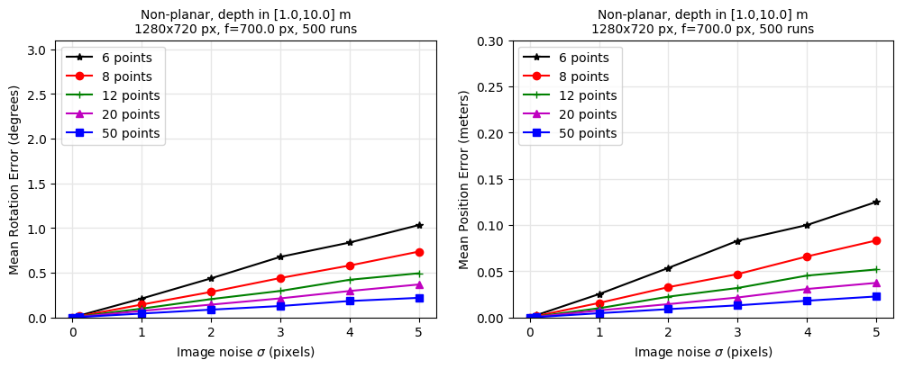
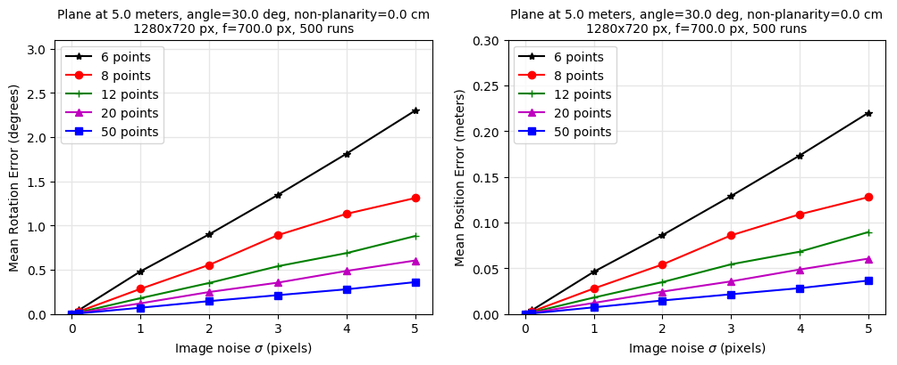
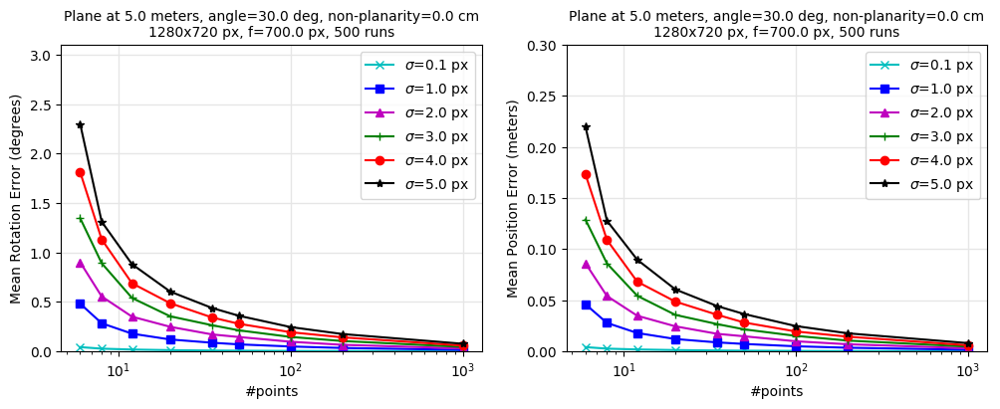

..
   Copyright (c) 2020, NVIDIA CORPORATION. All rights reserved.
   NVIDIA CORPORATION and its licensors retain all intellectual property
   and proprietary rights in and to this software, related documentation
   and any modifications thereto. Any use, reproduction, disclosure or
   distribution of this software and related documentation without an express
   license agreement from NVIDIA CORPORATION is strictly prohibited.

.. _pnp_chapter:

Perspective-n-Point Pose
========================

The Perspective-n-Point (PnP) pose problem is the problem of estimating the relative pose
-- 3D position and orientation -- between a calibrated perspective camera and a 3D object
(or between the camera and the entire 3D scene) from a set of n visible 3D points
with known (X,Y,Z) object (or scene) coordinates and their 2D projections with
known (u,v) pixel coordinates.

The PnP problem is relevant in 3D object tracking and camera localization / tracking and is often
used for example in Structure-from-Motion (SfM), Visual Odometry (VO), Simultaneous Localization
and Mapping (SLAM) and image-based localization pipelines.

Isaac SDK provides the PnP GEM and a simple C++ API for solving the PnP problem.
It contains an implementation of the EPnP algorithm and its adaptation to inputs contaminated
by gross outliers via a variant of the standard RANSAC_ algorithm.

.. _RANSAC: https://en.wikipedia.org/wiki/Random_sample_consensus

EPnP Solver
-----------
Properties of the EPnP implementation in Isaac SDK:

-  Assumes a perspective projection model.

-  Requires known camera intrinsics. These are typically determined in a preliminary off-line
   camera calibration procedure. Some fixed-lens cameras store and provide these parameters
   in runtime.

-  Requires at least 6 2D-3D point matches, each 2D-3D match brought into correspondence
   via perspective projection.

-  EPnP works with many (n>>6) inlier point matches in a least squares fashion.
   The more points used, the higher the pose accuracy.
   This is unlike many other PnP algorithms that are designed for specific n (e.g. P3P).

-  Supports 3D points in both planar and non-planar arrangements.

-  Assumes outlier-free input, like most other PnP solvers (see below how to handle outliers).

For more details about the EPnP algorithm, refer to the following paper:
V. Lepetit, F. Moreno-Noguer, P. Fua,
`EPnP: An Accurate O(n) Solution to the PnP Problem
<https://icwww.epfl.ch/~lepetit/papers/lepetit_ijcv08.pdf>`_,
IJCV 2008

Handling Outliers
------------------
The EPnP solver (as most minimal PnP solvers) does not handle outliers.
If your input data is contaminated with outlier 2D-3D matches, you need to use its robustified
adaptation. The GEM provides a variant of the standard RANSAC_ algorithm for this purpose.
It repeatedly performs the following steps:

-  Randomly sample a set of 6 distinct input 2D-3D matches from the full input set.
   Any input match is chosen with equal chance (uniform distribution).

-  Compute pose hypothesis from the 6-point sample using the EPnP algorithm.

-  Evaluate the quality of the pose hypothesis based on **every** input match
   (not only the ones in the sample).
   A soft-scoring scheme is used. The score contribution of each input match is a function of
   its reprojection error in pixels under the pose hypothesis.
   The contribution is 1 at zero reprojection error and it vanishes smoothly as the
   reprojection error increases to the inlier threshold specified by the user.

-  Retain the top-K distinct hypotheses with the highest score (K also user-specified).
   K=1 corresponds to the standard RANSAC scheme.
   K>1 can be useful for capturing all valid solutions in case of pose ambiguities.
   In such cases, disambiguation may be possible based on additional (e.g. temporal) information
   that is out of the scope of a PnP solver.

Finally, each of the top hypotheses are refit to their inliers using EPnP (n>=6).
The updated poses, their score and the list of inliers are returned by the algorithm.

This algorithm repeatedly calls the 6-point EPnP solver and finds a solution if at least one
of the random samples (of 6 input matches) happens to be outlier-free.
The higher the number of experiments (user-defined), the higher the chance of succeeding.

The GEM provides a function that uses the standard RANSAC formula to estimate the number
of experiments necessary to succeed with a certain probability (e.g. 0.99).
The closer the required success rate to 1 the higher the runtime.
For example, the number of samples necessary to get a solution with 99% probability
is summarized in the table below for different outlier rates, assuming large input size.
You need to have a worst-case estimate of the expected outlier rate in order to use the formula.
Use the RANSAC formula with caution because it is approximative and well-known to be optimistic
when the number of input points is low or when the input coordinates are very noisy.

+--------------+-------+-------+-------+-------+-------+-------+-------+
| % outliers   |   5%  |  10%  |  20%  |  25%  |  30%  |  40%  |  50%  |
+--------------+-------+-------+-------+-------+-------+-------+-------+
| 6-pt samples |   4   |   7   |  16   |  24   |  37   |  97   |  293  |
+--------------+-------+-------+-------+-------+-------+-------+-------+
| (Assuming min. 99% success rate, large input size, ideal inliers)    |
+--------------+-------+-------+-------+-------+-------+-------+-------+

Running the Examples
--------------------
Two examples are provided to demonstrate the basic usage of the PnP C++ API.

-  :code:`epnp_example` for using the EPnP solver directly (no outliers).

-  :code:`epnp_ransac_example` for using EPnP with RANSAC (fed with some outliers).

The examples take simulated input without (:code:`epnp_example`) and with
(:code:`epnp_ransac_example`) outliers and print the computed pose and the residual
reprojection errors in pixels to the console.
In these examples, inliers have subpixel accuracy (in the order of 0.01 pixels),
while outliers have a large residual and, consequently,
do not affect the computed pose.

To run the examples on the host system
~~~~~~~~~~~~~~~~~~~~~~~~~~~~~~~~~~~~~~

1. Build the examples with the following command:

   .. code::

        bob@desktop:~/isaac/sdk$ bazel build //packages/pnp/examples:epnp_example
        bob@desktop:~/isaac/sdk$ bazel build //packages/pnp/examples:epnp_ransac_example

2. Run the examples with the following command:

   .. code::

        bob@desktop:~/isaac/sdk$ bazel-bin/packages/pnp/examples/epnp_example
        bob@desktop:~/isaac/sdk$ bazel-bin/packages/pnp/examples/epnp_ransac_example

To run the examples on Jetson
~~~~~~~~~~~~~~~~~~~~~~~~~~~~~

Assuming that :code:`<JETSON_IP>` is the IP address of your Jetson system, do the following steps:

1. Build the example package on the host.

2. Deploy //packages/pnp/examples:pnp-examples to the robot as explained in :ref:`deployment_device`.

2. Log on to the Jetson system and run the application with the
   following commands:

   .. code::

      bob@jetson:~/$ cd deploy/bob/pnp-examples
      bob@jetson:~/deploy/bob/pnp-examples$ packages/pnp/examples/epnp_example
      bob@jetson:~/deploy/bob/pnp-examples$ packages/pnp/examples/epnp_ransac_example

Performance
-----------

Pose accuracy
~~~~~~~~~~~~~
The pose accuracy to be expected from EPnP is illustrated in the plots below for an example
non-planar (top) and a planar arrangement (bottom).
The plots show the mean rotation error in degrees (left) and the mean camera positional error (right)
in function of the amount of noise in the input 2D coordinates.
The curves are obtained by simulating a large number of cameras with random position
and orientation then simulating noisy 2D-3D matches for each camera, estimating the pose with EPnP,
and measuring the pose error.

The more accurate the input coordinates and the more input points are used
the higher the accuracy of the pose estimate and the higher the runtime.
Non-planar configurations tend to have a higher precision.

The plot below shows how the error decreases with increasing number of points (planar case)
for different amount of noise in the 2D point coordinates.

Runtime
~~~~~~~
Benchmarked EPnP runtimes for Jetson Nano are summarized below. The table shows that the runtime
of EPnP is sublinear in the number of points in the tested range. These results are averages over
100 random simulations (non-planar case)  and over 10 runs per dataset.

+--------+-----------------+
| Points |     Runtime     |
+========+=================+
|      6 |     0.28 ms     |
+--------+-----------------+
|     10 |     0.29 ms     |
+--------+-----------------+
|     50 |     0.51 ms     |
+--------+-----------------+
|    100 |     0.79 ms     |
+--------+-----------------+
|    500 |     3.19 ms     |
+--------+-----------------+
|   1000 |     6.17 ms     |
+--------+-----------------+

The runtime for RANSAC with EPnP is approximately the number of experiments times the
runtime for 6-point EPnP plus the time to refit K best hypotheses
to all their respective inliers (K times EPnP for n>>6 points).

