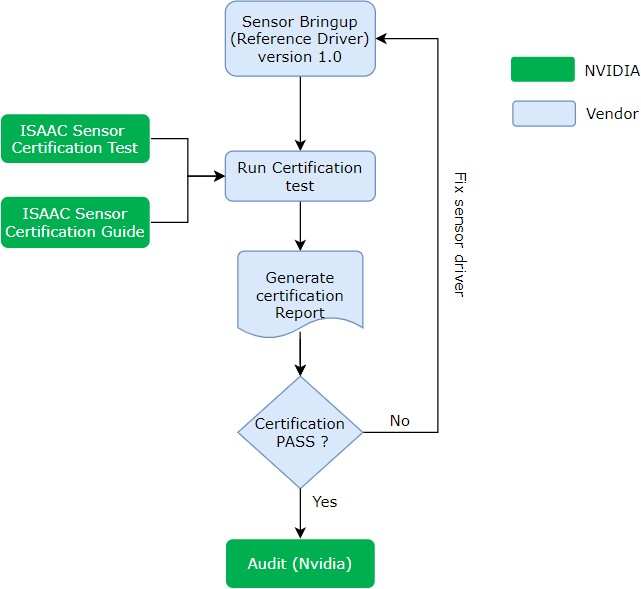
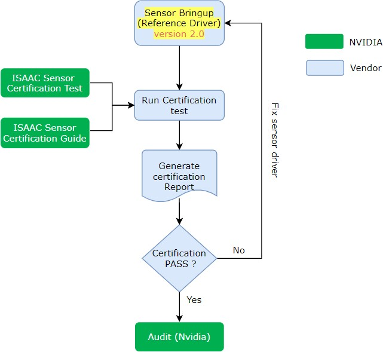
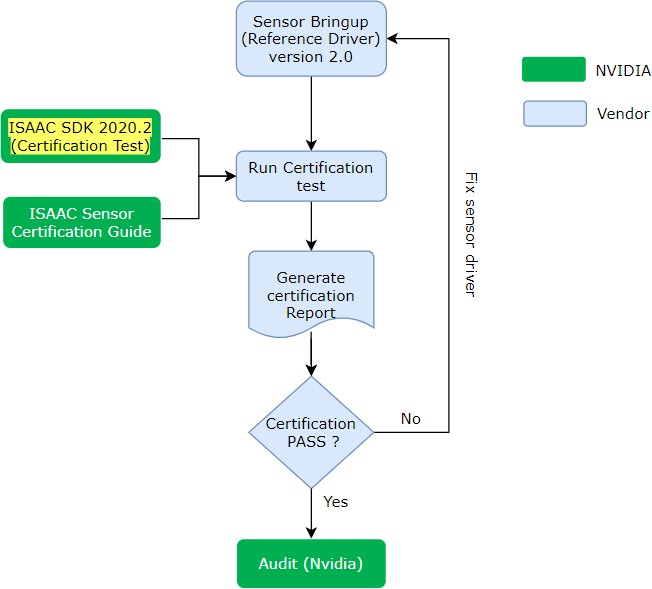
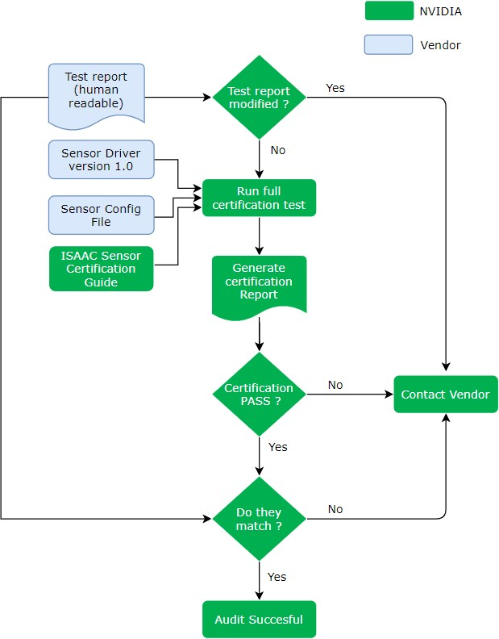
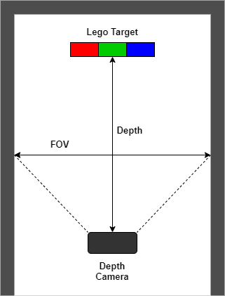
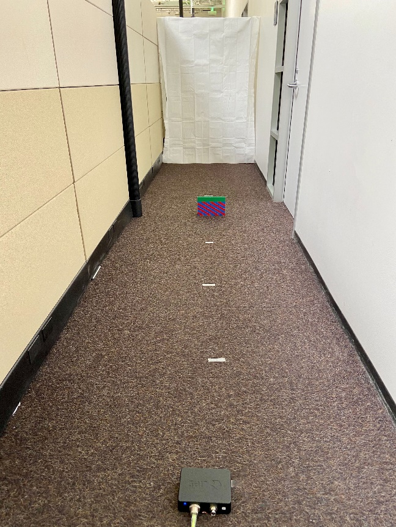
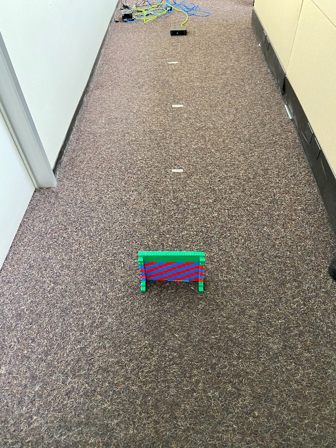
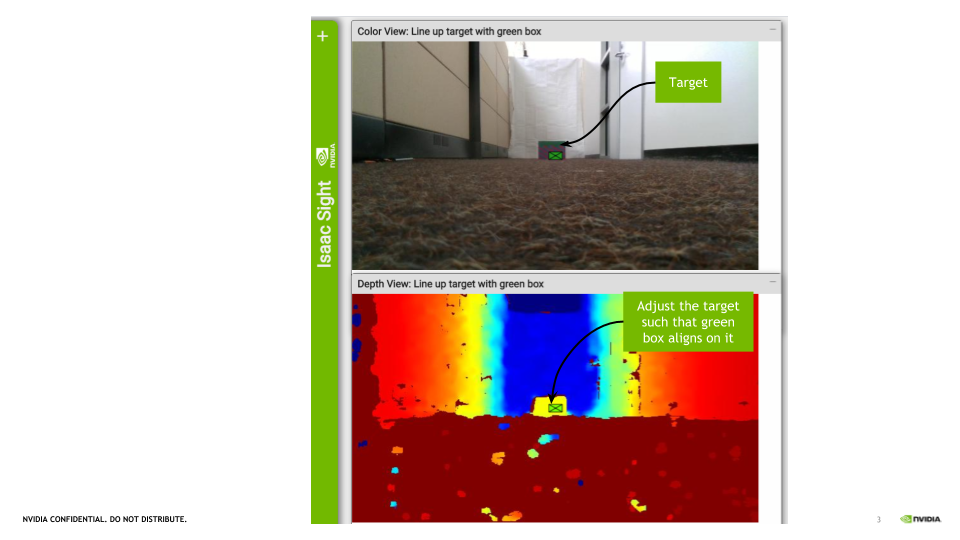

..
   Copyright (c) 2020, NVIDIA CORPORATION. All rights reserved.
   NVIDIA CORPORATION and its licensors retain all intellectual property
   and proprietary rights in and to this software, related documentation
   and any modifications thereto. Any use, reproduction, disclosure or
   distribution of this software and related documentation without an express
   license agreement from NVIDIA CORPORATION is strictly prohibited.

.. _sensor-certification-overview:

Sensor Certification
=================================

Sensor Certification is a test application framework built on top of NVIDIA Isaac SDK to
provide a mechanism for robotics sensor ecosystem partners to develop and verify software
drivers for their sensors against various ISAAC SDK releases.

It is a self-guiding, scene-dependent test application framework where test cases are tailored
based on the sensor type. It enables sensor vendors to measure the degree to which their
sensors are compatible with Isaac SDK perception algorithms. Higher compatibility directly relates
to the ability to use a sensor in reliable and industry-grade robots with Isaac SDK. See the
**Release Notes** section below for supported sensor types.

Certification Process
----------------------------------

As part of certification process, vendors are expected to pass all the test cases and generate a
certification test report (:ref:`test-report`). The test report, along with the sensor
configuration file (:ref:`configuration-file`) used as input to the test application
framework, is submitted to NVIDIA for audit.

NVIDIA performs a full audit of the vendor's test report & certifies them as an Isaac ecosystem
partner if all the criteria are met. This process is repeated for every Isaac/Jetpack release
and/or sensor driver update.

Initial Certification
^^^^^^^^^^^^^^^^^^^^^^^^^^^^^^^^^^^^^^^^

1. Vendor performs bringup of the sensor device and implements a reference driver for the
   latest public release of Isaac SDK, as well as every new release thereafter for recertification.
2. Vendor runs the Isaac sensor certification test provided by NVIDIA.
3. The Isaac certification test application generates a human-readable test report.
4. Vendor checks the test report for PASS status.
5. If overall result is FAIL, vendor modifies the driver until a PASS is achieved.
6. The certification test results are provided to NVIDIA for an audit, along with
   hardware samples and the software reference driver.

Vendor Recertification
^^^^^^^^^^^^^^^^^^^^^^^^^^^^^^^^^^^^^^^^

Vendor must recertify the driver any time there is a new publicly released sensor software driver
version, Isaac version, or Jetpack release version.

Sensor Driver Updates
""""""""""""""""""""""""""""""""""""""""

Any change in the sensor driver requires a recertification by the vendor:

1. Vendor reruns the Isaac certification test application provided as part of Isaac SDK for
   any sensor driver changes.
2. The certification test results are provided to NVIDIA for an audit along with
   hardware samples and the software reference driver.

Isaac SDK Updates
""""""""""""""""""""""""""""""""""""""""

Every Isaac SDK release requires a recertification of the sensor drivers.

1. Vendor reruns the Isaac certification test application provided with the new Isaac release.
2. Vendor is expected to work with NVIDIA to resolve any failures in certification test
   that arise due to an Isaac SDK update.
3. The certification test results are provided to NVIDIA for an audit, along with
   hardware samples and the software reference driver.

Certification Audit
^^^^^^^^^^^^^^^^^^^^^^^^^^^^^^^^^^^^^^^^

.. _audit:

1. Vendor submits the generated test report from the Isaac certification test application along
   with hardware samples and the software driver to NVIDIA.
2. NVIDIA audit entails running a full certification test with the vendor provided
   hardware samples and software driver to generate a report that matches the report submitted by
   the vendor. Any deviation in test setup or software stack will lead to different test results.
4. Once all the criteria are met, audit is deemed successful and vendor is published
   as an Isaac ecosystem partner.

.. _requirements:

Requirements
----------------------------------

Jetpack SDK
^^^^^^^^^^^^^^^^^^^^^^^^^^^^^^^^^^^^^^^^
Download the `NVIDIA Jetpack SDK`_ for Jetson AGX Xavier.

.. _NVIDIA Jetpack SDK: https://developer.nvidia.com/embedded/jetpack

.. note:: Isaac SDK currently supports **Jetpack 4.4.1** only.

Install Jetpack on Jetson AGX Xavier following `these
instructions`_.

.. _these instructions: https://docs.nvidia.com/sdk-manager/install-with-sdkm-jetson/index.html

Isaac SDK
^^^^^^^^^^^^^^^^^^^^^^^^^^^^^^^^^^^^^^^^
Download `NVIDIA Isaac SDK`_ 2020.2.

.. _NVIDIA Isaac SDK: https://developer.nvidia.com/isaac-sdk

.. note:: The Sensor Certification application supports **ISAAC SDK 2020.2** only.

The vendor is required to develop an Isaac codelet to support image acquisition for thier
sensor--see the :ref:`Developing Codelets in C++ <cplusplus_ping>` section for more details. The
certification test framework accepts the output data from the image acquisition process of the
vendor's codelet and validates the data by passing it through various Isaac perception algorithms.
The requirements of the codelet are dependent on the type of sensor used.

.. note:: The certification test currently supports only **depth cameras**. A depth camera is
          defined as a stereo camera that outputs a color image and a depth image at the same
          framerate.

For depth cameras, certification tests expect a color channel and depth channel output from the
codelet, including the camera intrinsics for each, like below:

.. code-block:: bash

   ISAAC_PROTO_TX(ImageProto, color);
   ISAAC_PROTO_TX(CameraIntrinsicsProto, color_intrinsics);
   ISAAC_PROTO_TX(ImageProto, depth);
   ISAAC_PROTO_TX(CameraIntrinsicsProto, depth_intrinsics);

This information will be used while creating the sensor configuration
file (:ref:`configuration-file`) as explained in the user guide. The codelet
may support :code:`ISAAC_PARAM` to configure sensor driver values
such as width, height, framerate etc. as needed.

Build
^^^^^^^^^^^^^^^^^^^^^^^^^^^^^^^^^^^^^^^^

Isaac uses the `Bazel <https://docs.bazel.build/versions/3.3.0/bazel-overview.html>`_ build system
to compile the source code. The sensor certification test framework along with the Isaac Codelet
are both cross compiled for Jetson on the host machine. Thus, follow the instructions to install
all dependencies for the Bazel build system as described :ref:`here <setup-isaac>`. Installation
steps for Isaac Sim are not required.

Sensor certification tests must be run on Jetson AGX Xavier. Please follow the instructions to
setup Isaac dependencies on Jetson
AGX :ref:`here <install_dependencies_jetson>`.

Vendors are required to compile their sensor driver package as an Isaac module.
An Isaac module defines a shared library that encapsulates a set of codelets and can
be used by different applications. A tutorial on how to create an Isaac module can be found
:ref:`here <cplusplus_ping>`.

.. code-block:: bash

   load("@com_nvidia_isaac_sdk//bzl:module.bzl", "isaac_cc_module")

   isaac_cc_module(
       name = "sample",
       srcs = [ ],
       hdrs = [ ],
   )

Version
^^^^^^^^^^^^^^^^^^^^^^^^^^^^^^^^^^^^^^^^

Vendors are required to assign a software version number to the sensor drivers provided to NVIDIA.
Proper versioning is key to avoiding regressions due to changes in the sensor driver
or incompatibility with various Isaac releases. The version and package checksum are
tracked in the test report. Version information can be passed as part of the sensor configuration
file.

.. code-block:: bash

   $ cat sample_config.json
   {
       "sensor_name": "sample",
       "sw_version": "sdk-v0.1.0.2",
       "codelet": "isaac::<vendor>::sample",
       "module_name": "external/com_sensor_driver//packages/sample",
       ........
       ........
   }

Test Scene Materials
^^^^^^^^^^^^^^^^^^^^^^^^^^^^^^^^^^^^^^^^

The test cases in the framework are tailored to the type of sensor device being tested, and while
some tests can be run with only the sensor and a Jetson, a few tests require a test scene setup
before proceeding. Furthermore, the test framework is self-guiding, which means descriptions and
instructions for setting up the scenes are provided in real-time to the user based on their sensor
settings and the specific test being run. The chosen materials required for the tests scenes
are listed below based on sensor type. The vendor will need to purchase the test scene materials to
fully run all tests for a particular sensor type.

The choice of the target materials is based on the following:

- Easy availability/accessibility in any vendor location
- Easy-to-build targets of arbitrary size as the test case demands
- Scalability to support variety of test cases (depth, color, etc.)
- Predictable test scene setups due to flat targets
- Predefined colors to create less scene variation among users while testing color channels
- Low cost and economical

Depth Camera
""""""""""""""""""""""""""""""""""""""""

The following are the requirements for the test scene setup for depth cameras:

.. csv-table:: Test Scene Target Materials
   :header: "Target Materials", "Purchase Link"
   :widths: 60, 10

   "LEGO: Bright Red 2 x 4 brick (x100) \ID: 300121/3001", `Red brick <https://www.lego.com/en-us/page/static/pick-a-brick?page=1&filters.i0.key=variants.attributes.exactColour.en-US&filters.i0.values.i0=Bright%20Red&filters.i1.key=categories.id&filters.i1.values.i0=b3495055-2386-4968-bc47-e980b02d01a1>`_
   "LEGO: Dark Green 2 x 4 brick (x100) ID: 4106356/3001", `Green brick <https://www.lego.com/en-us/page/static/pick-a-brick?page=1&filters.i0.key=categories.id&filters.i0.values.i0=b3495055-2386-4968-bc47-e980b02d01a1&filters.i1.key=variants.attributes.exactColour.en-US&filters.i1.values.i0=Dark%20Green>`_
   "LEGO: Bright Blue 2 x 4 brick (x100) ID: 300123/3001", `Blue brick <https://www.lego.com/en-us/page/static/pick-a-brick?page=1&filters.i0.key=categories.id&filters.i0.values.i0=b3495055-2386-4968-bc47-e980b02d01a1&filters.i1.key=variants.attributes.exactColour.en-US&filters.i1.values.i0=Bright%20Blue>`_
   "April Tag Marker (tag36h11 family any ID) (x1)", `April Tags <https://www.dotproduct3d.com/uploads/8/5/1/1/85115558/apriltags1-50.pdf>`_

The target materials cost approximately $60. They also support all the test cases required for
Isaac SDK.

Audit
^^^^^^^^^^^^^^^^^^^^^^^^^^^^^^^^^^^^^^^^

For a successful audit, vendors are required to provide the following for every Isaac release
and for any change in the sensor driver.

1. HW samples (if not provided already)
2. SW driver for the sensor
3. Sensor Configuration file
4. Certification Test report
5. Certification Test logs

Vendors must provide these details by filling out a template
`NvBug <https://nvbugswb.nvidia.com/NvBugs5/SWBug.aspx?bugid=3042571&cmtNo=>`_ provided by
NVIDIA using NVONLINE for all certification audit requests.

GDPR
^^^^^^^^^^^^^^^^^^^^^^^^^^^^^^^^^^^^^^^^

The test scenes are captured as RGB images and depth images as part of the test report.
As part of GDPR compliance to protect data privacy, it is required that the test scenes from the
ecosystem partner not contain any sensitive/confidential information while performing
certification tests. If any sensitive information is present in the scene, vendors are required to
postprocess the test scene setup images to remove any confidential information that may violate the
GDPR rule before submitting them to NVIDIA for certification audit.

User Guide
----------------------------------

Set up the Environment
^^^^^^^^^^^^^^^^^^^^^^^^^^^^^^^^^^^^^^^^
Before proceeding to the environment setup, make sure all the requirements are satisfied as
listed under the :ref:`Requirements <requirements>` section.

Download the newest release of ISAAC SDK and extract the tar file.

.. code-block:: bash

   tar -xzvf isaac-sdk.tar.xz

Configure the Workspace
^^^^^^^^^^^^^^^^^^^^^^^^^^^^^^^^^^^^^^^^

Edit the :code:`sensor_certification.bzl` file under the :code:`sensor_certification` package folder
as shown below.

.. code-block:: bash

   SENSOR_DRIVER_DIR = "~/Downloads/sample"
   SENSOR_DRIVER_MODULE = "//packages/sample:libsample_module.so"
   ........

Update the sensor driver path/directory and the shared library name (Isaac sensor driver module).
If there are any additional workspaces to be loaded for sensor driver compilation,
they can be added in the :code:`WORKSPACE` file in the :code:`sdk` directory of the Isaac repo.

.. code-block:: bash

   .....
   sensor_certification_workspace()

   # Additional workspaces
   load("@com_sensor_driver//third_party:sample.bzl", "sample_workspace")
   sample_workspace()
   .....

Bazel compilation will pull all the required dependencies to run the test certification.

.. _configuration-file:

Create Sensor Configuration File
^^^^^^^^^^^^^^^^^^^^^^^^^^^^^^^^^^^^^^^^

The vendor is required to create a configuration file that describes the modes of the sensor.
A sensor configuration file is a JSON input file for the test framework.
It contains the settings that are used to run the sensor driver codelet, as well as parameters
that will be verified by the test framework. The fields required in the sensor configuration file
vary based on the type of the sensor, and for different sensors there are different mandatory
fields. The sensor certification framework will indicate to the user missing fields for a
particular sensor type. Fields under :code:`sensor_spec` define the parameters that certification
will test against, while fields under :code:`sensor_drv_config` are the ISAAC_PARAM values that
need to be set in the sensor driver codelet. Certification must be performed for each available
mode of operation a sensor provides. Create a sensor configuration file with the available sensor
modes.

.. note:: The sensor certification application currently supports only **depth cameras**.

All depth cameras must support a color and depth channel in the ISAAC package, as well as FOV,
framerate, resolution, and minimum and maximum measurable depths.

The sensor configuration file for depth cameras is shown below.
While the ISAAC :code:`codelet` and :code:`module_name` dictate which modules are picked up
for test certification, :code:`sensor_name` and :code:`sw_version` are used to track
the sensor hardware and software versions. Each sensor mode must have a :code:`"type"` field
that will dictate the test cases run by the test framework.

.. code-block:: bash

   {
      "sensor_name": "SAMPLE",
      "sw_version": "v0.0.0",
      "codelet" : "isaac::vendor::sample",
      "module_name" : "external/com_sensor_driver//packages/sample",
      "sensor_modes": [
         {
            "type": "depth_camera",
            "sensor_spec": {
               "color_tx": "color",
               "depth_tx": "depth",
               "color_intrinsics_tx": "color_intrinsics",
               "depth_intrinsics_tx": "depth_intrinsics",
               "color_focal_length_x": 615,
               "color_focal_length_y": 615,
               "depth_focal_length_x": 617,
               "depth_focal_length_y": 617,
               "color_channels": 3,
               "fps": 30,
               "mode": "640x480",
               "min_depth": 0.5,
               "max_depth": 3.0
            },
            "sensor_drv_config": {
               “rows”: 480,
               “cols”: 640,
               "color_framerate": 30,
               "depth_framerate": 30
            }
         }
      ]
   }

:code:`color_tx` and :code:`depth_tx` are the channels on which the color and depth images are sent
as ImageProto messages in ISAAC SDK. :code:`color_intrinsics_tx` and :code:`depth_intrinsics_tx`
are the channels on which the camera sensor intrinsics are sent as CameraIntrinsicsProto messages
in Isaac SDK. The :code:`color_focal_length_x`/:code:`depth_focal_length_x` and
:code:`color_focal_length_y`/:code:`depth_focal_length_y` represent the focal length of the camera
in pixels as defined in :ref:`PinholeProto <PinholeProto>`.
The values entered must match the values being output in the sensor driver. The depth focal length,
in conjunction with the resolution (:code:`mode`) and :code:`max_depth`, are used to determine the size of
the target required for various test cases as described :ref:`here <size>`.

Place the sensor config JSON file under the :code:`sdk/packages/sensor_certification/apps`
directory in the Isaac SDK repo on the host before deploying. Doing so will automatically copy it
to the Jetson as part of the deployment process. On the Jetson, the config file will be found under
the deployed package folder now under :code:`packages/sensor_certification/apps`. A sample config
file has also already been provided under the host directory to be customized based on the sensor
model and type.

.. _query:

Query Test Cases
^^^^^^^^^^^^^^^^^^^^^^^^^^^^^^^^^^^^^^^^

Once a sensor configuration file that defines the sensor type to be certified has been created,
it can be used to query the list of test cases, their description, and the scene requirements before
running through the test framework.

The example query result for the depth camera is shown below:

.. code-block:: bash

   DepthSensorTestRunner is selected with mode:
   {
      "color_tx": "color",
      "depth_tx": "depth",
      "color_intrinsics_tx": "color_intrinsics",
      "depth_intrinsics_tx": "depth_intrinsics",
      "color_focal_length_x": 615,
      "color_focal_length_y": 615,
      "depth_focal_length_x": 620,
      "depth_focal_length_y": 620,
      "color_channels": 3,
      "fps": 30,
      "mode": "640x480",
      "min_depth": 0.5,
      "max_depth": 3.0
   }
   The following (11) tests will be run:
   +------------------+-----------------------------------------------------------+
   | Name             | DepthSanityTest                                           |
   +------------------+-----------------------------------------------------------+
   | Description      | Capture frames for 1s from the depth channel. Verify they |
   |                  | match the expected dimensions                             |
   +------------------+-----------------------------------------------------------+
   | Error Tolerances | NA                                                        |
   +------------------+-----------------------------------------------------------+

   +------------------+-----------------------------------------------------------+
   | Name             | ColorSanityTest                                           |
   +------------------+-----------------------------------------------------------+
   | Description      | Capture frames for 1s from the color channel. Verify they |
   |                  | match the expected dimensions and colorspace.             |
   +------------------+-----------------------------------------------------------+
   | Error Tolerances | NA                                                        |
   +------------------+-----------------------------------------------------------+

   +------------------+-----------------------------------------------------------+
   | Name             | ColorFrameRateTest                                        |
   +------------------+-----------------------------------------------------------+
   | Description      | Capture frames from the color channel for 5s. Verify that |
   |                  | the framerate is within the tolerance.                    |
   +------------------+-----------------------------------------------------------+
   | Error Tolerances | - FpsPercentError = 5.0: The maximum allowed error in     |
   |                  |   fps, calculated as 100 * abs(actual_fps - expected_fps)  |
   |                  |   / (expected_fps)                                        |
   |                  |                                                           |
   +------------------+-----------------------------------------------------------+

   +------------------+-----------------------------------------------------------+
   | Name             | DepthFrameRateTest                                        |
   +------------------+-----------------------------------------------------------+
   | Description      | Capture frames from the depth channel for 5s. Verify that |
   |                  | the framerate is within the tolerance.                    |
   +------------------+-----------------------------------------------------------+
   | Error Tolerances | - FpsPercentError = 5.0: The maximum allowed error in     |
   |                  |   fps, calculated as 100 * abs(actual_fps - expected_fps)  |
   |                  |   / (expected_fps)                                        |
   |                  |                                                           |
   +------------------+-----------------------------------------------------------+

   +------------------+-----------------------------------------------------------+
   | Name             | MinDepthTest                                              |
   +------------------+-----------------------------------------------------------+
   | Description      | Run a depth test for the minimum specified sensor         |
   |                  | depth.                                                    |
   |                  |                                                           |
   |                  | A depth test evaluates the ability for the depth camera   |
   |                  | to detect a flat target at a fixed depth. The target is   |
   |                  | expected to take up at least 1/15th the width of the image|
   |                  | and 1/15th the height of the image.                       |
   |                  |                                                           |
   |                  | The test captures 1s worth of frames and evaluates the    |
   |                  | average depth and coefficient of variation of pixels in   |
   |                  | the target region, which must be within the specified     |
   |                  | tolerances                                                |
   +------------------+-----------------------------------------------------------+
   | Error Tolerances | - AverageDepthPercentError = 10.0: The maximum allowed    |
   |                  |   error in average depth, calculated as 100 *              |
   |                  |   abs(actual_depth - target_depth) / (target_depth)       |
   |                  | - MaxCoefficientOfVariation = 0.05: The maximum allowed   |
   |                  |   coefficient of variation (standard deviation / mean) of  |
   |                  |   the target region. Setting this to 0.05 means most      |
   |                  |   points in the target region must be within 5 percent of |
   |                  |   the mean.                                               |
   |                  |                                                           |
   +------------------+-----------------------------------------------------------+

   +------------------+-----------------------------------------------------------+
   | Name             | MaxDepthTest                                              |
   +------------------+-----------------------------------------------------------+
   | Description      | Runs a depth test for the maximum specified sensor        |
   |                  | depth.                                                    |
   |                  |                                                           |
   |                  | A depth test evaluates the ability for the depth camera   |
   |                  | to detect a flat target at a fixed depth. The target is   |
   |                  | expected to take up at least 1/15th the width of the image|
   |                  | and 1/15th the height of the image.                       |
   |                  |                                                           |
   |                  | The test captures 1s worth of frames and evaluates the    |
   |                  | average depth and coefficient of variation of pixels in   |
   |                  | the target region, which must be within the specified     |
   |                  | tolerances                                                |
   +------------------+-----------------------------------------------------------+
   | Error Tolerances | - AverageDepthPercentError = 10.0: The maximum allowed    |
   |                  |   error in average depth, calculated as 100 *              |
   |                  |   abs(actual_depth - target_depth) / (target_depth)       |
   |                  | - MaxCoefficientOfVariation = 0.05: The maximum allowed   |
   |                  |   coefficient of variation (standard deviation / mean) of  |
   |                  |   the target region. Setting this to 0.05, means most     |
   |                  |   points in the target region must be within 5 percent of |
   |                  |   the mean.                                               |
   |                  |                                                           |
   +------------------+-----------------------------------------------------------+

   +------------------+-----------------------------------------------------------+
   | Name             | RangeDepthTest                                            |
   +------------------+-----------------------------------------------------------+
   | Description      | Runs a series of depth tests for a range of depths   |
   |                  | between the minimum and maximum specified sensor depth.   |
   |                  |                                                           |
   |                  | A depth test evaluates the ability for the depth camera   |
   |                  | to detect a flat target at a fixed depth. The target is   |
   |                  | expected to take up at least 1/15th width of the image    |
   |                  | and 1/15th the height of the image.                       |
   |                  |                                                           |
   |                  | The test captures 1s worth of frames and evaluates the    |
   |                  | average depth and coefficient of variation of pixels in   |
   |                  | the target region, which must be within the specified     |
   |                  | tolerances                                                |
   +------------------+-----------------------------------------------------------+
   | Error Tolerances | - AverageDepthPercentError = 10.0: The maximum allowed    |
   |                  |   error in average depth, calculated as 100 *              |
   |                  |   abs(actual_depth - target_depth) / (target_depth)       |
   |                  | - MaxCoefficientOfVariation = 0.05: The maximum allowed   |
   |                  |   coefficient of variation (standard deviation / mean) of  |
   |                  |   the target region. Setting this to 0.05, means most     |
   |                  |   points in the target region must be within 5 percent of |
   |                  |   the mean.                                               |
   |                  |                                                           |
   +------------------+-----------------------------------------------------------+

   +------------------+-----------------------------------------------------------+
   | Name             | ColorTest                                                 |
   +------------------+-----------------------------------------------------------+
   | Description      | Runs a series of color detection tests for the three      |
   |                  | specified lego colors (red, green, blue.)                 |
   |                  |                                                           |
   |                  | A color detection test evaluates the ability of a camera  |
   |                  | to perceive the correct colors. The target is expected to |
   |                  | take up at least 1/15th of the width and height of the    |
   |                  | image.                                                    |
   |                  |                                                           |
   |                  | The test captures 1s worth of frames and evaluates the    |
   |                  | average RGB values within the specified boxed region of   |
   |                  | the target which must consist of expected values.         |
   +------------------+-----------------------------------------------------------+
   | Error Tolerances | NA                                                        |
   +------------------+-----------------------------------------------------------+

   +------------------+-----------------------------------------------------------+
   | Name             | ColorFrameRateStressTest                                  |
   +------------------+-----------------------------------------------------------+
   | Description      | A longer duration frame rate test. Captures frames from   |
   |                  | the color channel for 60s. Verifies that the framerate is |
   |                  | within the tolerance.                                     |
   +------------------+-----------------------------------------------------------+
   | Error Tolerances | - FpsPercentError = 5.0: The maximum allowed error in     |
   |                  |   fps, calculated as 100 * abs(actual_fps - expected_fps)  |
   |                  |   / (expected_fps)                                        |
   |                  |                                                           |
   +------------------+-----------------------------------------------------------+

   +------------------+-----------------------------------------------------------+
   | Name             | DepthFrameRateStressTest                                  |
   +------------------+-----------------------------------------------------------+
   | Description      | A longer duration frame rate test. Captures frames from   |
   |                  | the depth channel for 60s. Verifies that the framerate is |
   |                  | within the tolerance.                                     |
   +------------------+-----------------------------------------------------------+
   | Error Tolerances | - FpsPercentError = 5.0: The maximum allowed error in     |
   |                  |   fps, calculated as 100 * abs(actual_fps - expected_fps)  |
   |                  |   / (expected_fps)                                        |
   |                  |                                                           |
   +------------------+-----------------------------------------------------------+

   +------------------+-----------------------------------------------------------+
   | Name             | AprilTagsTest                                             |
   +------------------+-----------------------------------------------------------+
   | Description      | An April tag detection test evaluates the fidelity of the |
   |                  | image being provided by a camera by passing its frames    |
   |                  | through an AprilTag detector and assessing whether        |
   |                  | detections are made correctly.                            |
   |                  |                                                           |
   |                  | The test captures 1s worth of frames and evaluates        |
   |                  | whether the aprilTag detections for each frame are        |
   |                  | within a target region.                                   |
   +------------------+-----------------------------------------------------------+
   | Error Tolerances | NA                                                        |
   +------------------+-----------------------------------------------------------+

.. _test_scene:

Setup Test Scenes
^^^^^^^^^^^^^^^^^^^^^^^^^^^^^^^^^^^^^^^^

Depending on the sensor type used, the vendor may need to create a test scene for a some of the test
cases. The target materials used for each sensor for the test scene setup are described
under :ref:`Requirements <requirements>`.

Depth Camera
""""""""""""""""""""""""""""""""""""""""

Tests for the depth camera primarily use a target made of Lego bricks. The minimum required size of
the Lego target varies based on the depth measured ‘d’. The test framework calculates the minimum
required target size using :code:`FOV`, :code:`maximum depth`, and resolution (:code:`mode`)
information as provided by the user in the sensor config file. Target size is calculated using the
following:

.. _size:

.. code-block:: bash

   width = (depth_pixels * width_pixels) / (HFOV_pixels * 15)
   depth = (depth_pixels * height_pixels) / (VFOV_pixels * 15)

The same target can be used for testing any depth up to a maximum depth of the sensor. The
test cases predict the required number of Lego bricks required and guides the user interactively.
The target wall is built using 2x4 classic bricks using Lego interlocking technique as shown
`here <https://www.youtube.com/watch?v=W0JPAteh2jM>`_. The color of the bricks used to create the
target is only important in the color test and not the depth tests. The brick color to be used, if
required in a test, will be specified in the interactive instructions of the test framework.

Below are some target sizes for a sample sensor configuration.

.. code-block:: bash

   Sample_sensor_config {
      ......
      "depth_focal_length_x": 617,
      "depth_focal_length_y": 617,
      "mode": "640x480",
      "max_depth": 3.0
      .......
   }

.. csv-table:: Example Target Size Estimation
   :header: "Depth (to be measured)", "Target size in cm (expected)",
            "No of 2x4 Lego Bricks (estimated)"
   :widths: 25, 25, 25

   "1m", "6.9 x 5.1", "3 x 6"
   "2m", "13.8 x 10.3", "5 x 11"
   "3m", "20.7 x 15.5", "7 x 16"

The scene has the depth sensor placed on the floor and the Lego target
placed in line of sight of the sensor at a depth ‘d’ on the floor.

For optimal results, the environment description below should be followed and
replicated to the best of the vendor's ability.

* The recommended test scene is a long corridor where the target can be placed
  in the line of sight of the camera.
* The floor is flat, uniform, and non-glossy (a carpeted floor is preferred).
* The lighting is fluorescent and at constant illumination. Make sure that there are
  no bright light sources that reflect from the flat surface of the target.
* The background is a white wall at the end of the corridor.

The test framework guides the user interactively for each scene setup. THe MinDepth test is shown
below as an example. The test setup describes the target choice, size, and location.

.. code-block:: bash

   Starting test "MinDepthTest"
   +------------------+-----------------------------------------------------------+
   | Name             | MinDepthTest                                              |
   +------------------+-----------------------------------------------------------+
   | Description      | This runs a depth test for the minimum specified sensor   |
   |                  | depth.                                                    |
   |                  |                                                           |
   |                  | A depth test evaluates the ability for the depth camera   |
   |                  | to detect a flat target at a fixed depth. The target is   |
   |                  | expected to take up at least 1/15th width of the image    |
   |                  | and 1/15th the height of the image.                       |
   |                  |                                                           |
   |                  | The test captures 1s worth of frames and evaluates        |
   |                  | the average depth and coefficient of variation of the     |
   |                  | pixels in the target region, which must be within the     |
   |                  | specified tolerances                                      |
   +------------------+-----------------------------------------------------------+
   | Error Tolerances | - AverageDepthPercentError = 5.0: The maximum allowed     |
   |                  |   error in average depth, calculated as 100 *              |
   |                  |   abs(actual_depth - target_depth) / (target_depth)       |
   |                  | - MaxCoefficientOfVariation = 0.05: The maximum allowed   |
   |                  |   coefficient of variation (standard deviation / mean) of  |
   |                  |   the target region. Setting this to 0.05, means most     |
   |                  |   points in the target region must be within 5% of the    |
   |                  |   mean.                                                   |
   |                  |                                                           |
   +------------------+-----------------------------------------------------------+

   Press 'c' to continue to run the test, 'e' to enter tolerances or 's' to skip the
   test:

   Test setup:
   +-----------------+------------------------------------------------------------+
   | Target          | Description                                                |
   +=================+============================================================+
   | Target Choice   | Classic Lego brick 2x4 Classic Lego Brick                  |
   +-----------------+------------------------------------------------------------+
   | Target Size     | Based on FOV & sensor mode, a target of a minimum size of  |
   |                 | 20.4cm wide by 15.6cm high is required for this testcase.  |
   |                 | Please see the documentation on how to build a lego target |
   |                 | that is 7 bricks wide by 16 bricks high.                   |
   +-----------------+------------------------------------------------------------+
   | Target Location | Place the target in the field of view of the camera at a   |
   |                 | distance of 0.500m                                         |
   +-----------------+------------------------------------------------------------+

   Please navigate to http://<Target_IP>:3000 in your web browser to see camera and depth
   viewers. Place the target in the line of sight of camera at a depth of 0.500m.

   Adjust the position of the target while maintaining the target depth such that the
   green box (with the cross mark) on the depth viewer lands on the target.

   Refer to 'Setup Test Scenes' section in the user guide for example.

   Press 'c' to continue to run the test once the scene is setup:

The user must navigate to :code:`http://<Target_IP>:3000` in a browser and check the color and
depth viewer. Place the target at the required depth from the sensor and adjust the target
position to left or right as needed such that the green box (with cross mark) lands on
the target. The green box in the viewers can also be adjusted using the 'w', 'a', 's', 'd' keys
from the terminal, it is recommended to open the browser with viewers in a split screen to
the terminal running the test to more easily make use of this. The depth viewer can be used as the
reference. An example is shown below.

Cross Compile on the Host
^^^^^^^^^^^^^^^^^^^^^^^^^^^^^^^^^^^^^^^^

Bazel is used to build the test framework. The tests are auto selected based on the sensor type
in the sensor config file. The tests are executed in sequence and are self-guiding to the user. The
compilation must be done for the Jetson platform to which the sensor is connected.

To cross compile, use the following command from the :code:`sdk` directory of the ISAAC repo:

.. code-block:: bash

   ../engine/engine/build/deploy.sh --remote_user <host_username>
   -p //packages/sensor_certification/apps:sensor_certification-pkg
   -h <jetson_ip> -d jetpack44

The above step copies the required libraries, scripts, and sensor config file to the target
(Jetson) under :code:`~/deploy/<host_username>/sensor_certification-pkg` folder.

Run the Certification Test on Target
^^^^^^^^^^^^^^^^^^^^^^^^^^^^^^^^^^^^^^^^

Log in to the Jetson AGX:

.. code-block:: bash

   $ ssh <jetson_username>@<jetson_ip>

Go to the deployment folder and run the application:

.. code-block:: bash

   cd ~/deploy/<host_username>/sensor_certification-pkg
   ./run packages/sensor_certification/apps/Cert.py <sensor_config_file> [-h]
   [-q] [-r report]

.. csv-table:: Command Line Options
   :header: "Options", "Parameters", "Description"
   :widths: 10, 10, 40

   "-h", "N/A", "Usage or help"
   "-v", "N/A", "By default, ISAAC logs are disabled on console. Use this option to enable ISAAC
   logs on the console."
   "-r", "[file]", "Path for the test report directory. Default location is /tmp/report.
   Sensor outputs & test report are saved in the same directory"
   "-q", "N/A", "Lists all the test cases for the sensor device"

The following is an example command to run the test certification framework:

.. code-block:: bash

   ./run packages/sensor_certification/apps/Cert.py
   $(pwd)/packages/sensor_certification/apps/sample_config.json -r $(pwd)/log

Verify certification test report
^^^^^^^^^^^^^^^^^^^^^^^^^^^^^^^^^^^^^^^^

.. _report:

A human readable certification test report is generated by default under the location
:code:`/tmp/report` with the data and time of the run. The test report summarizes the environment
used, time of run, and overall status. The vendor must provide the test report to NVIDIA for audit
along with the items described under :ref:`Certification Audit <audit>`.

An example test report for a depth camera is shown below.

.. code-block:: bash

   ---- ISAAC Sensor Certification Test Report ----
   Sensor Name         - SAMPLE
   Sensor SW Version   - v0.0.0
   Sensor SW Checksum  - NA
   ISAAC SDK Version   - 2020.2
   ISAAC SW Checksum   - NA
   TARGET_PLATFORM     - JETSON Xavier
   JETPACK SDK Version - 4.4.1
   Report Generation   - 2020-09-23 11:13:38.614652

   --- Summary ---
   Overall status: PASS

   Passed:  11/11
   Failed:  0/11
   Skipped: 0/11

   [PASS] 1. DepthSanityTest
   [PASS] 2. ColorSanityTest
   [PASS] 3. ColorFrameRateTest
   [PASS] 4. DepthFrameRateTest
   [PASS] 5. MinDepthTest
   [PASS] 6. MaxDepthTest
   [PASS] 7. RangeDepthTest
   [PASS] 8. ColorTest
   [PASS] 9. ColorFrameRateStressTest
   [PASS] 10. DepthFrameRateStressTest
   [PASS] 11. AprilTagstest

   --- Detailed Test Runs ---
   {
      "module_spec": {
         "codelet": "isaac::vendor::sample",
         "module_name": "external/com_sensor_driver//packages/sample",
         "sensor_name": "SAMPLE",
         "sw_version": "sdk-v0.0.0"
      },
      "sensor_spec": {
         "color_tx": "color",
         "depth_tx": "depth",
         "color_intrinsics_tx": "color_intrinsics",
         "depth_intrinsics_tx": "depth_intrinsics",
         "color_focal_length_x": 614.799,
         "color_focal_length_y": 615.035,
         "depth_focal_length_x": 617.19,
         "depth_focal_length_y": 617.19,
         "color_channels": 3,
         "fps": 30,
         "mode": "640x480",
         "min_depth": 0.5,
         "max_depth": 3.0
      },
      "sensor_drv_config": {
         "rows": 480,
         "cols": 640,
         "depth_framerate": 30,
         "color_framerate": 30
      },
      "tests": [
         {
               "name": "DepthSanityTest",
               "status": "PASS",
               "detailed_report": [
                  "All images and intrinsics matched expected dimensions",
                  ""
               ]
         },
         {
               "name": "ColorSanityTest",
               "status": "PASS",
               "detailed_report": [
                  "All images and intrinsics matched expected dimensions",
                  ""
               ]
         },
         {
               "name": "ColorFrameRateTest",
               "status": "PASS",
               "tolerances": {
                  "FpsPercentError": 5.0
               },
               "detailed_report": [
                  "Frame Rate Result:",
                  " - Target frame rate  30.00 fps",
                  " - Frame rate   30.01 fps",
                  " - FPS error    0.03%",
                  ""
               ]
         },
         {
               "name": "DepthFrameRateTest",
               "status": "PASS",
               "tolerances": {
                  "FpsPercentError": 5.0
               },
               "detailed_report": [
                  "Frame Rate Result:",
                  " - Target frame rate  30.00 fps",
                  " - Frame rate   29.98 fps",
                  " - FPS error    0.07%",
                  ""
               ]
         },
         {
               "name": "MinDepthTest",
               "status": "PASS",
               "tolerances": {
                  "AverageDepthPercentError": 10.0,
                  "MaxCoefficientOfVariation": 0.05
               },
               "detailed_report": [
                  "Frame 1/30: mean = 0.483783, coefficient of variation = 0.001028",
                  "Frame 2/30: mean = 0.483783, coefficient of variation = 0.001028",
                  "Frame 3/30: mean = 0.483851, coefficient of variation = 0.000974",
                  "Frame 4/30: mean = 0.483313, coefficient of variation = 0.000959",
                  "Frame 5/30: mean = 0.483482, coefficient of variation = 0.001034",
                  "Frame 6/30: mean = 0.483961, coefficient of variation = 0.001498",
                  "Frame 7/30: mean = 0.483661, coefficient of variation = 0.000979",
                  "Frame 8/30: mean = 0.483667, coefficient of variation = 0.000988",
                  "Frame 9/30: mean = 0.483825, coefficient of variation = 0.001384",
                  "Frame 10/30: mean = 0.483765, coefficient of variation = 0.000877",
                  "Frame 11/30: mean = 0.483836, coefficient of variation = 0.000765",
                  "Frame 12/30: mean = 0.483812, coefficient of variation = 0.000807",
                  "Frame 13/30: mean = 0.483595, coefficient of variation = 0.001220",
                  "Frame 14/30: mean = 0.483750, coefficient of variation = 0.000895",
                  "Frame 15/30: mean = 0.483791, coefficient of variation = 0.000926",
                  "Frame 16/30: mean = 0.483842, coefficient of variation = 0.001153",
                  "Frame 17/30: mean = 0.483806, coefficient of variation = 0.001163",
                  "Frame 18/30: mean = 0.483604, coefficient of variation = 0.001011",
                  "Frame 19/30: mean = 0.483934, coefficient of variation = 0.001142",
                  "Frame 20/30: mean = 0.483857, coefficient of variation = 0.001386",
                  "Frame 21/30: mean = 0.484015, coefficient of variation = 0.001132",
                  "Frame 22/30: mean = 0.483768, coefficient of variation = 0.000873",
                  "Frame 23/30: mean = 0.483595, coefficient of variation = 0.001015",
                  "Frame 24/30: mean = 0.483833, coefficient of variation = 0.000948",
                  "Frame 25/30: mean = 0.483409, coefficient of variation = 0.001017",
                  "Frame 26/30: mean = 0.483753, coefficient of variation = 0.000892",
                  "Frame 27/30: mean = 0.483854, coefficient of variation = 0.001478",
                  "Frame 28/30: mean = 0.483910, coefficient of variation = 0.001231",
                  "Frame 29/30: mean = 0.483813, coefficient of variation = 0.001272",
                  "Frame 30/30: mean = 0.483385, coefficient of variation = 0.001006",
                  "All frames were within expected tolerances",
                  ""
               ]
         },
         {
               "name": "MaxDepthTest",
               "status": "PASS",
               "tolerances": {
                  "AverageDepthPercentError": 10.0,
                  "MaxCoefficientOfVariation": 0.05
               },
               "detailed_report": [
                  "Frame 1/30: mean = 3.066657, coefficient of variation = 0.011543",
                  "Frame 2/30: mean = 3.066657, coefficient of variation = 0.011543",
                  "Frame 3/30: mean = 3.059644, coefficient of variation = 0.013254",
                  "Frame 4/30: mean = 3.041938, coefficient of variation = 0.007231",
                  "Frame 5/30: mean = 3.065000, coefficient of variation = 0.012660",
                  "Frame 6/30: mean = 3.051668, coefficient of variation = 0.007909",
                  "Frame 7/30: mean = 3.069225, coefficient of variation = 0.011782",
                  "Frame 8/30: mean = 3.047205, coefficient of variation = 0.005238",
                  "Frame 9/30: mean = 3.061128, coefficient of variation = 0.011024",
                  "Frame 10/30: mean = 3.053002, coefficient of variation = 0.010638",
                  "Frame 11/30: mean = 3.054868, coefficient of variation = 0.007364",
                  "Frame 12/30: mean = 3.042402, coefficient of variation = 0.006178",
                  "Frame 13/30: mean = 3.052686, coefficient of variation = 0.007738",
                  "Frame 14/30: mean = 3.052011, coefficient of variation = 0.008147",
                  "Frame 15/30: mean = 3.069380, coefficient of variation = 0.014178",
                  "Frame 16/30: mean = 3.053952, coefficient of variation = 0.015450",
                  "Frame 17/30: mean = 3.056552, coefficient of variation = 0.007005",
                  "Frame 18/30: mean = 3.057508, coefficient of variation = 0.009181",
                  "Frame 19/30: mean = 3.050852, coefficient of variation = 0.007406",
                  "Frame 20/30: mean = 3.066324, coefficient of variation = 0.010952",
                  "Frame 21/30: mean = 3.067405, coefficient of variation = 0.009597",
                  "Frame 22/30: mean = 3.068091, coefficient of variation = 0.012605",
                  "Frame 23/30: mean = 3.051865, coefficient of variation = 0.011392",
                  "Frame 24/30: mean = 3.051749, coefficient of variation = 0.008994",
                  "Frame 25/30: mean = 3.044260, coefficient of variation = 0.006073",
                  "Frame 26/30: mean = 3.045569, coefficient of variation = 0.007981",
                  "Frame 27/30: mean = 3.066255, coefficient of variation = 0.017594",
                  "Frame 28/30: mean = 3.064931, coefficient of variation = 0.013046",
                  "Frame 29/30: mean = 3.054105, coefficient of variation = 0.013145",
                  "Frame 30/30: mean = 3.070874, coefficient of variation = 0.013518",
                  "All frames were within expected tolerances",
                  ""
               ]
         },
         {
               "name": "RangeDepthTest",
               "status": "PASS",
               "tolerances": {
                  "AverageDepthPercentError": 10.0,
                  "MaxCoefficientOfVariation": 0.05
               },
               "detailed_report": [
                  "Depth test at 1.125m =============",
                  "Frame 1/30: mean = 1.090330, coefficient of variation = 0.002040",
                  "Frame 2/30: mean = 1.091175, coefficient of variation = 0.001728",
                  "Frame 3/30: mean = 1.090133, coefficient of variation = 0.002012",
                  "Frame 4/30: mean = 1.088878, coefficient of variation = 0.001712",
                  "Frame 5/30: mean = 1.090638, coefficient of variation = 0.001373",
                  "Frame 6/30: mean = 1.091341, coefficient of variation = 0.001448",
                  "Frame 7/30: mean = 1.092134, coefficient of variation = 0.001821",
                  "Frame 8/30: mean = 1.090244, coefficient of variation = 0.001454",
                  "Frame 9/30: mean = 1.089270, coefficient of variation = 0.001979",
                  "Frame 10/30: mean = 1.088910, coefficient of variation = 0.001495",
                  "Frame 11/30: mean = 1.089867, coefficient of variation = 0.001357",
                  "Frame 12/30: mean = 1.091307, coefficient of variation = 0.002100",
                  "Frame 13/30: mean = 1.093606, coefficient of variation = 0.002491",
                  "Frame 14/30: mean = 1.091066, coefficient of variation = 0.001831",
                  "Frame 15/30: mean = 1.090618, coefficient of variation = 0.003166",
                  "Frame 16/30: mean = 1.090891, coefficient of variation = 0.001888",
                  "Frame 17/30: mean = 1.090751, coefficient of variation = 0.002155",
                  "Frame 18/30: mean = 1.090604, coefficient of variation = 0.001379",
                  "Frame 19/30: mean = 1.090083, coefficient of variation = 0.001533",
                  "Frame 20/30: mean = 1.091321, coefficient of variation = 0.001608",
                  "Frame 21/30: mean = 1.091246, coefficient of variation = 0.002045",
                  "Frame 22/30: mean = 1.089359, coefficient of variation = 0.002096",
                  "Frame 23/30: mean = 1.089204, coefficient of variation = 0.001661",
                  "Frame 24/30: mean = 1.090988, coefficient of variation = 0.002053",
                  "Frame 25/30: mean = 1.089554, coefficient of variation = 0.001669",
                  "Frame 26/30: mean = 1.090639, coefficient of variation = 0.001819",
                  "Frame 27/30: mean = 1.090838, coefficient of variation = 0.001559",
                  "Frame 28/30: mean = 1.091198, coefficient of variation = 0.001482",
                  "Frame 29/30: mean = 1.090516, coefficient of variation = 0.002562",
                  "Frame 30/30: mean = 1.090735, coefficient of variation = 0.001673",
                  "All frames were within expected tolerances",
                  "Result: PASS",
                  "Depth test at 1.75m =============",
                  "Frame 1/30: mean = 1.772484, coefficient of variation = 0.002630",
                  "Frame 2/30: mean = 1.779736, coefficient of variation = 0.002172",
                  "Frame 3/30: mean = 1.779646, coefficient of variation = 0.002217",
                  "Frame 4/30: mean = 1.778365, coefficient of variation = 0.004369",
                  "Frame 5/30: mean = 1.780266, coefficient of variation = 0.003169",
                  "Frame 6/30: mean = 1.782866, coefficient of variation = 0.004125",
                  "Frame 7/30: mean = 1.769386, coefficient of variation = 0.003131",
                  "Frame 8/30: mean = 1.775678, coefficient of variation = 0.002803",
                  "Frame 9/30: mean = 1.773555, coefficient of variation = 0.003947",
                  "Frame 10/30: mean = 1.779458, coefficient of variation = 0.002327",
                  "Frame 11/30: mean = 1.770475, coefficient of variation = 0.003325",
                  "Frame 12/30: mean = 1.778341, coefficient of variation = 0.004128",
                  "Frame 13/30: mean = 1.781187, coefficient of variation = 0.002261",
                  "Frame 14/30: mean = 1.774465, coefficient of variation = 0.002608",
                  "Frame 15/30: mean = 1.773391, coefficient of variation = 0.002218",
                  "Frame 16/30: mean = 1.769608, coefficient of variation = 0.003787",
                  "Frame 17/30: mean = 1.776715, coefficient of variation = 0.002934",
                  "Frame 18/30: mean = 1.779964, coefficient of variation = 0.004371",
                  "Frame 19/30: mean = 1.776948, coefficient of variation = 0.003767",
                  "Frame 20/30: mean = 1.764420, coefficient of variation = 0.003137",
                  "Frame 21/30: mean = 1.776111, coefficient of variation = 0.003381",
                  "Frame 22/30: mean = 1.772993, coefficient of variation = 0.003818",
                  "Frame 23/30: mean = 1.778348, coefficient of variation = 0.003207",
                  "Frame 24/30: mean = 1.771795, coefficient of variation = 0.003953",
                  "Frame 25/30: mean = 1.780150, coefficient of variation = 0.003601",
                  "Frame 26/30: mean = 1.776612, coefficient of variation = 0.002009",
                  "Frame 27/30: mean = 1.778379, coefficient of variation = 0.002259",
                  "Frame 28/30: mean = 1.780973, coefficient of variation = 0.003810",
                  "Frame 29/30: mean = 1.775921, coefficient of variation = 0.001698",
                  "Frame 30/30: mean = 1.779593, coefficient of variation = 0.002341",
                  "All frames were within expected tolerances",
                  "Result: PASS",
                  "Depth test at 2.375m =============",
                  "Frame 1/30: mean = 2.376654, coefficient of variation = 0.002825",
                  "Frame 2/30: mean = 2.376654, coefficient of variation = 0.002825",
                  "Frame 3/30: mean = 2.376654, coefficient of variation = 0.002825",
                  "Frame 4/30: mean = 2.378435, coefficient of variation = 0.001224",
                  "Frame 5/30: mean = 2.382374, coefficient of variation = 0.002042",
                  "Frame 6/30: mean = 2.382235, coefficient of variation = 0.001868",
                  "Frame 7/30: mean = 2.377880, coefficient of variation = 0.002674",
                  "Frame 8/30: mean = 2.380625, coefficient of variation = 0.001974",
                  "Frame 9/30: mean = 2.378782, coefficient of variation = 0.002482",
                  "Frame 10/30: mean = 2.380116, coefficient of variation = 0.001621",
                  "Frame 11/30: mean = 2.377612, coefficient of variation = 0.002051",
                  "Frame 12/30: mean = 2.380072, coefficient of variation = 0.001633",
                  "Frame 13/30: mean = 2.382258, coefficient of variation = 0.001782",
                  "Frame 14/30: mean = 2.380808, coefficient of variation = 0.002513",
                  "Frame 15/30: mean = 2.382826, coefficient of variation = 0.001341",
                  "Frame 16/30: mean = 2.379643, coefficient of variation = 0.001816",
                  "Frame 17/30: mean = 2.380238, coefficient of variation = 0.002544",
                  "Frame 18/30: mean = 2.379576, coefficient of variation = 0.001508",
                  "Frame 19/30: mean = 2.377850, coefficient of variation = 0.001825",
                  "Frame 20/30: mean = 2.382744, coefficient of variation = 0.001444",
                  "Frame 21/30: mean = 2.378817, coefficient of variation = 0.001670",
                  "Frame 22/30: mean = 2.384007, coefficient of variation = 0.002075",
                  "Frame 23/30: mean = 2.382513, coefficient of variation = 0.001981",
                  "Frame 24/30: mean = 2.380740, coefficient of variation = 0.001590",
                  "Frame 25/30: mean = 2.384227, coefficient of variation = 0.001788",
                  "Frame 26/30: mean = 2.379474, coefficient of variation = 0.001951",
                  "Frame 27/30: mean = 2.376417, coefficient of variation = 0.002015",
                  "Frame 28/30: mean = 2.380218, coefficient of variation = 0.001685",
                  "Frame 29/30: mean = 2.380763, coefficient of variation = 0.002032",
                  "Frame 30/30: mean = 2.378434, coefficient of variation = 0.002571",
                  "All frames were within expected tolerances",
                  "Result: PASS",
                  ""
               ]
         },
         {
               "name": "ColorTest",
               "status": "PASS",
               "detailed_report": [
                  "Color test for RED =============",
                  "Detected color is RED",
                  "Result: PASS",
                  "Color test for GREEN =============",
                  "Detected color is GREEN",
                  "Result: PASS",
                  "Color test for BLUE =============",
                  "Detected color is BLUE",
                  "Result: PASS",
                  ""
               ]
         },
         {
               "name": "ColorFrameRateStressTest",
               "status": "PASS",
               "tolerances": {
                  "FpsPercentError": 5.0
               },
               "detailed_report": [
                  "Frame Rate Result:",
                  " - Target frame rate  30.00 fps",
                  " - Frame rate   29.77 fps",
                  " - FPS error    0.75%",
                  ""
               ]
         },
         {
               "name": "DepthFrameRateStressTest",
               "status": "PASS",
               "tolerances": {
                  "FpsPercentError": 5.0
               },
               "detailed_report": [
                  "Frame Rate Result:",
                  " - Target frame rate  30.00 fps",
                  " - Frame rate   29.77 fps",
                  " - FPS error    0.75%",
                  ""
               ]
         },
         {
            "name": "AprilTagsTest",
            "status": "PASS",
            "detailed_report": [
                "April tag detections were all within the target region in the FOV of the camera for all frames",
                ""
            ]
        }
      ]
   }

Troubleshooting
----------------------------------

.. _hardware_failures:

Sensor Hardware Failures
^^^^^^^^^^^^^^^^^^^^^^^^^^^^^^^^^^^^^^^^
If the ISAAC codelet for the sensor does not return any frames, the pipeline will timeout, and the
test framework may output either of the following messages. The device may need a hardware reset.

.. code-block:: bash

   2020-05-29 13:37:21.247 ERROR
   external/com_nvidia_isaac/engine/alice/components/Codelet.cpp@229: Component
   'dut/RealsenseCamera' of type 'isaac::RealsenseCamera' reported FAILURE:
   RealSense error calling rs2_pipeline_wait_for_frames(pipe:0x7f49300e49a0): Frame
   didn't arrived within 5000

.. code-block:: bash

   external/com_sensor_driver/packages/ae400/Ae400CameraComp.cpp@38: Realsense
   recommended firmware version is 05.10.03.00, currently using firmware version
   05.11.06.250
   2020-06-30 16:40:01.728 ERROR
   external/com_nvidia_isaac/engine/alice/components/Codelet.cpp@229: Component
   'dut/AE400Camera' of type 'isaac::lips::AE400Camera' reported FAILURE:
   RealSense error calling rs2_pipeline_start_with_config(pipe:0x7f800e4040,
   config:0x7f80172bb0): xioctl(VIDIOC_QBUF) failed Last Error: No such file or
   directory
   2020-06-30 16:40:01.729 ERROR
   external/com_nvidia_isaac/engine/alice/backend/event_manager.cpp@42: Stopping node
   'dut' because it reached status 'FAILURE'
   2020-06-30 16:40:01.729 WARN

Scene setup failures
^^^^^^^^^^^^^^^^^^^^^^^^^^^^^^^^^^^^^^^^

Issues Aligning the Target
""""""""""""""""""""""""""""""""""""""""

- If you have issues aligning the green box on target as shown :ref:`here <test_scene>`,
  even with target displacement (left/right), we recommend increasing the size of the target. Bigger
  targets make for easier alignment at higher depths.

- Always place the camera on the ground. Based on the sensor height from the ground,
  you may need to increase the height of the target accordingly or increase the height of
  the camera by placing a platform underneath it.

Issues with Noise in the Image
""""""""""""""""""""""""""""""""""""""""

- Ensure the floor on which the camera is placed is flat, uniform, and not reflective.
  Reflectivity may increase noise in the depth image.

- Ensure there are no bright light sources that reflect from the flat surface of the
  target.

Issues Connecting to the Camera
""""""""""""""""""""""""""""""""""""""""

- If the test fails due to the camera connection error noted above (:ref:`hardware_failures`),
  try resetting or power cycling the camera.

Issues with coefficient of variation
""""""""""""""""""""""""""""""""""""""""

.. code-block:: bash

   Test result
   MinDepthTest [FAIL]
   Tolerances:
      - AverageDepthPercentError = 5.0: The maximum allowed error in average
      depth, calculated as 100 * abs(actual_depth - target_depth) /
      (target_depth)
      - MaxCoefficientOfVariation = 0.05: The maximum allowed coefficient of
      variation (standard deviation / mean) of the target region. Setting this
      to 0.05, means most points in the target region must be within 5% of the
      mean.
   Detailed Report:
   Frame 2/30: mean = 0.473331, coefficient of variation = 0.055065
   Frame 2/30: cov (0.055065) is greater than tolerance of 0.050000
   Frame 2/30: depth error (5.333787%) is greater than tolerance of 5.000000%

If the test fails due to COV being greater than allowed tolerance as shown above,
these are possible causes:

- Target might be angled w.r.t camera, especially for smaller depth
  measurements. Try aligning the target surface to be flat.

- Reflections are present on the target or there is noise in the depth image. Adjust the
  camera height to align the green box on a clean area of the target depth image.

Target Setup Failures
^^^^^^^^^^^^^^^^^^^^^^^^^^^^^^^^^^^^^^^^

Issues with Camera Frame Rate
""""""""""""""""""""""""""""""""""""""""

If you have issues reaching and maintaining the expected frame rate, we recommend setting the CPU
scaling frequency manually to be more performant. To do so, set the Jetson Xavier power mode to 5.
See the "To change power mode" steps in the `Jetson Xavier Power Management`_ document for
more details.

.. _Jetson Xavier Power Management: https://docs.nvidia.com/jetson/l4t/index.html#page/Tegra%20Linux%20Driver%20Package%20Development%20Guide/power_management_jetson_xavier.html

Release Notes
----------------------------------

Supported test cases can be queried from the test application as explained
in the :ref:`Query <query>` section.

.. csv-table:: Supported Sensor Types & Test Cases
   :class: longtable
   :header: "Sensor Type", "Test Cases", "Description", "Scene Setup"
   :widths: 10, 15, 20, 10

   "Depth Camera", "Color - Sanity Test", "Captures frames worth 1 second from the
   color channel of the camera and verifies that the resolution and color space adhere to the
   sensor config file", "N/A"

   "Depth Camera", "Depth - Sanity Test", "Captures frames worth 1 second from the depth
   channel of the camera and verifies that the resolution adheres to the sensor config file", "N/A"

   "Depth Camera", "Color - Frame rate test", "Captures frames from the color channel of
   the camera for 5 seconds, measures the framerate, and verifies if the framerate is
   within the acceptable range as specified in the sensor config file", "N/A"

   "Depth Camera", "Depth - Frame rate test", "Captures frames from the depth channel
   of the camera for 5 seconds, measures the framerate, and verifies if the framerate is
   within the acceptable range as specified in the sensor config file", "N/A"

   "Depth Camera", "Min depth measurement test", "The objective of this test is to measure the
   minimum depth that the camera can detect. This test requires a scene set up.
   A depth test evaluates the ability for the
   depth camera to detect a flat target at a fixed depth. The target is expected to take
   up at least 1/15th width of the image and 1/15th the height of the image. The test
   captures 1s worth of frames and valuates the average depth and coefficient of
   variation of the pixels in the target region, which must be within the specified
   tolerances ", "Yes"

   "Depth Camera", "Max depth measurement test", "The objective of this test is to measure the
   maximum depth that the camera can detect. This test requires a scene setup. It
   performs the test in a similar fashion as explained in the minDepth test case above", "Yes"

   "Depth Camera", "Depth range test", "The objective of this test is to measure the
   depth range between the minimum depth and maximum depth distances that the camera
   can detect. This test requires a scene set up. It performs the test in a similar fashion
   as explained in minDepth test case above", "Yes"

   "Depth Camera", "Color - Frame rate stress test", "Captures frames from the color channel of
   the camera for 60 seconds, measures the framerate, and verifies if the framerate is
   within the acceptable range as specified in the sensor config file", "N/A"

   "Depth Camera", "Depth - Frame rate stress test", "Captures frames from the depth channel
   of the camera for 60 seconds, measures the framerate, and verifies if the framerate is
   within the acceptable range as specified in the sensor config file", "N/A"

   "Depth Camera", "Color test", "This runs a series of color detection tests for the three
   specified lego colors (red, green, blue).
   A color detection test evaluates the ability of a camera to perceive the correct colors.
   The target is expected to take up at least 1/15th of the width and height
   of the image. The test captures 1s worth of frames and evaluates the average RGB values
   within the specified boxed region of the target, which must consist of expected values.", "Yes"

   "Depth Camera", "April tags test", "This test evaluates the fidelity of the image being provided
   by a camera, as well as the image compatibility with computer vision algorithms in the Isaac
   stack, by passing its frames through an AprilTag detector and assessing whether detections are
   made correctly.
   The test captures 1s worth of frames and evaluates whether the AprilTag detections for each
   frame are found and within a region of interest.", "Yes"

.. csv-table:: Bugs / Known Issues
   :header: "Bug ID", "Description"
   :widths: 10, 60

   3039320, "[Isaac Sensor Certification] Multiple sensor modes in a single sensor config file
   is not supported"
